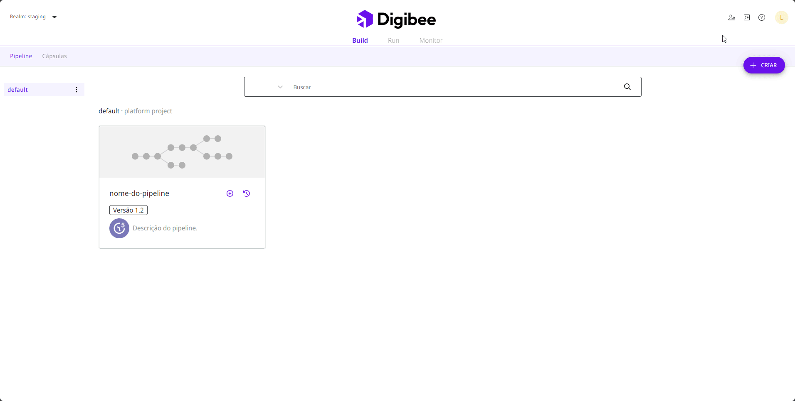
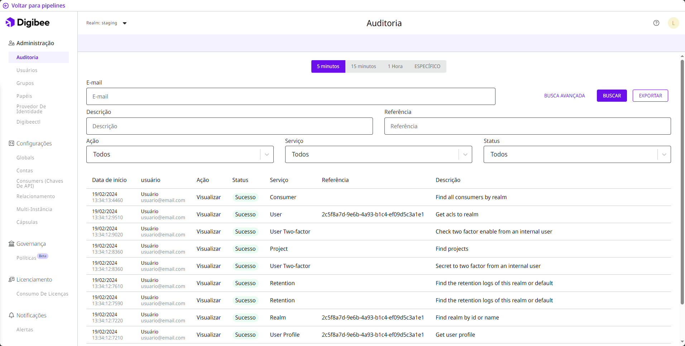

# Auditoria

Para facilitar tanto o gerenciamento quanto o registro das ações, todas as operações realizadas dentro da Digibee Integration Platform são armazenadas de forma segura e exibidas na página Auditoria da Plataforma. Isso ajuda você a rastrear e monitorar alterações do sistema e atividades do usuário, bem como investigar incidentes de segurança.

Para acessar a página Auditoria, clique em **Administração** no canto superior direito da página inicial da Plataforma e abra o submenu **Auditoria**.

<figure><figcaption></figcaption></figure>

## Visão geral da página Auditoria

A página Auditoria oferece funções com as quais você pode filtrar e pesquisar os registros de auditoria e baixá-los como um arquivo para o seu próprio computador.

<figure><figcaption>
Página de auditoria na Digibee Integration Platform.
</figcaption></figure>

### Período de tempo

Na parte superior da página, você pode selecionar o período para seus registros de auditoria.

Ao selecionar o período, você pode escolher se deseja ver os registros de auditoria dos últimos **5 minutos**, **15 minutos**, **1 hora**, ou um intervalo de datas **específico**.

### Busca simples e avançada

Abaixo do período de tempo, você pode realizar uma busca simples no campo de pesquisa digitando o endereço de email do usuário que deseja pesquisar e clicando em **Buscar**. Você também pode clicar em **Busca avançada** para ver mais opções e pesquisar informações específicas. Preencha todos ou alguns dos campos abaixo para pesquisar:

* **Descrição:** descrição do registro que você deseja pesquisar.
* **Ação:** tipo de ação realizada, que pode ser: **Todos**, **Visualizar**, **Criar**, **Atualizar** ou **Remover/Arquivar**.
* **Referência:** ID do objeto no qual o usuário fez a ação.
* **Serviço:** funcionalidade em que a ação foi executada.
* **Status:** _status_ da ação, que pode ser: **Todos**, **Sucesso** ou **Erro**.

### Registros de auditoria

Abaixo do período de tempo e do campo de pesquisa, você pode visualizar os registros de auditoria de acordo com o intervalo de tempo e parâmetros de pesquisa previamente definidos. As informações estão organizadas em uma tabela com as seguintes colunas:

* **Data de início:** data e hora de início da ação.
* **Usuário:** nome e endereço de email do usuário que executou a ação.
* **Ação:** tipo de ação realizada, que pode ser: **Todos**, **Visualizar**, **Criar**, **Atualizar** ou **Remover/Arquivar**.
* **Status:** _status_ da ação, que pode ser **Sucesso** para ações executadas com sucesso ou **Erro** para ações em que ocorreu um erro durante a execução.
* **Serviço:** funcionalidade em que a ação foi executada.
* **Referência:** ID do objeto no qual o usuário fez a ação. Caso o registro de auditoria se refira a um serviço e não a um objeto específico, este campo permanece vazio.
* **Descrição:** breve descrição da ação executada.


Em alguns registros de auditoria, a coluna **Referência** não tem nenhum dado. Isso ocorre porque esses registros não se referem a ações executadas em um objeto específico. Eles referem-se a serviços, que são as entidades do sistema que englobam os objetos. Os objetos específicos de um serviço possuem um ID, enquanto os serviços não possuem um ID.


### Exportar registros de auditoria

Depois de filtrar os registros, você pode clicar no botão **Exportar** para baixar uma pasta compactada com os registros de auditoria para o seu computador. Nesta pasta você encontrará um arquivo CSV com os últimos 50.000 registros de auditoria. Os registos baixados correspondem aos apresentados na página, levando em consideração o intervalo de tempo e parâmetros de pesquisa. O arquivo contém as seguintes informações:

* **dateStart:** data de início do processamento da requisição.
* **dateEnd:** data final do processamento da requisição.
* **description:** descrição da ação executada.
* **url:** endereço que foi acessado.
* **method:** método HTTP da requisição realizada.
* **uri:** recurso que foi acessado.
* **httpStatusCode:** código do _status_ HTTP da requisição.
* **status:** _status_ da operação realizada.
* **remoteAddress:** endereço que foi acessado remotamente.
* **payload:** _body_ da requisição.
* **queryParam:** parâmetro da requisição.
* **fullName:** nome do usuário que realizou a operação.
* **email:** email do usuário que realizou a operação.
* **service:** serviço de _backend_ que foi acessado.
* **sourceIp:** endereço IP do dispositivo que realizou a operação.
