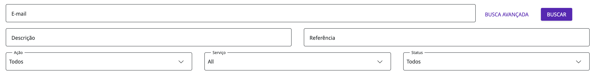

# Auditoria

Para auxiliar na governança e no mapeamento de ações, toda e qualquer operação realizada dentro da Digibee Integration Platform é armazenada em segurança e apresentada no submenu Auditoria, localizado na página de Administração da Plataforma.

## Seletor de período 

No centro da tela “Auditoria”, podemos atualizar os logs de ações ao selecionar o período pretendido entre as opções:

* 5 minutos
* 15 minutos
* 1 hora
* **Específico:** Ao clicar em “Específico”, é possível estabelecer um intervalo de tempo entre duas datas e horas.

## Logs de Ações 

Nesta seção, é mostrado os logs de ações conforme o intervalo de tempo e os parâmetros de busca previamente definidos. As informações de cada log estão dispostas no relatório conforme as seguintes colunas:

* **Data de início:** A data e o horário de início da ação;
* **Usuário:** O nome e o email do usuário que executou a ação;
* **Ação:** O tipo de ação realizada, podendo ser:
  * **Todos:** Todos os tipos de ações;
  * **Visualizar:** Logs de ações de visualização;
  * **Criar:** Logs de ações de criação;
  * **Atualizar:** Logs de ações de atualização;
  * **Remover/Arquivar:** Logs de ações de exclusão ou arquivamento.
* **Status:** O status da ação, podendo ser:
  * **Sucesso**: Ações executadas com sucesso;
  * **Erro**: Ações que apresentaram erro em sua execução.
* **Serviço:** Onde a ação foi realizada.
* **Referência:** O _id_ do objeto que sofreu a ação. Caso o log da ação se refira a um serviço e não a um objeto em específico, este campo será apresentado em branco.
* **Descrição:** Breve descrição da ação executada.

**Important:** Alguns logs de ação serão apresentados com o campo Referência em branco, pois esses não se referem a ações executadas em um objeto específico, mas sim a serviços, que são as entidades do sistema que englobam os objetos. Os objetos específicos de um serviço possuem _id_ e os serviços, por sua vez, não possuem _id_.

## Campo de busca 

O “Campo de busca” comporta parâmetros que auxiliam o usuário a encontrar determinado log de ação. Através deles, é possível especificar atributos de determinada ação para localizá-la com maior precisão e rapidez.

### Busca simples 

* **Email:** Este parâmetro filtra os logs pelo email do usuário que realizou ou solicitou a ação.

### Busca avançada 

* **Descrição:** Este parâmetro filtra os logs pela descrição da ação;
* **Ação:** Este parâmetro filtra os logs conforme o tipo de ação realizada, podendo ser escolhido dentre as seguintes opções:
  * **Todos:** Apresenta todos os tipos de ações;
  * **Visualizar:** Apresenta apenas os logs de ações de visualização;
  * **Criar:** Apresenta apenas os logs de ações de criação;
  * **Atualizar:** Apresenta apenas os logs de ações de atualização;
  * **Remover/Arquivar**_**:**_ Apresenta apenas os logs de ações de exclusão ou arquivamento.
* **Referência:** O _id_ do objeto que sofreu a ação.
* **Serviços:** Este parâmetro filtra a ação pelo serviço, ou seja, pela funcionalidade onde a ação foi realizada, podendo ser:
  * Account
  * API Keys
  * Audit
  * Capsule
  * Capsule Collection
  * Capsule Group
  * Capsule Header
  * Completed Execution
  * Component
  * Consumer
  * Deployment
  * Entity
  * Environment
  * Event
  * Global
  * Library
  * Monitor Overview
  * Multi Instance
  * OAuth Provider
  * OAuth Provider (Legacy)
  * Pipeline
  * Pipeline Configuration
  * Pipeline Log
  * Pipeline Metric
  * Pipeline Template
  * Pipeline Tracking
  * Platform Permission
  * Platform User
  * Project
  * Realm
  * Realm Parameter
  * Relationship
  * Retention
  * Running Execution
  * SAML Group Mapping
  * SAML Scheme
  * Scope
  * Static Content
  * Term of Acceptance
  * Test Mode
  * Trigger
  * User
  * User Group
  * User Group (Binding)
  * User Password
  * User Profile
  * User Role
  * User Two-factor
  * digibeectl
