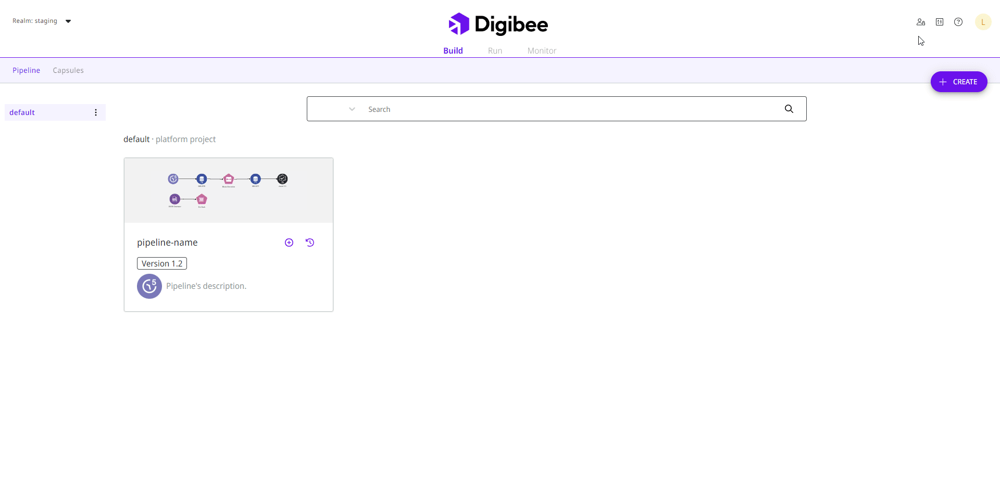
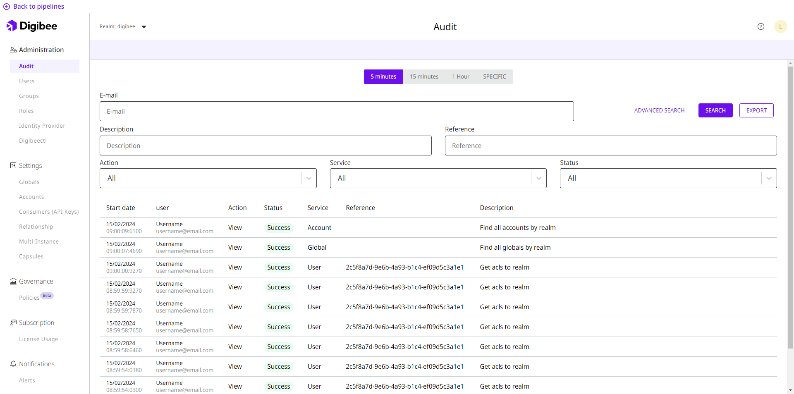

# Audit

To facilitate both the management and registration of actions, all operations performed within the Digibee Integration Platform are securely stored and displayed on the Platform's Audit page. This helps you to track and monitor system changes and user activity, as well as investigate security incidents.

To access the Audit page, click **Administration** in the upper right corner of the Platform home page and open the **Audit** submenu.

<figure><figcaption></figcaption></figure>

## Overview of the Audit page

The Audit page offers functions with which you can filter and search the audit records and download them as a file to your own computer.

<figure><figcaption>
Audit page in the Digibee Integration Platform.
</figcaption></figure>

### Time period

At the top of the page, you can select the time period for your audit records.

When selecting the time period, you can choose whether you want to see the audit records for the last **5 minutes**, **15 minutes**, **1 hour**, or a **specific** date range.

### Basic and advanced search

Below the time period, you can perform a simple search in the search field by entering the email address of the user you want to search for and clicking **Search**. You can also click **Advanced search** to see more options and search for specific information. Complete all or some of the fields below to search:

* **Description:** description of the record you want to search for.
* **Action:** type of action performed, which can be: **All**, **Viewed**, **Created**, **Updated** or **Removed/Archived**.
* **Reference:** ID of the object with which the user has interacted.
* **Services:** feature in which the action was performed.
* **Status:** status of the action, which can be: **All**, **Success**, or **Errors**.

### Audit records

Below the time period and the search field, you can see the audit records according to the previously defined time interval and search parameters. The information is organized in a table with the following columns:

* **Start date:** start date and time of the action.
* **User:** name and email address of the user who performed the action.
* **Action:** type of action performed, which can be: **All**, **View**, **Create**, **Update** or **Remove/Archive**.
* **Status:** status of the action, which can be **Success** for successfully executed actions or **Error** for actions where an error occurred during execution.
* **Service:** feature in which the action was performed.
* **Reference:** ID of the object with which the user has interacted. If the audit record refers to a service and not to a specific object, this field remains empty.
* **Description:** short description of the action performed.


In some audit records, the **Reference** column is empty. This is because these records don’t refer to actions that were performed on a specific object. They refer to services, which are the system entities that encompass the objects. The specific objects of a service have an ID, while the services don’t have an ID.


### Export audit records

After you have filtered the records, you can click the **Export** button to download a zipped folder with the audit records to your computer. In this folder you will find a CSV file with the last 50,000 audit records. The downloaded records correspond to those displayed on the page, taking into account the time period and search filters. The file contains the following information:

* **dateStart:** start date of the request processing.
* **dateEnd:** end date of the request processing.
* **description:** description of the action performed.
* **url:** address that was accessed.
* **method:** HTTP method of the request performed.
* **uri:** resource that was accessed.
* **httpStatusCode:** HTTP status code of the request.
* **status:** status of the operation performed.
* **remoteAddress:** address that was accessed remotely.
* **payload:** body of the request.
* **queryParam:** parameter of the request.
* **fullName:** name of the user who performed the operation.
* **email:** email of the user who performed the operation.
* **service:** backend service that was accessed.
* **sourceIp:** IP address of the device that performed the operation.
