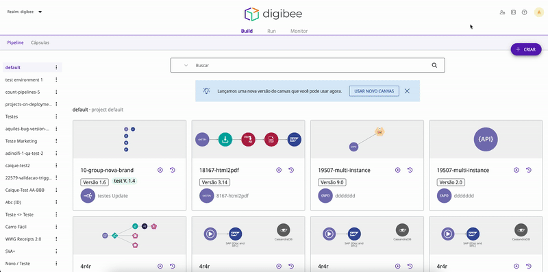

# Regras de autenticação

Por padrão, se você usar um modelo de acesso integrado, os usuários podem acessar a Digibee Integration Platform usando credenciais Digibee ou por meio de um provedor de identidade (IdP). No entanto, você pode gerenciar regras de acesso para impor acessos via IdP para todos os usuários ou apenas para usuários específicos usando a página de Regras de autenticação.


Para executar as ações descritas nesta página, você deve estar atribuído a um grupo vinculado ao papel de sistema **groups-manager**, como, por exemplo, o grupo padrão **access-manager**.


## Página de Regras de autenticação

Na página Administração, clique em **Provedor de Identidade** e em seguida acesse a aba **Regras de autenticação.**

<figure><figcaption>
<em>Página de Regras de autenticação</em>
</figcaption></figure>

Na página de Regras de autenticação, você verá uma tabela que mostra o número de acessos Digibee ativos (não arquivados), o número de acessos via IdP, assim como a regra de autenticação para cada domínio de e-mail usado para acessar o realm que você gerencia. Você também pode gerir acessos a um novo domínio clicando no botão **Criar**.

Existem três tipos de regras de autenticação possíveis para cada domínio:

| Regra de autenticação | Descrição                                                                                                                                                                                                                                                                                                                                                                                                                                                                               |
| --------------------- | --------------------------------------------------------------------------------------------------------------------------------------------------------------------------------------------------------------------------------------------------------------------------------------------------------------------------------------------------------------------------------------------------------------------------------------------------------------------------------------- |
| Apenas IdP            | Os usuários deste domínio só podem fazer login na Digibee Integration Platform via IdP. Logins com credenciais Digibee são bloqueados para todos os usuários deste domínio.                                                                                                                                                                                                                                                                                                             |
| Digibee/IdP           | Os usuários deste domínio podem fazer login na Digibee Integration Platform usando suas credenciais Digibee ou via IdP.                                                                                                                                                                                                                                                                                                                                                                 |
| Personalizado         | Para cada usuário deste domínio que tenha feito login anteriormente no _realm_, você pode escolher se eles podem ou não fazer login na Digibee Integration Platform usando suas credenciais. Em outras palavras, você pode escolher se a regra de autenticação individual é apenas IdP ou Digibee/IdP. Por padrão, se esta opção estiver ativada, novos usuários deste domínio são atribuídos à regra de autenticação somente IdP e não poderão fazer login usando credenciais Digibee. |

Você pode clicar no **ícone de lápis** para editar a regra de autenticação para um domínio de e-mail. Se você selecionar **personalizado**, você poderá editar a regra de autenticação de cada usuário que já se conectou anteriormente com aquele domínio de e-mail.

Ao terminar de configurar as regras, clique em Ativar Regras para ativá-las. Você pode alterar essas regras a qualquer momento.


Quando um usuário com regra de autenticação **Digibee/Idp** efetua login via IdP, ele é removido de todos os grupos Digibee não integrados aos quais foi atribuído. Consequentemente, ele também perde as permissões concedidas por esses grupos.



Após a implementação da página de Regras de autenticação, as regras de autenticação de todos os domínios foram definidos como **personalizado** por padrão. Se um usuário desse domínio se conectou pela última vez usando um IdP, sua regra de autenticação individual foi definida como **apenas IdP**. Se ele se conectou pela última vez usando credenciais Digibee, sua regra de autenticação individual foi definida como **Digibee/IdP**.



Você não pode usar a página de Regras de autenticação para bloquear logins IdP na Digibee Integration Platform. Você só pode fazer isso por meio das configurações do seu IdP.

