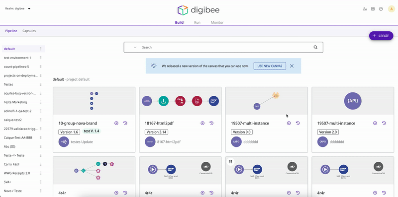

# Authentication rules

By default, if you use an integrated access model, users can access the Digibee Integration Platform either using Digibee credentials or via an IdP. However, you can manage access rules to enforce IdP access for all users or only for specific users using the Authentication rules page.


To access this feature, you must belong to a group that is bound to the **groups-manager** role, such as the **access-manager** default group. You can learn more about users, groups and roles [here](../new-access-control/).


## Authentication rules page

On the Administration page, click on **Identity Provider** and then on the tab **Authentication rules**.

<figure><figcaption>
IdP accesses page
</figcaption></figure>

On the Authentication rules page, you will see a table that shows the number of active (non-archived) Digibee accesses and IdP accesses, as well as the **authentication rule** for each e-mail domain used to access the realm you manage. You can also manage accesses to a new domain by clicking on the **Create** button.

There are three possible authentication rules for each domain:

| Authentication rule | Description                                                                                                                                                                                                                                                                                                                                                                                                                                                         |
| ------------------- | ------------------------------------------------------------------------------------------------------------------------------------------------------------------------------------------------------------------------------------------------------------------------------------------------------------------------------------------------------------------------------------------------------------------------------------------------------------------- |
| IdP only            | Users of this domain can only log in to the Digibee Integration Platform via IdP. Logins with Digibee credentials are blocked for all users of this domain.                                                                                                                                                                                                                                                                                                         |
| Digibee/IdP         | Users of this domain can log into the Digibee Integration Platform either by using their Digibee credentials or via IdP.                                                                                                                                                                                                                                                                                                                                            |
| Custom              | For each user of this domain who has previously logged into the realm, you can choose whether or not they can log in to the Digibee Integration Platform using their credentials. In other words, you can choose whether their individual authentication rule is IdP only or Digibee/IdP. By default, if this option is activated, new users of this domain are assigned to the IdP only authentication rule and won’t be able to log in using Digibee credentials. |

You can click on the **pencil icon** to edit the authentication rule for an e-mail domain. If you select **custom**, you will be able to edit the authentication rule of each user who has previously logged in with that e-mail domain.

When you finish setting up the rules, click on **Activate Rules** to activate them. You can alter these rules at any time.


When a user with Digibee/Idp authentication rule logs in via IdP, they are removed from all non-integrated Digibee groups to which they were assigned. Consequently, they lose the permissions granted by those groups.



After the Authentication rules page was implemented, the authentication rules of all domains were set to **custom** by default. If a user of this domain logged in for the last time using an IdP, their individual authentication rule was set to **IdP only**. If they logged in for the last time using Digibee credentials, their individual authentication rule was set to **Digibee/IdP**.



You cannot use the Authentication rules page to block IdP logins on the Digibee Integration Platform. You can only do that through the settings of your IdP.

