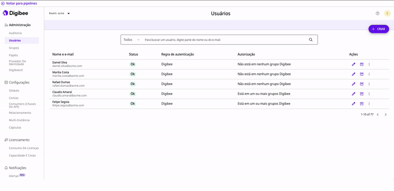

# Usuários

Usuários são indivíduos que têm acesso à Digibee Integration Platform. Cada conta de usuário é identificada de maneira única por seu email.

## A página de Usuários 

A página de Usuários exibe uma tabela que mostra os usuários ativos e arquivados em seu _realm_.

Você pode listá-los ou pesquisá-los por nome ou email e também filtrar os usuários arquivados na barra de pesquisa. Observe que um usuário pode ser arquivado e desarquivado quantas vezes desejar.

Você pode visualizar o status dos seus usuários e ver quais regras de autenticação e autorização foram definidas para eles. Como gestor de usuários, você tem acesso a diversas ações, como criar, editar e arquivar usuários.

Na coluna **Ações**, você também pode redefinir as senhas dos usuários e desativar o botão "Esqueci a senha" na página de login. Observe que a opção está habilitada por padrão, é será necessário pedir à equipe de suporte para configurá-lo para você.

<figure><figcaption></figcaption></figure>

A coluna **status** representa a situação do usuário, que pode assumir os valores abaixo:

| Status          | Descrição                                              |
| --------------- | ------------------------------------------------------ |
| OK              | Usuários ativos (não arquivados).                      |
| Redefinir senha | Usuários ativos que precisam redefinir suas senhas.    |
| Inativo         | Usuários arquivados.                                   |
| Login bloqueado | Usuários com o login de acesso à Plataforma bloqueado. |

A variável **regra de autenticação** pode assumir os seguintes valores listados abaixo

Para saber mais sobre regras de autenticação, leia nosso[ artigo sobre Regras de autenticação](https://docs.digibee.com/documentation/v/pt-br/administration/identity-provider-integration/idp-accesses).

| Regra de autenticação | Descrição                                                                 |
| --------------------- | ------------------------------------------------------------------------- |
| Digibee/IdP           | Este usuário pode fazer login usando suas credenciais Digibee ou via IdP. |
| Somente IdP           | Este usuário pode fazer login apenas via IdP.                             |

A variável **autorização** pode assumir os seguintes valores, de acordo com a regra de autenticação:

| Autorização                            | Descrição                                                                                                        |
| -------------------------------------- | ---------------------------------------------------------------------------------------------------------------- |
| Em um ou mais grupos Digibee           | Este usuário efetuou login pela última vez com credenciais Digibee e está atribuído a um ou mais grupos Digibee. |
| Não está em nenhum grupo Digibee       | Este usuário efetuou login pela última vez com credenciais Digibee e não está atribuído a nenhum grupo Digibee.  |
| Autorização não definida               | Este usuário foi criado, mas ainda não fez login.                                                                |
| Em um ou mais grupos IdP integrados    | Este usuário se conectou pela última vez via IdP e está atribuído a um ou mais grupos IdP integrados.            |
| Não está em nenhum grupo IdP integrado | Este usuário efetuou login pela última vez via IdP e não está atribuído a nenhum grupo IdP integrado.            |
| Não está em nenhum grupo IdP           | Este usuário efetuou login pela última vez via IdP e não está atribuído a nenhum grupo IdP.                      |
