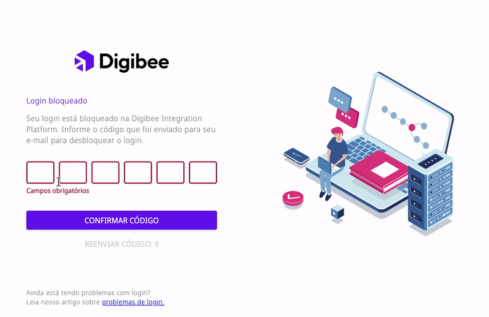

# Como resolver problemas para fazer o login na Digibee Integration Platform

Existem algumas razões pelas quais o login efetuado na Digibee Integration Platform pode não ter sido bem-sucedido. Aqui seguem as causas mais comuns e como solucioná-las.

## Esqueci minha senha

Caso tenha esquecido sua senha:

1. Na tela de login, clique em **Esqueceu a sua senha?**
2. Preencha o seu _realm_ e email e clique em **Confirmar**;&#x20;


Em alguns casos, a Digibee automaticamente identifica seu _realm_, sendo apenas necessário o preenchimento do endereço de email.


3. Você receberá um email, então siga as instruções para redefinir sua senha;
4. Faça o login com a nova senha.

## Esqueci meu _realm_ ou endereço de email

Caso tenha esquecido seu _realm_ e/ou email, entre em contato com o suporte via chat clicando no ícone de “**interrogação**” no canto superior direito da tela de login, ou envie um email para [suporte@digibee.com](mailto:suporte@digibee.com).

## Meu login foi bloqueado

O login pode ter sido bloqueado por questões de segurança. No entanto, você tem duas opções para desbloquear sua conta.

<figure><figcaption></figcaption></figure>

### 1. Desbloqueie sua conta através do código de segurança

Nesse caso, você será direcionado para uma página onde deverá inserir o código enviado por email.

Para desbloquear sua conta:&#x20;

1. Insira o endereço de email registrado na Digibee Integration Platform;
2. Copie o código de segurança;&#x20;
3. Cole o código no local indicado na tela de bloqueio;
4. Clique em **Confirmar código**;
5. Clique em **Voltar para entrar**;
6. Faça o login novamente.

<figure><figcaption></figcaption></figure>


Se o código não funcionar ou ocorrer algum erro no email, clique em **Reenviar código** na tela de bloqueio de login.&#x20;



Você terá três tentativas para debloquear seu usuário, e o número restante de tentativas é exibido na página de desbloqueio. Caso exceda este limite, seu usuário será temporariamente bloqueado.&#x20;


<figure><figcaption></figcaption></figure>

### 2. Desbloqueie seu usuário redefinindo sua senha

Para desbloquear seu usuário redefinindo sua senha, você receberá a mensagem de confirmação por email, conforme informado anteriormente no tópico “**Esqueci minha senha**”. Siga as instruções para ser redirecionado para a página de login, onde poderá fazer uma nova tentativa de login.

## Não consigo fazer o login com as credenciais Digibee

Se seu _realm_ é integrado, o gestor de acesso pode ter bloqueado logins com as credenciais Digibee. Neste caso, você precisará fazer o login usando um provedor de identidade (IdP).
