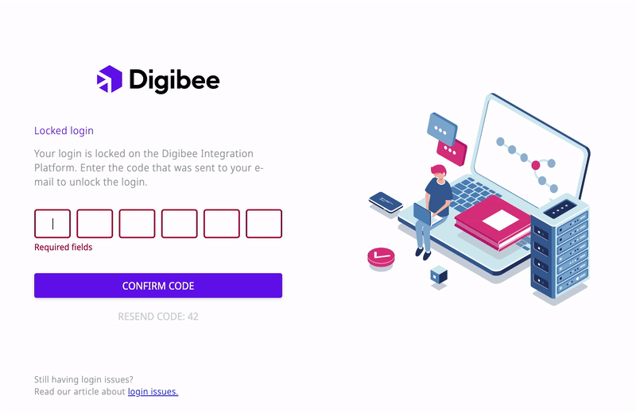

# How to solve login problems on the Digibee Integration Platform

There are a few reasons why you can’t log in to the Digibee Integration Platform. Here are the most common login issues and how you can solve them.

## I forgot my password

If you have forgotten your password:

1. Click **Forgot your password** on the login screen;
2. Enter your realm and email address, and click **Confirm**;


In some cases, Digibee automatically detects your realm, so you only need to enter your email address.


3\. You will receive an email and then follow the instructions to reset your password;

4\. Log in with your new password.

## I forgot my realm or email address

If you have forgotten your realm or email address, contact our support team by clicking the **question mark** icon in the upper right corner of the login screen or email us at support@digibee.com.

## My login has been locked

Your login may have been locked for security reasons. However, you have two options to unlock your account.

<figure><figcaption></figcaption></figure>

### 1. Unlock your account via security code

In this case, you will be redirected to a page where you will have to enter a code that will be sent to you by email.

To unlock your account:

1. Enter the email address registered in the Digibee Integration Platform;
2. Copy the security code;
3. Paste the security code in the place indicated on the locked login screen;
4. Click **Confirm code**;
5. Click **Return to login**;
6. Log in again.

<figure><figcaption></figcaption></figure>


If the code does not work or an error occurs with the email, click **Resend code** on the locked login screen.



You will have three attempts to unlock your account, and the remaining number of attempts will be displayed on the login page. If you exceed this limit, your user will be temporarily locked.


<figure><figcaption></figcaption></figure>

### 2. Unlock your user by resetting your password

To unlock your user by resetting your password, you will receive the confirmation message by email, as previously informed on the topic “**I forgot my password**”. Follow the instructions to be redirected to the login page, where you can make a new login attempt.

## I can’t log in with my Digibee credentials

If your realm is integrated, an access manager might have blocked logins with Digibee credentials. In this case, you will need to login using an Identity Provider (IdP).

\

\

\
