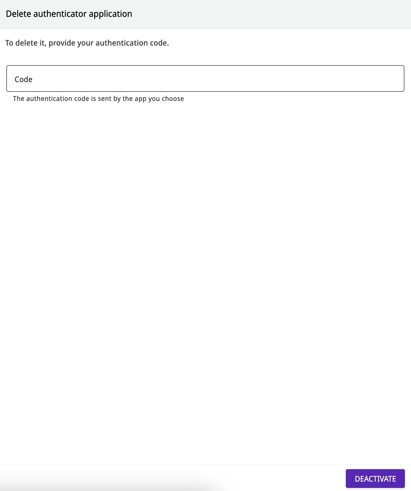

# How to activate and deactivate two-factor authentication

Two-factor authentication is a feature that provides additional protection and ensures secure access to any system.

On the Digibee Integration Platform, it is possible to activate two-factor authentication on the Platform itself to protect your login. See the steps below.


If your access is through an [identity provider](https://docs.digibee.com/documentation/administration/identity-provider-integration/how-to-integrate-the-identity-provider) that is already integrated with the Digibee Integration Platform, this authentication feature is not required.


## **How to activate the two-factor** authentication

1. Log in to the Digibee Integration Platform.
2. Click the user menu in the upper right corner.
3. Click **Two-factor authentication.**
4. Select the authentication app and download it to your phone.
5. Open the selected app, scan the QR code and enter the code that appears in the app.
6. Click **Activate.**


**Important information:**

* Download the authentication app (_Google Authenticator,_ _Microsoft Authenticator_, or _LastPass Password Manager_) using your smartphone operating system store.
* Once you click **Activate**, the Platform will redirect the user to a deactivation page. It is only necessary to fill in this page if the purpose is to disable the feature.


<figure><figcaption></figcaption></figure>

From now on, every time you log in through the Digibee Integration Platform, you will need to provide the application's security code. To learn more, [read our documentation about the login flow](https://docs.digibee.com/documentation/administration/user-authentication-and-autorization/login-flow).

If it's not possible to access the application when logging in, please contact support.

## **How to deactivate the two-factor** authentication

1. Log in to the Digibee Integration Platform.
2. Click the user menu in the upper right corner.
3. Click **two-factor authentication.**
4. Enter the security code provided by the application.
5. Click **Deactivate.**

<figure><figcaption></figcaption></figure>

