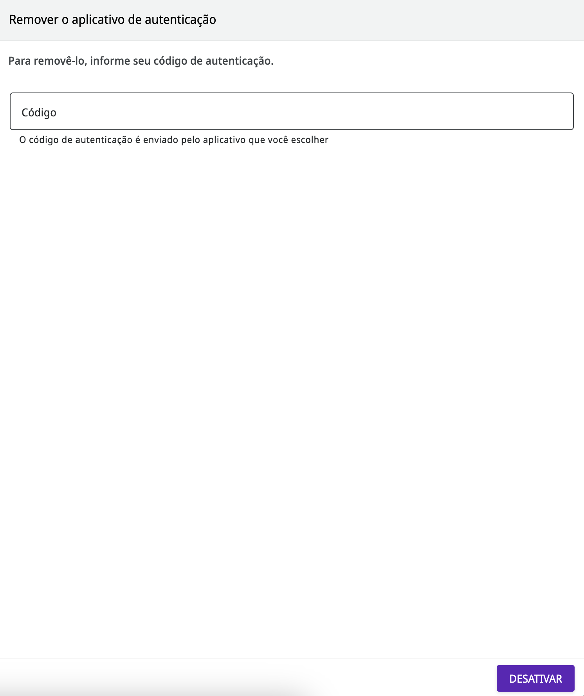

# Como habilitar e desabilitar a autenticação de dois fatores

A autenticação de dois fatores é um recurso que coloca uma camada a mais de proteção e garante um acesso seguro a qualquer sistema.

Na Digibee Integration Platform, é possível habilitar a autenticação de dois fatores na própria Plataforma e assim proteger o seu login. Veja os passos a seguir.


Caso o seu acesso seja efetuado via [provedor de identidade](https://docs.digibee.com/documentation/v/pt-br/administration/identity-provider-integration) integrado à Digibee Integration Platform, esse recurso de autenticação não é necessário.


## **Como habilitar a autenticação de dois fatores**

1. Faça o login na Digibee Integration Platform.
2. Clique no menu do usuário no canto superior direito.
3. Clique em **Autenticação de dois fatores.**
4. Escolha o aplicativo de autenticação e faça o download no seu celular.
5. Abra o aplicativo escolhido, leia o QR code e coloque o código que aparecer no aplicativo.
6. Clique em **Ativar.**


**Informações importantes:**

* Baixe um aplicativo de autenticação (_Google Authenticator,_ _Microsoft Authenticator_ ou _LastPass Password Manager_) através da loja do sistema operacional do seu smartphone.
* Logo que clicar em **Ativar**, a Plataforma direciona o usuário para uma página de desativação. Só é necessário preencher essa página caso queira desabilitar o recurso.


<figure><figcaption></figcaption></figure>

A partir deste momento, será obrigatório informar o código de segurança do aplicativo todas as vezes que fizer o login via Digibee Integration Platform. Para saber mais, [leia nossa documentação de fluxo de login](https://docs.digibee.com/documentation/v/pt-br/administration/user-authentication-and-autorization/login-flow).

Caso não seja possível acessar o aplicativo na hora do login, entre em contato com o suporte.

## **Como desabilitar a autenticação de dois fatores**

1. Faça o login na Digibee Integration Platform.
2. Clique no menu do usuário no canto superior direito.
3. Clique em **Autenticação de dois fatores.**
4. Coloque o código de autenticação que está no aplicativo.
5. Clique em **Desativar.**

<figure><figcaption></figcaption></figure>
