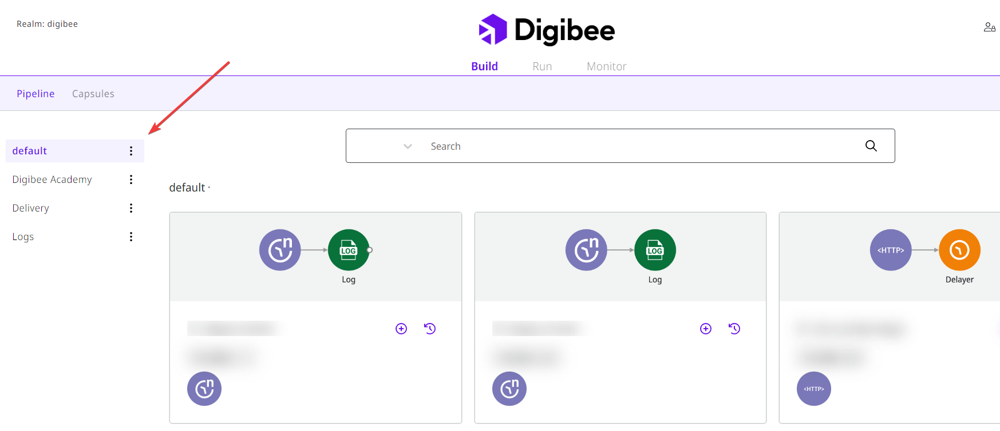

# Build overview

On the Build page, you can create and manage pipelines and projects.&#x20;

## Build layout

When you select Build, the page layout appears as shown in the figure below.&#x20;

On this page, you can see the **CREATE** button on the top right corner, the **Projects list** on the left corner, and the pipelines list on the bottom. In the upper left corner are **Pipeline** and **Capsules**.&#x20;

When you select Pipeline, the created projects and pipelines are displayed. In the middle of the screen, you will find all the pipelines created.&#x20;

When you select Capsules, the created Capsules will be displayed as well. In the right corner you will find the button **CREATE**. &#x20;

In the following sections you will learn more about each tool.

<figure><figcaption></figcaption></figure>

## CREATE button

You can click on the **CREATE** button on the top right corner of the screen to create a new pipeline or project. You can also find the CREATE button in the Run screen.

<figure><figcaption></figcaption></figure>

### How to create a pipeline

To create a pipeline in our Canvas:

1. Click on the CREATE button on the top right corner on the screen.
2. Select **Pipeline.**

To learn more about the Canvas, read the [documentation](https://docs.digibee.com/documentation/build/new-canvas-beta-restricted).&#x20;

<figure><figcaption></figcaption></figure>

### How to create a project

To create a new project, follow the steps below:

1. Select **Project**. Projects are folders where you can store your pipelines.&#x20;
2. Enter the project name and description on the side sheet **Create a new project,** just as the image below.&#x20;
3. Assign the project to specific users.

<figure><figcaption></figcaption></figure>


If you check **Select all users**, all users in your realm will be able to access the new project and thus the pipelines in it.


<figure><figcaption></figcaption></figure>

If you want only certain groups to have access to your project, click **Assign groups** and select the groups to which you want to grant access to your project.

4. After you have selected and filled in the fields, click **Save** and your project will be created.

## Projects

In the left corner of the Build screen, you will see a list of projects you have access to, and within each project you will find the pipelines that have been created. [To learn more about projects and how they work, read this article about Projects.](https://docs.digibee.com/documentation/build/projects)

<figure><figcaption></figcaption></figure>

### Pipeline list

When you click on a project, the pipelines in that project are displayed in alphabetical order. You will see the name and version of each pipeline, as well as buttons to create a new pipeline version and to view its build history.&#x20;

Read our [article](https://docs.digibee.com/documentation/build/pipelines/pipelines-version-history) to learn more about Pipeline version history.

<figure><figcaption></figcaption></figure>

## Capsules

Closer to the Pipeline on the left side, we have Capsules. It's as if the components available in the platform are atoms and the capsules are molecules that group the atoms into more complex tasks to solve a particular problem. To learn more about this, read our [article about Capsules](https://docs.digibee.com/documentation/build/capsulas).&#x20;

<figure><figcaption></figcaption></figure>

