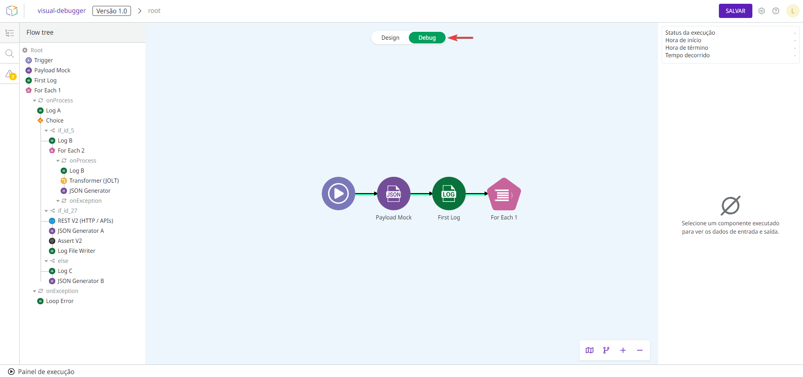

# Modos de design e debug

O canvas tem dois modos: _design_ e _debug_. Por padrão, ele abre no modo de _design_, onde você cria e edita seu fluxo. Ao executar o fluxo, o modo de _debug_ é ativado para ajudá-lo a rastrear o caminho de execução e ver mais informações sobre cada componente.

## Modo de design

O modo de _design_ é onde você faz seu trabalho. Neste modo você [configura os componentes e cria o fluxo](https://docs.digibee.com/documentation/v/pt-br/build/new-canvas-beta-restricted#crie-um-fluxo).

Enquanto você cria seu fluxo e antes de executar pela primeira vez, apenas o modo de _design_ fica ativo.

## Modo de debug

Para ativar o modo de _debug_, você deve abrir o [Painel de execução](https://docs.digibee.com/documentation/v/pt-br/build/new-canvas-beta-restricted/execution-panel) no modo de _design_ e executar o fluxo. O modo de _debug_ é ativado quando há mensagens na execução.


O modo de _debug_ não é ativado se:

* O fluxo não é executado.
* O número de mensagens é muito baixo.
* O limite de 2.000 mensagens foi atingido.


Uma vez executado o fluxo, você deve clicar no botão _**Debug**_ na parte superior da tela para entrar no modo de _debug_, conforme a imagem abaixo.


<figure><figcaption><p>Botão para acessar o modo de <em>debug</em>.</p></figcaption></figure>

No modo de _debug_, o caminho de execução é mostrado com uma linha verde. A linha tracejada e os componentes esmaecidos representam a parte do fluxo que não foi executada. Componentes vermelhos no fluxo significam que a execução falhou.

Veja uma ilustração desses elementos visuais:

<figure><figcaption><p>Caminho visual da execução do fluxo.</p></figcaption></figure>

Este modo é somente leitura, portanto você não pode editar o fluxo enquanto estiver nele. Para editar o fluxo, você deve voltar ao modo de _design_ clicando no botão _**Design**_.


As alterações feitas no modo de _design_ não serão visíveis no modo de _debug_ até que você execute o fluxo novamente. Isso é para facilitar a comparação, pois você pode visualizar o fluxo antigo enquanto edita o fluxo atual.


### Componentes no modo de debug

Ao clicar em algum dos componentes executados, você tem acesso às seguintes informações no lado direito da tela:

* _**Status**_** da execução:** _status_ da execução do componente, que pode ser "Sucesso" ou "Falha".
* **Hora de início:** o momento em que a execução do componente foi iniciada, em AAAA/MM/DD HH:mm:ss.SSS.
* **Hora de término:** o momento em que a execução do componente terminou, em AAAA/MM/DD HH:mm:ss.SSS.
* **Tempo decorrido:** o tempo decorrido durante a execução do componente, em milissegundos.
* _**Input**_**:** a entrada que o componente recebeu.
* _**Output**_**:** a saída que o componente envia.
* **Erros (apenas para componentes com falha):** o erro que ocorreu quando o componente falhou.

Além dessas informações, você também pode clicar no ícone de engrenagem para ver a configuração do componente em modo somente leitura.

### Mensagens no modo de debug

No Painel de execução, você pode acessar a aba **Mensagens** e dar um duplo clique em qualquer mensagem para ver no modo de _debug_ o momento em que a mensagem foi gerada durante a execução.

### Loops no modo de debug

Alguns componentes usados ​​no fluxo podem criar _loops_. Esses componentes são: [Do While](https://docs.digibee.com/documentation/v/pt-br/components/logic/do-while), [For Each](https://docs.digibee.com/documentation/v/pt-br/components/logic/for-each), [Stream Excel](https://docs.digibee.com/documentation/v/pt-br/components/files/stream-excel), [Stream File Reader](https://docs.digibee.com/documentation/v/pt-br/components/files/stream-file-reader), [Stream File Reader Pattern](https://docs.digibee.com/documentation/v/pt-br/components/files/stream-file-reader-pattern), [Stream JSON File Reader](https://docs.digibee.com/documentation/v/pt-br/components/files/stream-json-file-reader), [Stream XML File Reader](https://docs.digibee.com/documentation/v/pt-br/components/files/stream-xml-file-reader), e [Stream DB V3](https://docs.digibee.com/documentation/v/pt-br/components/structured-data/stream-db-v3).

Quando um _loop_ é criado, você pode navegar pelos índices no menu de navegação na parte inferior da tela. As três maneiras de navegar são usando as setas, clicando nos três pontos para abrir o índice desejado ou inserindo o índice no campo **Ir para**.

<figure><figcaption><p>Menu de navegação em componentes com <em>loops</em>.</p></figcaption></figure>

O índice do _loop_ atual é exibido no menu de navegação e também na trilha de navegação entre colchetes ( \[ ] ), por exemplo “For Each 1 (OnProcess) \[27]”. Neste caso o valor “\[27]” representa o _loop_ atual.

#### Loop dentro de um loop

Um fluxo pode conter _loops_ dentro de _loops_. Se você estiver em um **OnProcess** e quiser entrar em outro **OnProcess** no modo _debug_, pode se deparar com dois cenários diferentes:

**Cenário 1: acessando o OnProcess de um componente que foi executado**

Vamos supor que você esteja no **OnProcess** de um componente **For Each** (mais tarde chamado de “**For Each A**”) e esteja observando o _loop_ número 2. Então você está neste ponto do fluxo:

```
root > For Each A (onProcess) [2]
```

Dentro do loop número 2 deste **OnProcess**, existe outro **For Each**, o qual chamaremos de “**For Each B**”, que foi executado. Ao acessar o **OnProcess** do **For Each B**, o subfluxo será a continuação do caminho que você visualizou no nível anterior.

Agora, você está neste ponto do fluxo:

```
root > For Each A (onProcess) [2] > For Each B (onProcess) [0]
```

**Cenário 2: acessando o OnProcess de um componente que não foi executado**

Vamos supor que você esteja de volta ao **OnProcess** do **For Each A**, mas agora no _loop_ número 5. Então você está neste ponto do fluxo:

```
root > For Each A (onProcess) [5]
```

No _loop_ 5, o **For Each B** não foi executado, mas você ainda pode acessar seu **OnProcess** normalmente. Ao acessar o **OnProcess**, o modo _debug_ corresponderá automaticamente ao nível anterior do caminho de execução onde o subfluxo de **For Each B** foi executado.

Como o **For Each B** foi executado no loop 2, a trilha de navegação é atualizada para:

```
root > For Each A (onProcess) [2] > For Each B (onProcess)[0]
```

Se você retornar ao nível **For Each A**, verá o _loop_ 2 em vez do _loop_ 5.

### Importar execução no modo de debug

Ao importar uma execução para o canvas, o modo de _debug_ é ativado e você pode analisar a execução no modo somente leitura.


A execução importada será aberta no modo de _debug_ somente se a execução tiver sido exportada após o lançamento dos modos de _design_ e _debug_.


## Navegação no canvas no modo de design e debug

A navegação no canvas, que inclui a [_flow tree_](https://docs.digibee.com/documentation/v/pt-br/build/pipelines/pipeline-navigation#flow-tree), [campo de busca](https://docs.digibee.com/documentation/v/pt-br/build/pipelines/pipeline-navigation#campo-de-busca), e [alertas do linter](https://docs.digibee.com/documentation/v/pt-br/build/pipelines/validacao-de-construcao-do-pipeline), sempre leva em consideração o modo em que você está.

Por exemplo, se você adicionar um novo componente no modo de _design_, poderá vê-lo na _flow tree_, encontrá-lo por meio da busca e ver os alertas do _linter_. No entanto, se você não executar o fluxo, o componente não existirá no modo de _debug_ e não será encontrado na _flow tree_ ou na busca, nem terá alertas.
