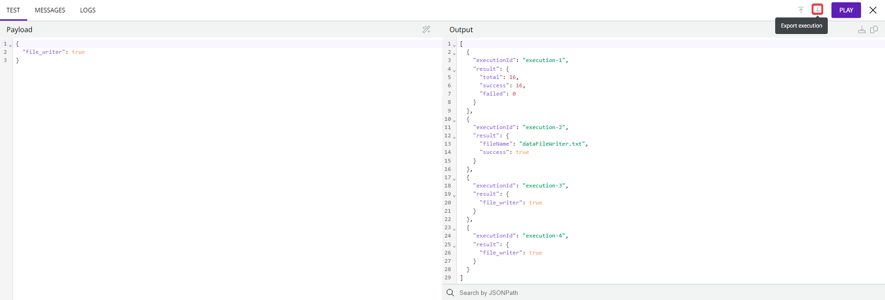
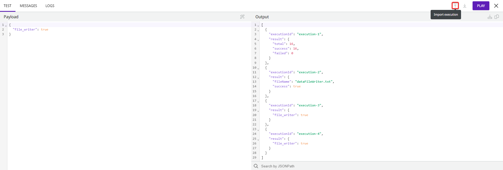

# Execution panel


This feature was named "Test mode" until June 2023.


Using Execution panel, you can test a [pipeline](https://docs.digibee.com/documentation/build/pipelines) or [capsule](../capsulas/) on canvas before deploying it. This is useful for testing implementation logic, debugging and troubleshooting.

To open the Execution panel, click **Execution panel** in the lower left corner of canvas.

## How the Execution panel works

The Execution panel runs the pipeline or capsule in the test environment and validates the integration logic. In addition, it uses test values registered in the Globals, Accounts, Relationship, and Multi-instance services.

The feature is available in both pipelines and capsules. The only difference is that in capsules, when testing the execution, you must enter the parameters defined in the configuration form, if required. For more information, see the [Test tab](execution-panel.md#test-tab).


If you try to execute too many transactions in the Execution panel, an “Out of Memory” error may be issued.


## Overview of the Execution panel functionalities

The Execution panel has three tabs where you can debug your pipeline or capsule.

### Test tab

The Test tab allows you to enter the desired input data into the **Payload** column directly below the Test title. You can see the execution result in the **Output** column alongside **Payload**.

<figure><figcaption></figcaption></figure>

#### Payload column

In the **Payload** column, you can enter input data to test your pipeline or capsule. Once you have entered the data, click the **Format JSON** button in the upper right to format your JSON.

To run the execution, click **Play**. Each execution lasts up to 60 seconds, but you can interrupt it at any time by clicking **Stop**.

When a pipeline is multi-instance, a **Multi-instance** dropdown menu is displayed to select the instance to execute.&#x20;

#### Output column

In the **Output** column, you can see the result of the execution.

To download the output to your computer in JSON format, click the **Download JSON** button, or copy the output information to your clipboard by clicking **Copy JSON**.

You can use the **Search for a JSONPath** field in the output information to create expressions for selecting and filtering JSON elements from the JSON output.

### Messages tab

The **Messages** tab displays the result of the execution of each component. A component always receives the payload generated by the previous component, processes this payload based on its function, and generates a new payload in response.

<figure><figcaption></figcaption></figure>

#### List of messages

The first 2000 messages are listed in the left column of the **Messages** tab. In this area you can see the name of the message (which is the same as the Step Name of the component) and the time it took to execute it.

To see a specific message, use the **Search for messages** field below the list of messages. You can enter the name of the message, part of the name of the message, or a parameter.

#### Message preview&#x20;

To see the preview of each message, click the mouse on the desired message and navigate with the arrow keys on the keyboard to see the other message previews.

To download the message preview JSON or copy it to your clipboard, click the buttons in the upper right corner of the **Message preview** column.

Besides, the **Search for a JSONPath** field allows you to create expressions for selecting and filtering JSON elements from the JSON of the message preview.

### Logs tab

The **Logs** tab contains information about the event logs that occur during the execution of a pipeline in the Execution panel, and allows visualization of individual logs in a dedicated section.

<figure><figcaption></figcaption></figure>

#### List of logs

In the list of logs you can see the following information:

* **Log level:** the classification of the log, represented by an icon. The levels are: &#x20;
  * **Info:** informative logs.
  * **Error:** logs with an error during execution.
  * **Warning:** logs that contain a warning.&#x20;
* **Timestamp:** the date and time the step was executed.
* **Log message:** the messages in each log, for example the event’s records concerning the execution of the pipeline.

#### Actions

On the **Logs** tab, click the **Filter** button to specify the log levels to list.

To copy the contents of the log message to your clipboard, click the **Copy log message** button in the right corner of the log whose contents you want to save.

You can also search for a specific log by entering part of the text or the full text of the log message in the **Search for logs** field below the list of logs.

### Export and import&#x20;

#### Export

Click the **Export execution** button to download the file with pipeline or capsule configurations and execution data. Wait until all execution data is loaded on the screen before exporting the file so that no information is missing.\

<figure><figcaption></figcaption></figure>

The file contains the following data:

* `pipelineId`: the ID of the pipeline or capsule.
* `pipelineName`: the name of the pipeline or capsule.
* `currentFlowSpec`: the pipeline or capsule flow information available in canvas at the time the file is exported, including all components and their configurations.&#x20;
* `executedFlowSpec`: the pipeline or capsule flow information at the time of the execution, including all components and their configurations,&#x20;
* `realm`: the realm of the pipeline or capsule.
* `execution`: the execution data. Contains the **Payload**, **Output**, **Messages**, and **Logs**.


If you don't execute before exporting the file, only the pipeline or capsule related information (such as the ID and name), the `currentFlowSpec`, and the `executedFlowSpec`will be available in the file.


#### Import

Click the **Import execution** button to import a file from your computer that contains the pipeline or capsule configurations and execution data.

<figure><figcaption></figcaption></figure>

Once you import the file, the `execution` data will be displayed in the Execution panel. However, the `currentFlowSpec` and `executedFlowSpec` data won’t be displayed in the canvas.


You can only run the execution of an imported file if you are in the same pipeline or capsule from which the execution was exported and if the original flow still exists.


## Additional information

### Execution panel timeout

For runs in the Execution panel, the front end waits up to 60 seconds for a response. If there is no response, a timeout occurs, but the execution continues in the background for up to 5 minutes. To analyze this execution, go to the Monitor page, click **Pipeline Logs**, type "test-mode" in the **Pipeline Name** filter, and search.

You can also analyze the execution on the Monitor page if you lose your internet connection.

### Keyboard shortcuts

* To open or close the Execution panel: CTRL+D; Cmd+D.
* To run the Execution panel: CTRL+Enter; Cmd+Enter.
