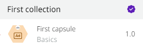

# Capsules

## What are Capsules?

Capsules are a set of configured components that are encapsulated to be reused in Pipelines construction. Since they allow modularizing business logic, it becomes easier to manage, maintain, and update individual parts of the system, as well as decrease the pipeline building time.

It's like the components available in the Platform are atoms and the Capsules are molecules that group the atoms into more complex tasks to solve a specific issue.

## How to use Capsules?

To use a Capsule, follow these steps:

* [Create a collection](how-to-use-capsules/how-to-create-a-capsule-collection/)
* [Create a group](how-to-use-capsules/how-to-create-a-capsule-group.md)
* [Configure a Capsule](how-to-use-capsules/how-to-configure-a-capsule.md)
* [Build a Capsule](how-to-use-capsules/how-to-build-a-capsule.md)
* [Test a Capsule](how-to-use-capsules/how-to-test-a-capsule.md)
* [Save a Capsule](how-to-use-capsules/how-to-save-a-capsule.md)
* [Publish a Capsule](how-to-use-capsules/how-to-publish-a-capsule.md)

## FAQ (Frequently Asked Questions)

What are the solutions offered by Capsules?

The essence of Capsules is to provide the market with ready-made, tested and validated integrations to get a better internal or external connection in a documented way. It allows a company to modernize its IT and its partner companies to use offers with security and simplicity.

For example, imagine a company where there are multiple relevant data flows for all areas – authentication, customer requests, inventory queries, and others. For these data flows, it’s possible to create pipelines that distribute the services, but it’s also necessary to document, catalog and maintain the deployed pipeline.

By making the flows from any part of a pipeline more accessible, you can set broader business goals. That's why we developed this functionality that brings together flows and makes them reusable and self-documenting, just like our core components. This way, the flows become easier to use and familiar across your organization – all you need to do is consult the components palette.

The Capsules contain the core components of the Digibee Integration Platform, which means they have all the functionality that these components offer.

<strong>Who can create Capsules?</strong>

Capsules can be created by you, if you have the [necessary permissions](https://docs.digibee.com/documentation/administration/new-access-control/access-control-roles), and also by Digibee and its partners to make available for use.

When a Capsule is created, you can specify the parameters, the documentation, the interface, and also the instructions for use. The freedom to create Capsules comes with all these features and the documentation remains in the component itself.

<strong>Can I use Capsules in my ecosystem of partners and customers?</strong>

Yes. It’s possible to have Capsules with ready integration between a company's system and its partner. Capsules can also be reused for other partners with similar use cases.

For example, a bank can use a Capsule for microcredit with the POS (Point of Sale) systems of different pharmacy chains.

<strong>Is the Capsule secure to share my sensitive data with?</strong>

Yes. The Digibee Integration Platform has a variety of features to protect your data in transit and at rest when we are responsible for it.

Because Capsules are embedded in an organization's pipeline, they run in isolation, even within your own organization. In addition, Capsules run in a shared environment and never individually.

<strong>Are the Capsules compatible with the information needs of my legacy?</strong>

Yes. Capsules consist of the core components of the Digibee Integration Platform used in the pipelines, and therefore have all the functionality that these components offer.

<strong>Do Capsules help in the migration of systems to the cloud?</strong>

Yes. When cloud migration happens, it’s very important to have coexistence strategies with on-premises. For example, by incorporating Capsules into this strategy, it’s possible to develop solutions that register data on-premises, in the cloud, or both.

In addition, the Digibee Integration Platform has a wide range of Capsules available for cloud native solutions.

<strong>Does the Digibee Integration Platform provide support for expanding my business system with Capsules?</strong>

Yes. The Digibee Integration Platform has a Delivery team specialized in Capsules that supports all customers in the creation and development of projects for any company, including the creation of public Capsules (created at the request of the company).

<strong>What is the limit for using Capsules in my pipelines?</strong>

The platform doesn’t set quantitative limits on the components that can be used in the pipeline, whether they are core components or Capsules. However, the pipeline has limits, such as the number of concurrent executions, timeout, and controlled capacity in deployment when SMALL, MEDIUM, or LARGE is selected.

<strong>Why is it necessary to inform a Capsule output contract?</strong>

Since Capsules are reusable components in pipelines, we use the output contract of the JSON Schema specification to ensure that pipelines have clarity and security of response information. In addition, the output contract also supports Capsule versioning automation.

<strong>How do I know which Capsules have been created by Digibee?</strong>

Capsules created by Digibee are marked with the certificate icon (checkmark icon ). See below how to identify them:

<strong>Can Capsules be published for other customers?</strong>

No. Capsules have a set of permissions that are managed by Digibee. These permissions determine which users can make a Capsule public.

<strong>Can customer partners publish public Capsules?</strong>

No. This configuration is not yet available, but is under review for future possibilities.

<strong>Can Capsules with the same functionality not be used by different customers?</strong>

Yes. Capsules are restricted to the particular company that uses them.

<strong>How does the process of updating Capsules in my pipelines work?</strong>

The Digibee Integration Platform never makes direct changes to the structure or information of deployed pipelines. Therefore, the use of Capsules works with [versioning](capsules-versioning.md).

When you add a Capsule to your pipeline, you link it to the "Major" or "Minor" version of the Capsule. The "Fix" version is not linked because the pipeline always automatically gets the latest "Fix" version when a new deployment is made or when the Execution panel is run on the pipeline canvas.

As mentioned in the [Capsules versioning documentation](capsules-versioning.md), the "Fix" version is only changed if the change does not affect the pipeline. Pipelines are not affected or updated by "Major" or "Minor" versions of a Capsule that is part of its compilation. To use this Capsule, an Integration Analyst responsible for the pipeline must apply it manually.

<strong>How do I control access to Capsules within my organization?</strong>

You can use a set of permissions that allow you to control the specific functions to fully manage the lifecycle of your Capsules. Read more in the [Roles documentation](https://docs.digibee.com/documentation/administration/new-access-control/access-control-roles).

<strong>Why can't I use the Object Store, Digibee Storage, and Relationship inside a Capsule?</strong>

These components are native resources of your realm. Therefore, they are automatically authorized for the controlled context of the realm. Since a Capsule can be created for use by other realms, it's not possible to authorize access to data from these components within the Capsule.

