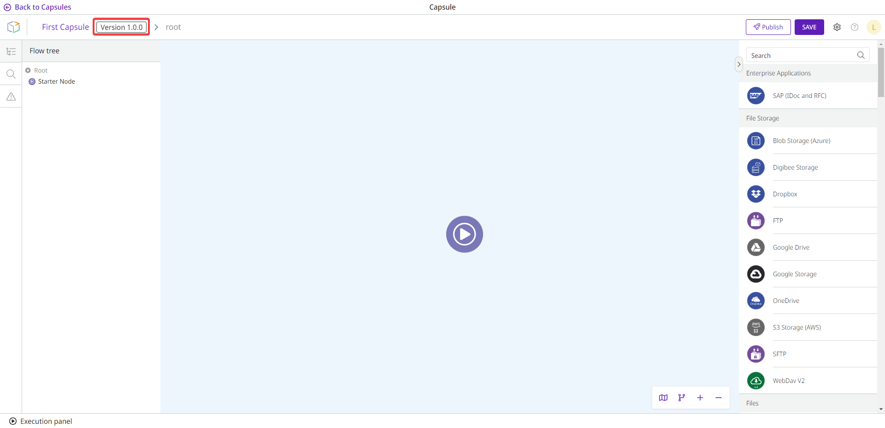

# Capsules versioning

Capsules have a version control consisting of 3 levels represented by: 1.0.0. The first number is called “Major”, the second number is called “Minor”, and the third number is called “Fix”.

When versions need to be updated, the Digibee Integration Platform automatically analyzes the Capsule after each change to determine versioning level values.

See how the levels are determined:

* **Fix:** version of the Capsule when no impactful changes are made in the pipelines that use it. It increments Fix by 1 (0.0.1).
* **Minor:** version of the Capsule when a configuration item (input or output) is added or becomes optional. Increases Minor by 1 (0.1.0).
* **Major:** version of the Capsule when a configuration item (input or output) is deleted or becomes mandatory. This version is also applicable when the Capsule contract is completely changed. It increases Major by 1 (1.0.0).

These changes are only made if the changed version has already been published. For example, if you create a Capsule, it will initially be given the version "1.0.0". If you don’t publish it, this version will never change, regardless of whether you make updates to the Capsule or not.

After you publish the Capsule, the version “1.0.0” is defined as not editable. When a new update is made in the same Capsule, the Platform checks what has been changed to determine if the version number should be added to Major, Minor or Fix.

The version number is displayed next to the Capsule name.

<figure><figcaption></figcaption></figure>
