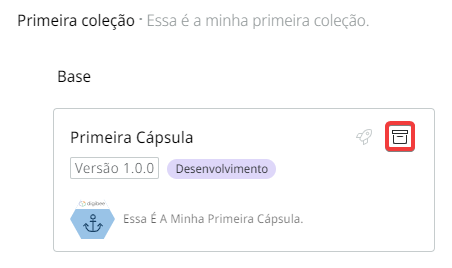
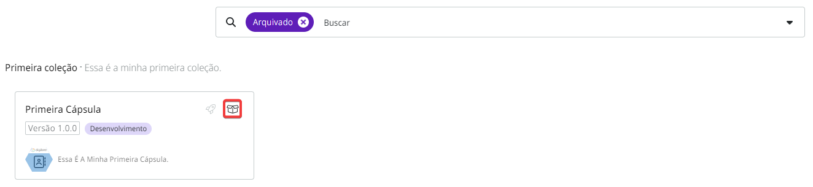

# Como arquivar e restaurar uma Cápsula

## Como arquivar uma Cápsula

Siga estas etapas para arquivar uma Cápsula:

1. Na página _Build_, clique na aba **Cápsulas**.
2. No lado esquerdo da tela, clique na coleção que contém a Cápsula que você deseja arquivar.
3. No cartão da Cápsula, clique no botão **Arquivar** representado por um ícone de arquivo.

<figure><figcaption></figcaption></figure>

## Como restaurar uma Cápsula

Siga estas etapas para restaurar uma Cápsula:

1. Na página _Build_, clique na aba **Cápsulas**.
2. No campo de pesquisa, clique na seta e selecione o filtro **Arquivado**. As Cápsulas arquivadas na Coleção serão exibidas.
3. Clique no botão **Restaurar Cápsula**, representado por um ícone de caixa aberta.

<figure><figcaption></figcaption></figure>
