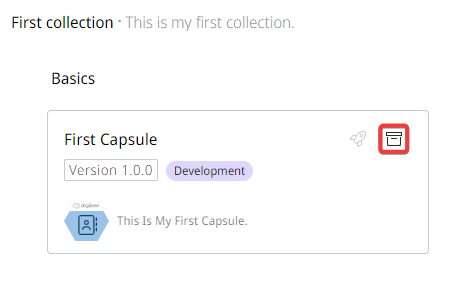
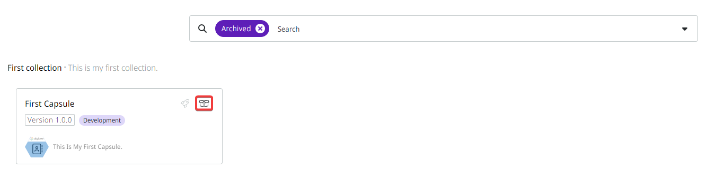

# How to archive and restore a Capsule

## How to archive a Capsule

Follow these steps to archive a Capsule:

1. On the Build page, click the **Capsules** tab.
2. On the left side of the screen, click the collection that contains the Capsule you want to archive.
3. In the Capsule card, click the **Archive** button represented by an archive icon.

<figure><figcaption></figcaption></figure>

## How to restore a Capsule

Follow these steps to restore a Capsule:

1. On the Build page, click the **Capsules** tab.
2. In the search field, click the arrow and select the **Archived** filter. The archived Capsules in the Collection are displayed.
3. Click the **Restore Capsule** button, represented by an open box icon.

<figure><figcaption></figcaption></figure>
