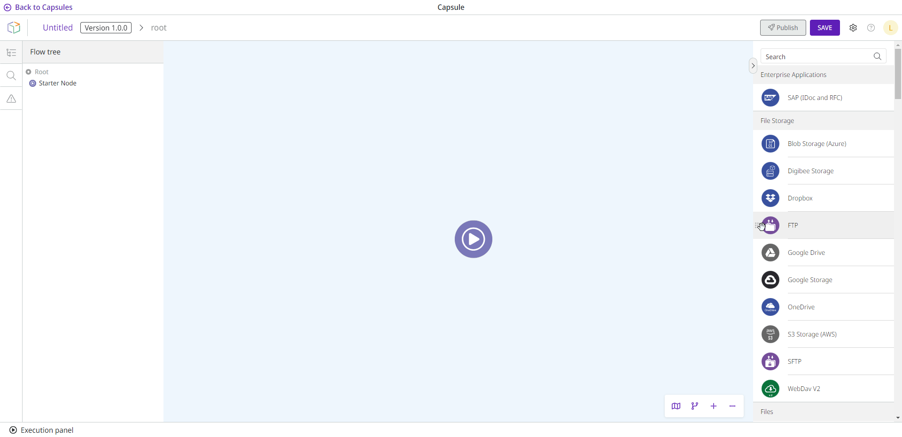
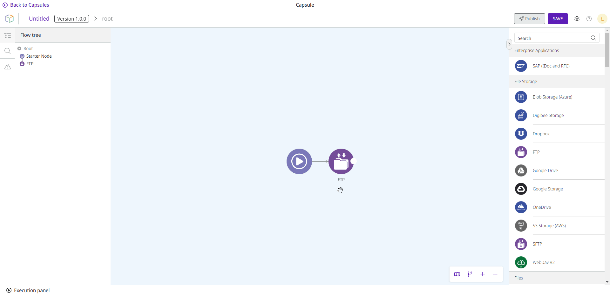

# How to build a Capsule

Follow these steps to create an integration flow in a Capsule:

1. Drag the desired component from the components palette on the right side of the screen.
2. Drop the component into the Capsule creation environment (referred to later in this document as just “Capsule canvas”).
3. Connect the component to the **Starter Node**.

<figure><figcaption></figcaption></figure>


Only core components are supported in Capsules. Among them, the following components are not supported: Object Store, Digibee Storage, and Relationship. Learn more about each component in the [Components documentation](https://docs.digibee.com/documentation/components/).


4. To access the configuration of the component, move the mouse cursor over the component and click the **Configurations** button represented by a gear icon.
5. On the right side of the screen, a page will open with a configuration form. After you have configured the component, click **Confirm** to save your changes. If you close the window before clicking **Confirm**, all data will be lost.
6. To delete the connection between two components, move the mouse cursor over the line and click the **Delete** button represented by a trash icon. You must confirm the deletion by clicking the button with the **X** icon one more time.
7. To delete a component, move the mouse cursor over it and click the **Delete** button represented by a trash icon. You will have to confirm the deletion by clicking the button with the **X** icon one more time.

<figure><figcaption></figcaption></figure>

You can navigate in the Capsule canvas in the same way as in the Pipeline. Navigation includes the [flow tree, search, and minimap](https://docs.digibee.com/documentation/build/pipelines/pipeline-navigation). In addition to the same navigation, the Capsule canvas also provides you with the [Linter function](https://docs.digibee.com/documentation/build/pipelines/pipeline-building-validation), which is a building validator.
