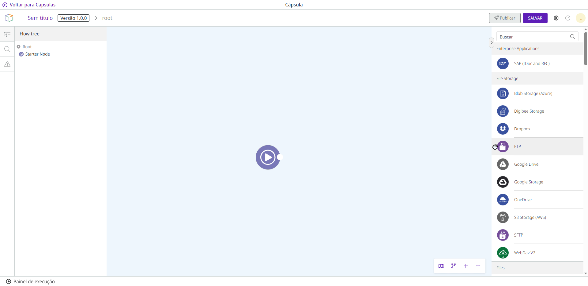
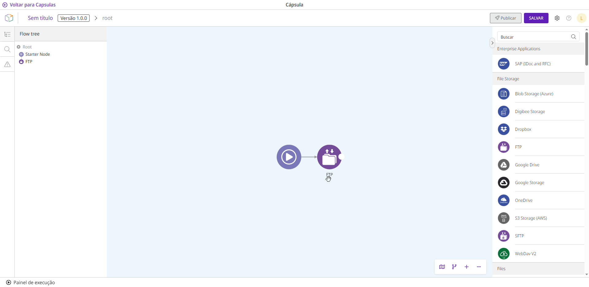

# Como construir uma Cápsula

Siga estas etapas para criar um fluxo de integração em uma Cápsula:

1. Arraste o componente desejado da paleta de componentes no lado direito da tela.
2. Solte o componente no ambiente de criação da cápsula (referido mais adiante neste documento como apenas “canvas”).
3. Conecte o componente ao _**Starter Node**_.

<figure><figcaption></figcaption></figure>


Apenas os componentes _core_ são suportados em Cápsulas. Entre eles, os seguintes componentes não são suportados: Object Store, Digibee Storage, e Relationship. Saiba mais sobre cada componente na [documentação de Componentes](https://docs.digibee.com/documentation/v/pt-br/components/).


4. Para acessar a configuração do componente, mova o cursor do mouse sobre o componente e clique no botão **Configurações** representado por um ícone de engrenagem.
5. No lado direito da tela, será aberta uma página com um formulário de configuração. Depois de você configurar o componente, clique em **Confirmar** para salvar suas alterações. Se você fechar a janela antes de clicar em **Confirmar**, todos os dados serão perdidos.
6. Para excluir a conexão entre dois componentes, mova o cursor do mouse sobre a linha e clique no botão **Remover** representado por um ícone de lixeira. Você deve confirmar a exclusão clicando no botão com o ícone **X** mais uma vez.
7. Para excluir um componente, mova o cursor do mouse sobre ele e clique no botão **Remover** representado por um ícone de lixeira. Você terá que confirmar a exclusão clicando no botão com o ícone **X** mais uma vez.

<figure><figcaption></figcaption></figure>

Você pode navegar no canvas de Cápsula da mesma forma que no _Pipeline_. A navegação inclui a [_flow tree_, busca e minimapa.](https://docs.digibee.com/documentation/v/pt-br/build/pipelines/pipeline-navigation) Além da mesma navegação, o canvas de Cápsulas também oferece a [função Linter](https://docs.digibee.com/documentation/v/pt-br/build/pipelines/validacao-de-construcao-do-pipeline), um validador de construção do fluxo.
