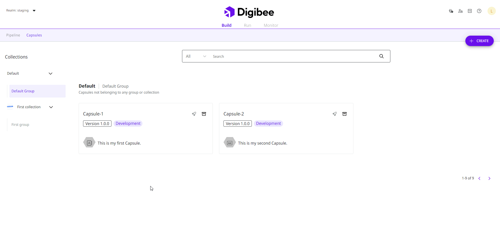

# How to change a Capsule collection or group


The features for saving Capsules in a default collection and group and for moving Capsules between collections and groups are currently in beta phase. Learn more about the [Beta Program](https://docs.digibee.com/documentation/general/beta-program).


Follow these steps to change the Capsule collection or group:

1. On the **Build** page, click the **Capsules** tab.
2. Move the mouse pointer over the Capsule you want to move. A draggable icon will appear in the bottom right corner of the card.
3. Hold down the mouse button over the icon and drag the Capsule to the collection or group you want to move to.
4. A confirmation message will appear on the screen. Check the information and click **Move** to confirm the action.

<figure><figcaption></figcaption></figure>
