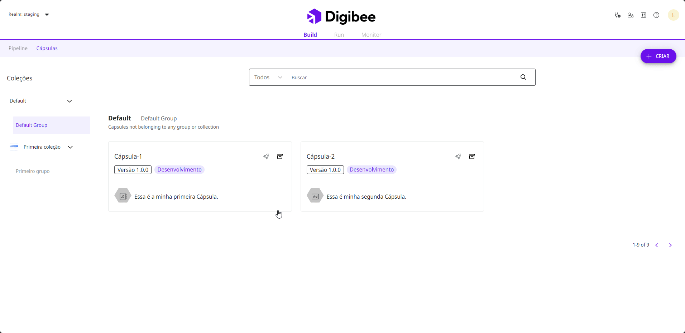

# Como mudar uma Cápsula de coleção ou grupo


As funcionalidades de salvar Cápsulas em uma coleção e grupo _default_ e de mover Cápsulas entre coleções e grupos estão atualmente em fase beta. Entenda mais sobre o [Programa Beta](https://docs.digibee.com/documentation/v/pt-br/geral/programa-beta).


Siga estas etapas para mudar uma Cápsula de coleção ou grupo:

1. Na página **Build**, clique na aba **Cápsulas**.
2. Mova o ponteiro do mouse sobre a Cápsula que deseja mover. Um ícone arrastável aparecerá no canto inferior direito do cartão.
3. Mantenha pressionado o botão do mouse sobre o ícone e arraste a Cápsula para a coleção ou grupo que deseja mover.
4. Uma mensagem de confirmação aparecerá na tela. Confira as informações e clique **Mover** para confirmar a ação.

<figure><figcaption></figcaption></figure>
