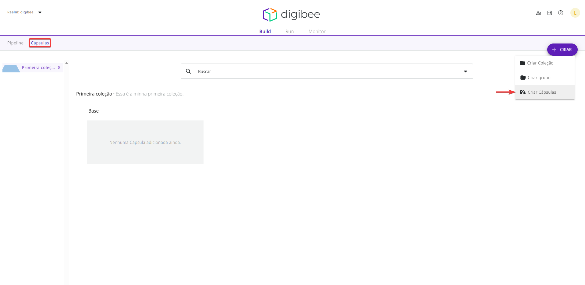
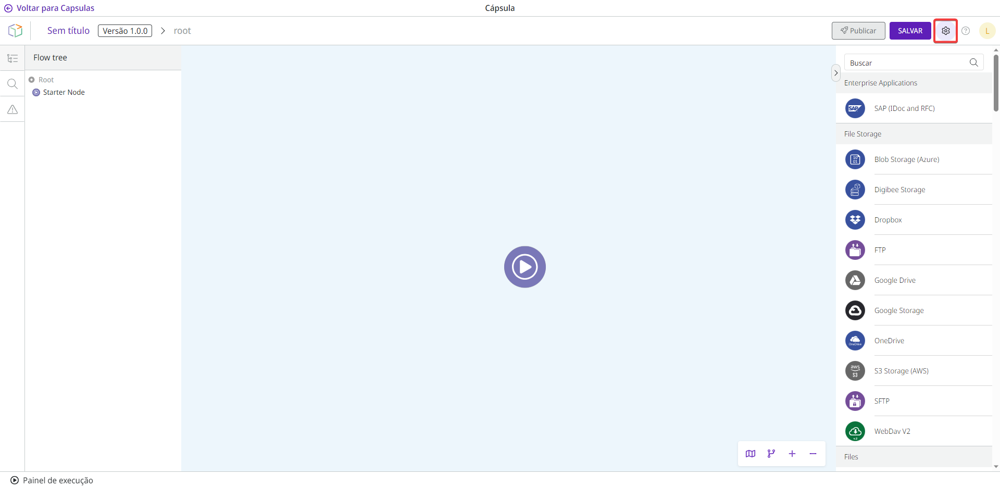
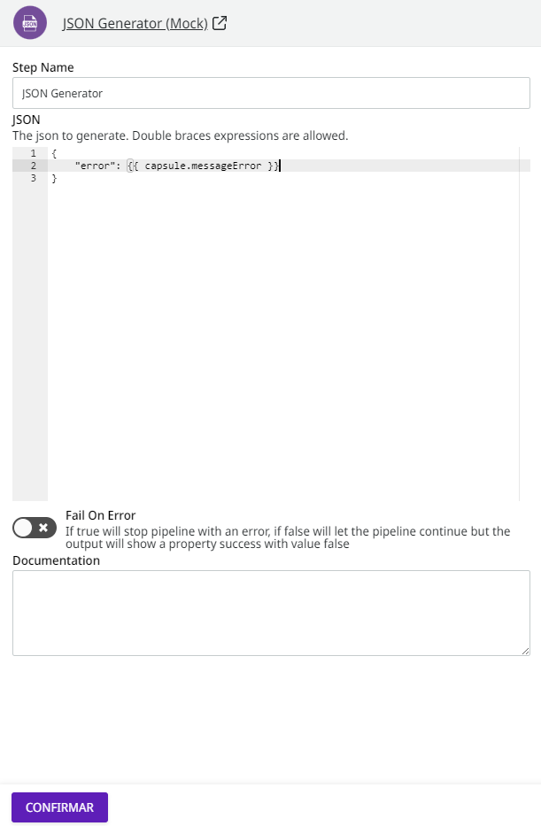

# Como configurar uma Cápsula

## Como criar uma Cápsula

Siga estas etapas para criar uma Cápsula:

1. Na página _Build_, clique na aba **Cápsulas**.
2. Clique no botão **Criar** no canto superior direito.
3. Selecione a opção **Criar Cápsulas**.

<figure><figcaption></figcaption></figure>

## Como configurar uma Cápsula

Dentro da Cápsula, clique no ícone de engrenagem no canto superior direito da tela (ao lado do botão **Salvar**) para começar a configurar a Cápsula.

<figure><figcaption></figcaption></figure>

Uma nova página com um formulário de configuração será aberta no lado direito da tela. O formulário contém quatro abas: Parâmetros, Contas, Documentação e Contrato.


Para publicar a Cápsula, você deve preencher o campo **Saída** na aba Contrato.


### Aba Parâmetros

Na aba Parâmetros, defina os parâmetros da Cápsula.

Os parâmetros são um contrato de uso. Eles definem os parâmetros específicos que devem e devem ser fornecidos para atender aos requisitos da Cápsula e de todos os componentes que ela contém. Esses parâmetros são exibidos no momento em que você usa a Cápsula em um _pipeline_.

Para criar um parâmetro, preencha os campos:

* _**Property**_**:** a propriedade do parâmetro. A estrutura da propriedade é: `params.property`, por exemplo, `params.messageError`.


Se você não escrever a palavra `params` na expressão, ela será adicionada automaticamente quando você salvar o formulário de configuração.


* _**Label**_**:** o nome do parâmetro a ser exibido no formulário, por exemplo “MESSAGE ERROR”.
* _**Description**_**:** a descrição do parâmetro, por exemplo “Esta é uma mensagem indicando um erro”.
* _**Default Value**_**:** o valor padrão do parâmetro, por exemplo “Ocorreu um erro nesta aplicação”.
* _**Component Type**_**:** o tipo do componente. As opções são: _**Text**_, _**Textarea**_, _**Code**_, _**Select**_, _**Toggle**_, _**Number**_, _**Tags**_ e _**Key Value**_.

Você pode ver a prévia do formulário no lado direito da tela.

Para reordenar os parâmetros, use as setas (ao lado do botão _**Remove**_) ou ative a opção **Habilitar reordenação**.

#### Como usar o parâmetro em um componente

Para utilizar o parâmetro declarado em um componente, proceda da seguinte forma:

1. No ambiente da Cápsula, abra o componente que deseja adicionar o parâmetro. O componente deve suportar [expressões Double Braces](https://docs.digibee.com/documentation/build/double-braces).
2. Crie uma expressão _Double Braces_ (`{{ }}`) no componente.
3. Dentro da expressão, escreva a palavra reservada `capsule.` (substitui a palavra `params.`) e em seguida insira o nome da propriedade, criando a seguinte estrutura: `capsule.property`.

A expressão completa seria semelhante a este exemplo: `{{ capsule.messageError }}`.

<figure><figcaption></figcaption></figure>

### Aba Contas

Na aba Contas, especifique um nome e uma descrição para as contas a serem usadas em componentes _core_ para autenticação em _endpoints_ (por exemplo, REST).

Ao contrário dos _pipelines_, que exibem todas as contas registradas no _realm_, as Cápsulas permitem especificar o tipo de conta que você espera que o usuário selecione ao usar componentes no _pipeline_.

Na aba Contas, preencha os campos:

* _**Name**_**:** dê um nome para a conta.
* _**Description**_**:** insira uma breve descrição sobre o tipo de conta que deve ser selecionada no _pipeline_.

Você pode reordenar as contas usando as setas (ao lado do botão _**Remove**_) ou ativando a opção **Habilitar reordenação**.

### Aba Documentação

Na aba Documentação, no campo **Texto**, registre informações detalhadas e relevantes sobre o funcionamento da Cápsula e para futuras manutenções. Esta é uma área de texto livre, mas recomendamos o uso de _Markdown_.

O conteúdo é destinado exclusivamente aos desenvolvedores da Cápsula em seu _realm_. Portanto, não está disponível para usuários da Cápsula.

### Aba Contrato

Na aba Contrato, no campo **Saída**, defina a estrutura de saída do seu componente personalizado no formato JSON Schema. Esta é uma configuração que garante que a estrutura dos dados da execução da Cápsula esteja sempre de acordo com o JSON Schema definido pelo desenvolvedor.

É obrigatório adicionar um JSON Schema para publicar a Cápsula. Um JSON Schema bem definido traz mais segurança para quem utiliza a Cápsula.


Alterações no JSON Schema que resultam em quebra de contrato atualizam automaticamente a versão da Cápsula para garantir que _pipelines_ não sejam afetados. Leia mais sobre o [versionamento de Cápsulas](../versionamento-de-capsulas.md).

