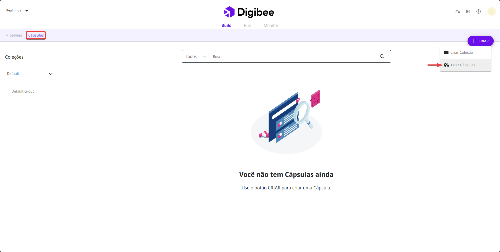
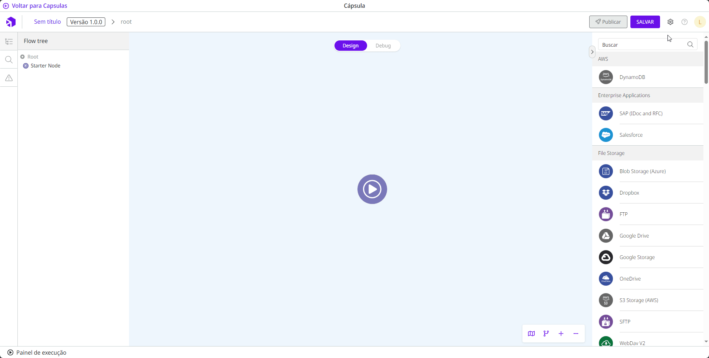
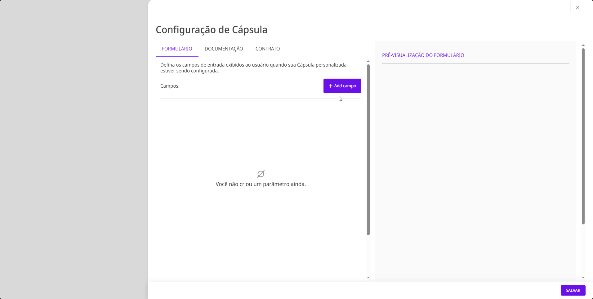
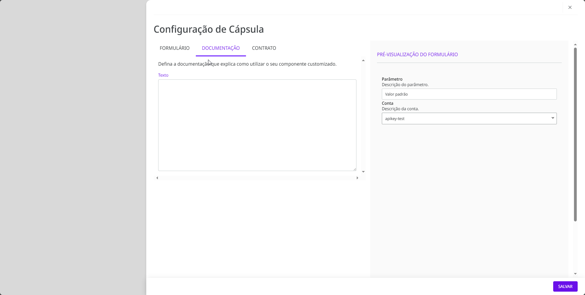

# Como configurar uma Cápsula

## Como criar uma Cápsula

Siga estas etapas para criar uma Cápsula:

1. Na página **Build**, clique na aba **Cápsulas**.
2. Clique no botão **Criar** no canto superior direito.
3. Selecione a opção **Criar Cápsulas**.

<figure><figcaption></figcaption></figure>

## Como configurar uma Cápsula

Dentro da Cápsula, clique no ícone de engrenagem no canto superior direito da página (ao lado do botão **Salvar**) para começar a configurar a Cápsula.

<figure><figcaption></figcaption></figure>

Uma página lateral com a configuração da Cápsula será aberta. A página contém três abas: **Formulário**, **Documentação** e **Contrato**.

No lado direito você verá a **Pré-visualização do formulário**. Ela mostra como o formulário será exibido para o usuário final quando ele configurar a Cápsula em um _pipeline_.

### Aba Formulário

Na aba **Formulário**, você pode adicionar parâmetros e variáveis ​​de conta ao seu formulário da Cápsula.

Depois de criar [parâmetros](how-to-configure-a-capsule.md#adicionando-um-parametro) e [variáveis de conta](how-to-configure-a-capsule.md#adicionando-uma-conta), você pode expandir ou recolher os campos clicando no ícone de **seta** ou reorganizá-los clicando no ícone **mover** e arrastando o campo para a posição desejada.

Se você quiser excluir um parâmetro ou conta, clique no ícone do **cesto de lixo** e então em **Remover** na caixa de diálogo.

#### Adicionando um parâmetro

Um parâmetro é uma configuração personalizável que permite adaptar o comportamento da Cápsula a necessidades e requisitos específicos.

Por exemplo, todos os componentes da Plataforma possuem alguns parâmetros que podem ser configurados para ajustar o comportamento do componente às necessidades específicas do usuário que o configura. Ao criar a Cápsula, você define os parâmetros que serão configurados quando a Cápsula for usada em um _pipeline_.

Siga estas etapas para criar um novo parâmetro:

1. Dentro da aba **Formulário**, clique em **Add campo**.
2. Selecione a opção **Parâmetro**.
3. Um novo parâmetro será exibido no formulário. Preencha os seguintes campos:

* **Label:** o nome do parâmetro a ser exibido no formulário.
* **Propriedade:** a propriedade do parâmetro.
* **Texto de ajuda:** a descrição do parâmetro. Use este campo para descrever detalhadamente para que o parâmetro é usado.
* **Tipo de campo:** o tipo de campo a ser adicionado ao formulário. As opções são:
  * **Text:** um campo de texto pequeno é exibido no formulário.
  * **Number:** um campo de número é exibido no formulário.
  * **Select:** um campo de seleção é exibido no formulário. Para configurar as opções de seleção, insira cada opção no campo **Selecionar opções** e pressione a tecla **Enter** para adicioná-lo ao formulário.
  * **Code:** um campo de código é exibido no formulário.
  * **Key Value:** um par de chave-valor é exibido no formulário.
  * **Text Area:** um campo de texto expansível é exibido no formulário.
  * **Toggle:** um botão liga/desliga é exibido no formulário.
* **Valor padrão:** o valor que deve ser exibido no parâmetro por padrão. Nem todos os tipos de parâmetros possuem um valor padrão.

4. Para tornar o parâmetro obrigatório na configuração da Cápsula, ative a opção **Obrigatório**.

<figure><figcaption></figcaption></figure>


Saiba mais sobre como usar uma propriedade de um parâmetro em um componente dentro da Cápsula em [Como referenciar dados usando Double Braces](https://docs.digibee.com/documentation/v/pt-br/build/double-braces/how-to-reference-data-using-double-braces#referenciando-propriedades-de-capsula).


#### Adicionando uma conta

As contas podem ser configuradas pelos usuários na Plataforma para garantir a segurança dos processos de autenticação e o armazenamento de dados confidenciais, como senhas, chaves privadas e _tokens_ de autenticação. Eles são usados ​​para verificar o acesso aos _endpoints_. Aprenda mais sobre [como configurar uma conta](https://docs.digibee.com/documentation/v/pt-br/settings/accounts#informacoes-basicas-das-contas).

Nas Cápsulas, ao adicionar uma conta ao formulário, você cria uma variável de conta. Essa variável de conta é definida posteriormente quando o construtor da Cápsula testa o fluxo no Painel de execução ou quando o usuário final configura a Cápsula no _pipeline_.


No formulário de configuração dos componentes dentro da Cápsula, você só pode selecionar a variável de conta que você configurou no formulário da Cápsula. No entanto, se você testar a Cápsula no Painel de execução ou usá-la em um fluxo de _pipeline_, poderá selecionar qualquer conta criada no _realm_.


Siga estas etapas para adicionar uma variável de conta:

1. Dentro da aba **Formulário**, clique em **Adicionar campo**.
2. Selecione a opção **Conta**.
3. A nova conta será exibida no formulário. Preencha os seguintes campos:

* **Label:** o nome do campo da conta a ser exibido no formulário de configuração da Cápsula.
* **Texto de ajuda:** uma breve descrição sobre a conta a ser selecionada.

4. Para tornar a conta obrigatória na configuração da Cápsula, ative a opção **Obrigatório**.

<figure><figcaption></figcaption></figure>

### Aba Documentação

Na aba **Documentação**, adicione conteúdo para registrar informações detalhadas e relevantes sobre o funcionamento da Cápsula e para futuras manutenções.

O conteúdo é destinado exclusivamente aos construtores de Cápsulas em seu _realm_. Portanto, não está disponível para usuários finais da Cápsula.

<figure><figcaption></figcaption></figure>

### Aba Contrato

Na aba **Contrato**, defina a estrutura de saída do seu componente personalizado no formato JSON Schema. Esta é uma configuração que garante que a estrutura dos dados da execução da Cápsula esteja sempre em conformidade com o JSON Schema definido pelo construtor da Cápsula.

É obrigatório adicionar um JSON Schema para publicar a Cápsula. Um JSON Schema bem definido traz mais segurança para quem utiliza a Cápsula.


Alterações no JSON Schema que resultam em quebra de contrato atualizam automaticamente a versão da Cápsula para garantir que os _pipelines_ não sejam afetados. Leia mais sobre [Versionamento de Cápsulas](https://docs.digibee.com/documentation/v/pt-br/build/capsulas/capsules-versioning).


<figure><figcaption></figcaption></figure>
