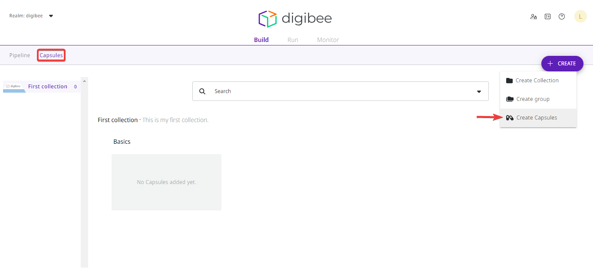
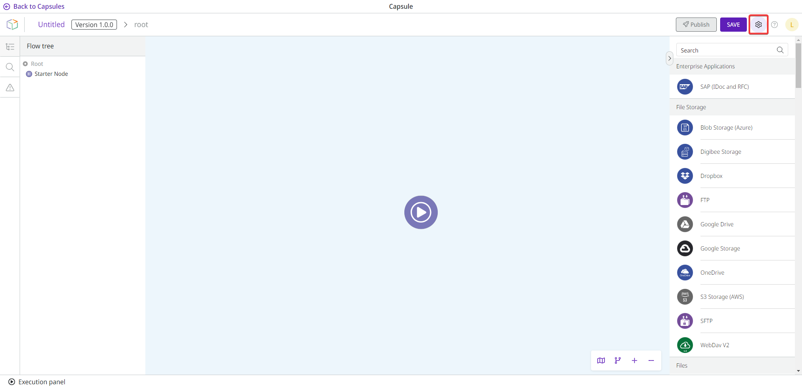
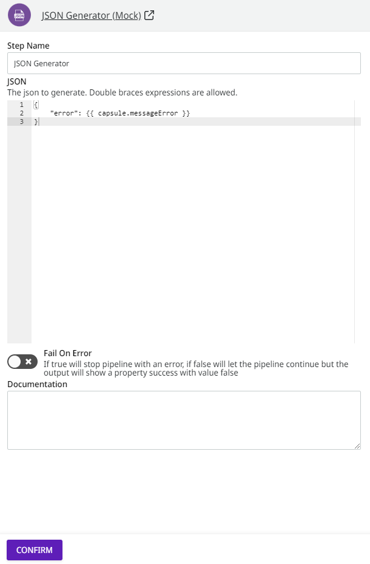

# How to configure a Capsule

## How to create a Capsule

Follow these steps to create a Capsule:

1. On the Build page, click the **Capsules** tab.
2. Click the **Create** button in the upper right corner.
3. Select the **Create Capsules** option.

<figure><figcaption></figcaption></figure>

## How to configure the Capsule

Inside the Capsule, click the gear icon in the upper right corner of the screen (next to the **Save** button) to begin configuring the Capsule.

<figure><figcaption></figcaption></figure>

A new page with a configuration form will open on the right side of the screen. The form contains four tabs: Parameters, Accounts, Documentation, and Contract.


To publish the Capsule, you must fill in the **Output** field on the Contract tab.


### Parameters tab

On the Parameters tab, define the parameters for the Capsule.

The parameters are a usage agreement. They define the specific parameters that should and must be provided to meet the requirements of the Capsule and all the components it contains. These parameters are displayed the moment you use the Capsule in a pipeline.

To create a parameter, fill in the fields:

* **Property:** the property of the parameter. The structure of the property is: `params.property`, for example, `params.messageError`.


if you don’t write the word `params` in the expression, it will be added automatically when you save the configuration form.


* **Label:** the name of the parameter to be displayed in the form, for example “MESSAGE ERROR”.
* **Description:** the description of the parameter, for example “This is a message indicating an error”.
* **Default Value:** the default value of the parameter, for example “An error has occurred in this application”.
* **Component Type:** the type of the component. The options are: **Text**, **Textarea**, **Code**, **Select**, **Toggle**, **Number**, **Tags**, and **Key Value**.

You can see the form preview on the right side of the screen.

To reorder the parameters, use the arrows (next to the **Remove** button) or activate the **Reorder mode** toggle function.

#### How to use the parameter in a component

To use the declared parameter in a component, proceed as follows:

1. In the Capsule environment, open the component to which you want to add the parameter. The component must support [Double Braces expressions](https://docs.digibee.com/documentation/build/double-braces).
2. Create a Double Braces expression (`{{ }}`) in the component.
3. Inside the expression, write the reserved keyword `capsule.` (it replaces the word `params.`) and then insert the name of the property, creating the following structure: `capsule.property`.

The full expression would look similar to this example: `{{ capsule.messageError }}`.

<figure><figcaption></figcaption></figure>

### Accounts tab

On the Accounts tab, specify a name and description for the accounts to be used in core components for authentication to endpoints (for example, REST).

Unlike pipelines, which displays all accounts registered in the realm, Capsules lets you specify the type of account you expect the user to select when using components in the pipeline.

In the Accounts tab, fill in the fields:

* **Name:** the name of the account.
* **Description:** a short description about the type of account that must be selected in the pipeline.

You can reorder the Accounts using the arrows (next to the **Remove** button) or by activating the **Reorder mode** toggle function.

### Documentation tab

On the Documentation tab, in the **Text** field, add content to register detailed and relevant information about how the Capsule works and for future maintenance. This is a free text area, but we recommend using Markdown.

The content is intended exclusively for Capsule developers in your realm. Therefore, it's not available for Capsule users.

### Contract tab

On the Contract tab, in the **Output** field, define the output structure of your custom component in JSON Schema format. This is a configuration that guarantees that the structure of the data from the Capsule execution always conforms to the JSON Schema defined by the developer.

It’s mandatory to add a JSON Schema to publish the Capsule. A well-defined JSON Schema brings more security for those who use the Capsule.


Changes to the JSON Schema that result in a contract break automatically update the Capsule version to ensure that Pipelines are not affected. Read more about [Capsules versioning](../capsules-versioning.md).

