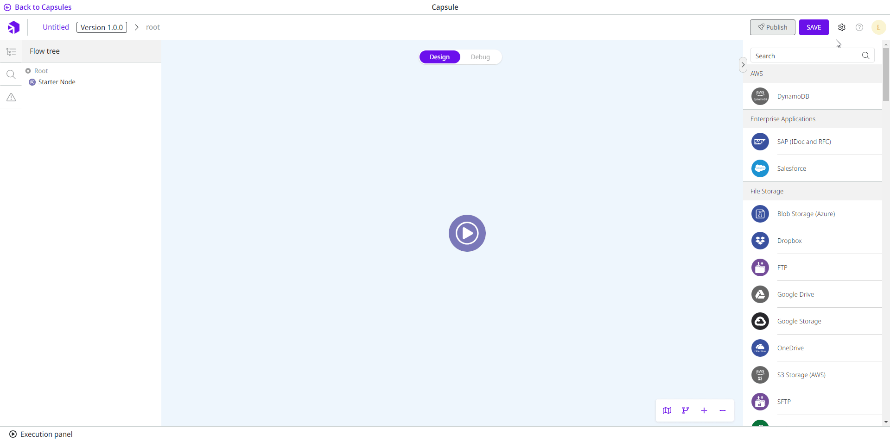

# How to configure a Capsule

## How to create a Capsule

Follow these steps to create a Capsule:

1. On the **Build** page, click the **Capsules** tab.
2. Click the **Create** button in the upper right corner.
3. Select the **Create Capsules** option.

<figure><figcaption></figcaption></figure>

## How to configure a Capsule

Inside the Capsule, click the gear icon in the upper right corner of the page (next to the **Save** button) to begin configuring the Capsule.

<figure><figcaption></figcaption></figure>

A side page with the Capsule configuration will open. The page contains three tabs: **Form**, **Documentation**, and **Contract**.

On the right side, you will see the **Form preview**. It shows you how the form will be displayed for the end user when they configure the Capsule in a pipeline.

### Form tab

On the **Form** tab, you can add parameters and account variables to your Capsule form.

Once you have created [parameters](how-to-configure-a-capsule.md#adding-a-parameter) and [account variables](how-to-configure-a-capsule.md#adding-an-account), you can expand or collapse them by clicking the **arrow** icon or rearrange them by clicking the **move** icon and dragging them to the desired position.

If you want to delete a parameter or account, click the **trash can** icon and then **Delete** in the dialog box.

#### Adding a parameter

A parameter is a customizable setting that allows you to adapt the Capsule's behavior to specific needs and requirements.

For example, all Platform components have some parameters that can be configured to adjust the behavior of the component to the specific needs of the user configuring it. When you create the Capsule, you define the parameters that will be configured when the Capsule is used in a pipeline.

Follow these steps to create a new parameter:

1. Inside the **Form** tab, click **Add field**.
2. Select the **Parameter** option.
3. A new parameter will be displayed in the form. Complete the following fields:

* **Label:** the name of the parameter to be displayed in the form.
* **Property:** the property of the parameter.
* **Helper text:** the description of the parameter. Use this field to describe in detail what the parameter is used for.
* **Field type:** the type of input to add to the form. The options are:
  * **Text:** a short text input field is displayed on the form.
  * **Number:** a number input field is displayed on the form.
  * **Select:** a select field is displayed on the form. To configure the options for the selection, enter each option in the **Select options** field and press the **Enter** key to add it to the form.
  * **Code:** a code field is displayed on the form.
  * **Key Value:** a key-value pair is displayed on the form.
  * **Text Area:** an expandable text input field is displayed on the form.
  * **Toggle:** an on/off switch is displayed on the form.
* **Default value:** the value that should be displayed in the parameter by default. Not all types of parameters have a default value.

4. To make the parameter mandatory in the Capsule configuration, activate the **Required** option.

<figure><figcaption></figcaption></figure>


You can find out how to use the parameter property in a component within the Capsule in [How to reference data using Double Braces](../../double-braces/how-to-reference-data-using-double-braces.md#referencing-capsule-property).


#### Adding an account

Accounts can be set up by users in the Platform to ensure the security of authentication processes and the storage of sensitive data such as passwords, private keys and authentication tokens. They are used to verify access to endpoints. Learn more about [how to configure an account](https://docs.digibee.com/documentation/settings/accounts).

In Capsules, when you add an account to the form, you create an account variable. This account variable is set later when the Capsule builder tests the flow in the Execution panel or when the end user configures the Capsule in the pipeline.


In the configuration form of the components within the Capsule, you can only select the account variable that you have configured in the Capsule form. However, if you test the Capsule in the Execution panel or use it in a pipeline flow, you can select any account created in the realm.


Follow these steps to add an account variable:

1. Inside the **Form** tab, click **Add field**.
2. Select the **Account** option.
3. A new account will be displayed in the form. Complete the following fields:

* **Label:** the name of the account field to be displayed on the Capsule configuration form.
* **Helper text:** a short description about the account to be selected.

4. To make the account mandatory in the Capsule configuration, activate the **Required** option.

<figure><figcaption></figcaption></figure>

### Documentation tab

On the **Documentation** tab, add content to register detailed and relevant information about how the Capsule works and for future maintenance.

The content is intended exclusively for Capsule builders in your realm. Therefore, it's not available for Capsule end-users.

<figure><figcaption></figcaption></figure>

### Contract tab

On the **Contract** tab, define the output structure of your custom component in JSON Schema format. This is a configuration that guarantees that the structure of the data from the Capsule execution always conforms to the JSON Schema defined by the Capsule builder.

It’s mandatory to add a JSON Schema to publish the Capsule. A well-defined JSON Schema brings more security for those who use the Capsule.


Changes to the JSON Schema that result in a contract break automatically update the Capsule version to ensure that pipelines are not affected. Read more about [Capsules versioning](https://docs.digibee.com/documentation/build/capsulas/capsules-versioning).


<figure><figcaption></figcaption></figure>
