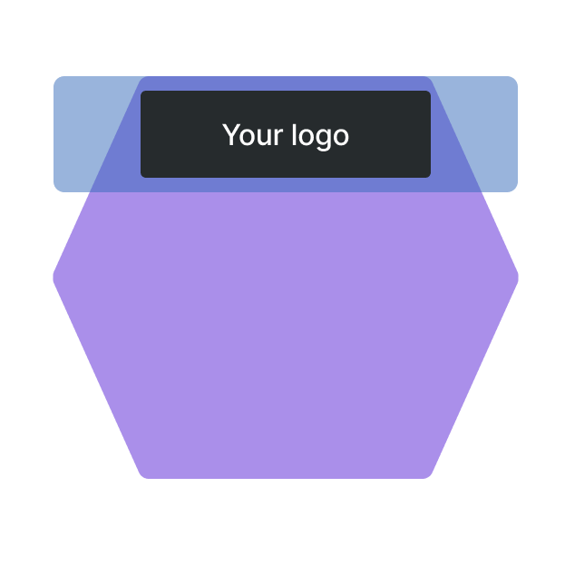
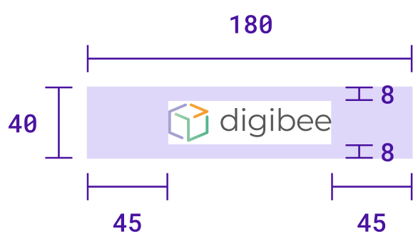

# Capsule header dimensions

Headers are used in Capsules to indicate which collection the Capsule belongs to. When you create a new collection, you must upload the header and select the capsule color.

Capsules have a hexagonal format and the header is located in the upper part of this hexagon. Therefore, the image size of the header must be larger to fill the hexagonal format, but the logo must be smaller to be fully displayed, as shown in the following figure:

<figure><figcaption></figcaption></figure>

## Header dimensions

The header file must be in `.jpg` or `.png` format and have the following dimensions:

* **Header width:** 180px
* **Header height:** 40px
* **Logo width:** 90px
* **Logo height:** 24px

The logo must be placed centrally in the image. This way you get a padding of 8px on top and bottom and a padding of 45px on both sides.\

<figure><figcaption></figcaption></figure>
