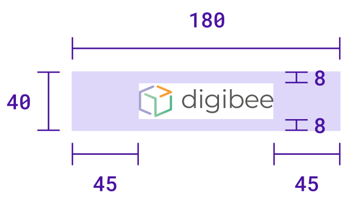

# Dimensões do cabeçalho da Cápsula

Cabeçalhos são usados ​​em Cápsulas para indicar a qual coleção a Cápsula pertence. Ao criar uma nova coleção, você deve fazer upload do cabeçalho e selecionar a cor da cápsula.

As cápsulas possuem formato hexagonal e o cabeçalho está localizado na parte superior deste hexágono. Portanto, o tamanho da imagem do cabeçalho deve ser maior para preencher o formato hexagonal, mas o logotipo deve ser menor para ser totalmente exibido, conforme mostra a figura a seguir:

<figure><figcaption></figcaption></figure>

## Dimensões do cabeçalho

O arquivo de cabeçalho deve estar no formato `.jpg` ou `.png` e ter as seguintes dimensões:

* **Largura do cabeçalho:** 180px
* **Altura do cabeçalho:** 40px
* **Largura do logo:** 90px
* **Altura do logo:** 24px

Seu logo deve ser colocado centralizado na imagem. Dessa forma, você obtém um preenchimento de 8px na parte superior e inferior e um preenchimento de 45px em ambos os lados.

<figure><figcaption></figcaption></figure>
