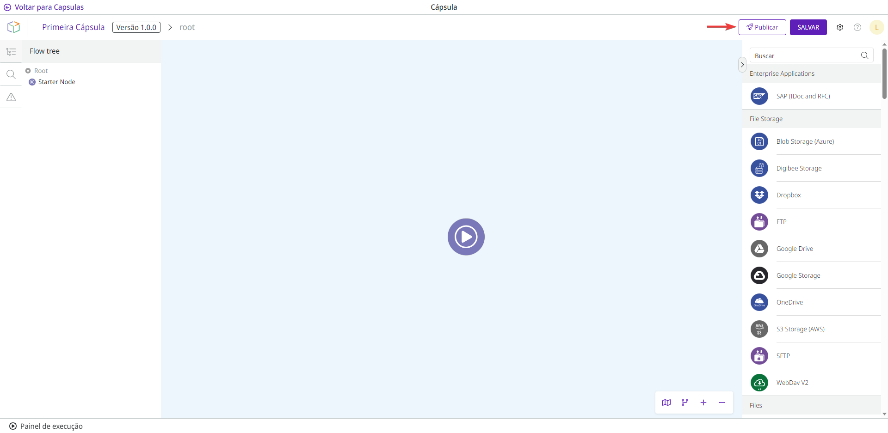

# Como publicar uma Cápsula

Publicar uma Cápsula significa disponibilizá-la para uso em _pipelines_.

Para publicar uma Cápsula, você deve atender a estes critérios:

* Adicionar um JSON Schema na aba **Contrato** do [formulário de configuração](how-to-configure-a-capsule.md).
* Preencher o [formulário para salvar a Cápsula](how-to-save-a-capsule.md).
* Ter a permissão CAPSULE:UPDATE:PUBLISH. Leia mais na [documentação sobre Papéis](https://docs.digibee.com/documentation/v/pt-br/administration/new-access-control/papeis-do-controle-de-acesso).

Depois que todos esses critérios forem atendidos, clique no botão **Publicar** botão no canto superior direito. O botão ficará inativo se alguns dos critérios não forem atendidos.

<figure><figcaption></figcaption></figure>

Uma vez publicada a Cápsula, ela recebe a _tag_ **Publicado** e é adicionada à lista de Cápsulas disponíveis que podem ser usadas nos _pipelines_. As Cápsulas públicas com o selo são certificadas pela Digibee.

<figure><figcaption></figcaption></figure>
