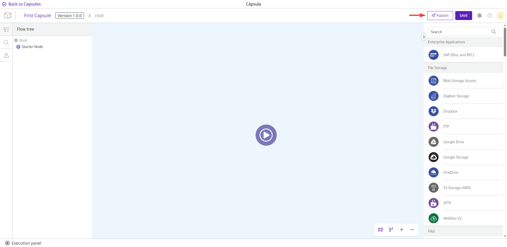

# How to publish a Capsule

Publishing a Capsule means making it available for use in pipelines.

To publish a Capsule, you must meet these criteria:

* Add a JSON schema to the Contract tab of the [configuration form](how-to-configure-a-capsule.md).
* Complete the [Save form](how-to-save-a-capsule.md).
* Have the permission CAPSULE:UPDATE:PUBLISH. Read more in the [Roles documentation](https://docs.digibee.com/documentation/administration/new-access-control/access-control-roles).

Once all these criteria are met, click the **Publish** button in the upper right corner. The button is inactive if some of the criteria are not met.

<figure><figcaption></figcaption></figure>

Once the Capsule is published, it receives the **Published** tag and is added to the list of available Capsules that can be used in the pipelines. Public Capsules with a check mark are certified by Digibee.

<figure><figcaption></figcaption></figure>
