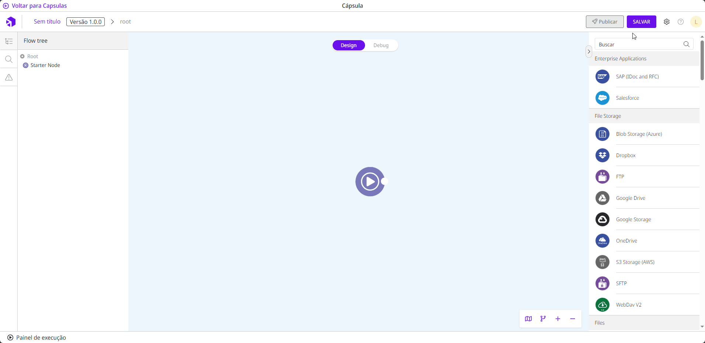
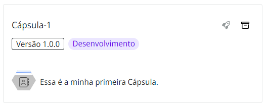

# Como salvar uma Cápsula

Siga estas etapas para salvar uma Cápsula:

1. Clique no botão **Salvar** no canto superior direito do ambiente da Cápsula
2. Insira um nome para a Cápsula no campo **Nome da Cápsula** no formulário.
3. Adicione uma descrição em **Descrição da Cápsula**.
4. Selecione o ícone para representar a Cápsula dentro do grupo.
5. Selecione a coleção que deseja adicionar a Cápsula. Se você não tiver uma [coleção criada](https://docs.digibee.com/documentation/v/pt-br/build/capsulas/como-usar-capsulas/como-criar-uma-colecao-de-capsulas), a Cápsula será salva no **Default Collection**.
6. Selecione o grupo que deseja adicionar a Cápsula. Se você não tiver um [grupo criado](https://docs.digibee.com/documentation/v/pt-br/build/capsulas/como-usar-capsulas/como-criar-um-grupo-de-capsulas), a Cápsula será salva no **Default Group**.


Você pode mudar a coleção e o grupo da Cápsula depois de salvá-la. Aprenda mais em [Como mudar uma Cápsula de coleção ou grupo](how-to-change-a-capsule-collection-or-group.md).


7. Veja como a Cápsula está ficando em **Pré-visualização da Cápsula**.
8. Clique em **Salvar**.

<figure><figcaption></figcaption></figure>

Salvar a Cápsula não a disponibiliza na lista de Cápsulas no _pipeline_. Para disponibilizá-la, você deve [publicar a Cápsula](how-to-publish-a-capsule.md).

Cápsulas que ainda não foram publicadas tem a tag de **Desenvolvimento** na página de Cápsulas.

<figure><figcaption></figcaption></figure>
