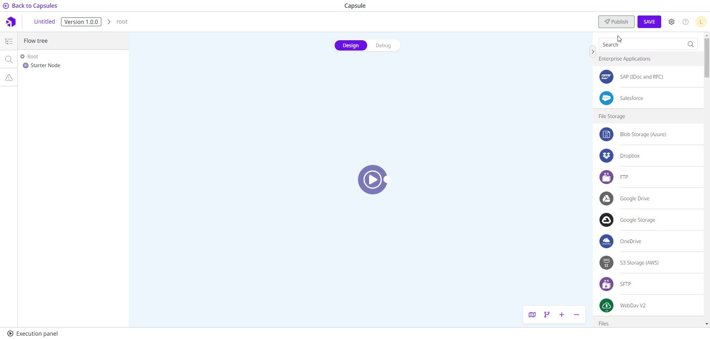
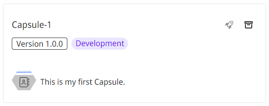

# How to save a Capsule

Follow these steps to save a Capsule:

1. Click the **Save** button in the upper right corner of the Capsule environment.
2. Enter a name for the Capsule in the **Capsule name** field on the form.
3. Add a description in the **Capsule description** field.
4. Select the icon that will represent the Capsule inside the group.
5. Select the collection to which you want to add the Capsule. If you don’t have a [collection created](https://docs.digibee.com/documentation/build/capsulas/how-to-use-capsules/how-to-create-a-capsule-collection), the Capsule is saved in the **Default collection**.
6. Select the group to which you want to add the Capsule. If you don’t have a [group created](https://docs.digibee.com/documentation/build/capsulas/how-to-use-capsules/how-to-create-a-capsule-group), the Capsule is saved in the **Default group**.


You can change the collection and group of a Capsule after you have saved it. Learn more in [How to change a Capsule collection and group](how-to-change-a-capsule-collection-or-group.md).


7. See what the Capsule icon looks like in the **Capsule preview**.
8. Click **Save**.

<figure><figcaption></figcaption></figure>

Saving the Capsule doesn’t make it available in the list of Capsules in the pipeline. To make it available, you must [publish the Capsule](how-to-publish-a-capsule.md).

Capsules that are not yet published have the **Development** tag in the Capsules page.

<figure><figcaption></figcaption></figure>
