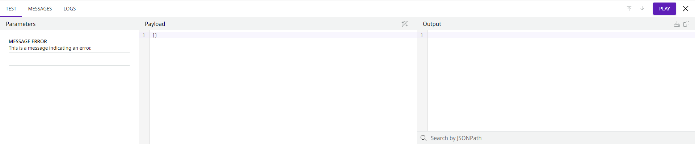

# How to test a Capsule

Follow these steps to test a Capsule:

1. Open the Execution panel at the bottom of the Capsule environment.
2. Click the **Test** tab.
3. If needed, in the **Parameters** column, enter the parameters defined in the configuration form.
4. In the **Payload** column, add the JSON of the input data.
5. Click **Play** to run the execution.
6. Check the result of the execution in the Output column. For more information about the output of each component, see the **Messages** tab. To see the logs of the execution, go to the **Logs** tab.

<figure><figcaption></figcaption></figure>

If you want to learn more about the features of the Execution panel, read the [Execution panel documentation](https://docs.digibee.com/documentation/build/new-canvas-beta-restricted/execution-panel).
