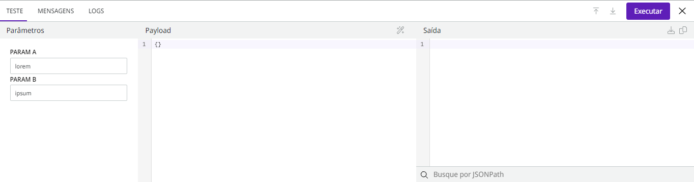

# Como testar uma Cápsula

Siga estas etapas para testar uma Cápsula:

1. Abra o Painel de execução na parte inferior do ambiente de Cápsula.
2. Clique na aba **Teste**.
3. Se necessário, na coluna **Parâmetros**, insira os parâmetros definidos no formulário de configuração.
4. Na coluna _**Payload**_, adicione o JSON com os dados de entrada.
5. Clique em **Executar** para executar a Cápsula.
6. Verifique o resultado da execução na coluna **Saída**. Para obter mais informações sobre a saída de cada componente, consulte a aba **Mensagens**. Para ver os logs da execução, acesse a aba _**Logs**_.

<figure><figcaption></figcaption></figure>

Se você quiser saber mais sobre os recursos do Painel de execução, leia a [documentação sobre o Painel de execução](https://docs.digibee.com/documentation/v/pt-br/build/new-canvas-beta-restricted/execution-panel).
