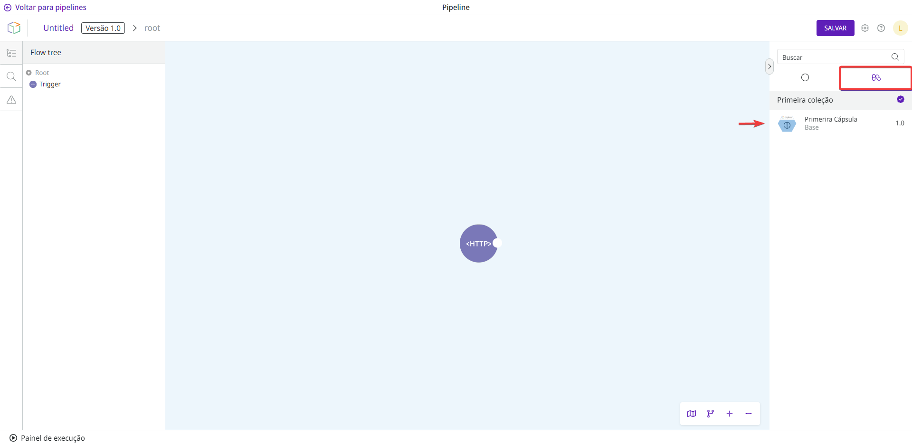

# Cápsulas públicas

Cápsulas públicas são componentes reutilizáveis ​​ou conjuntos de integração fornecidos a qualquer cliente ou usuário da plataforma. Elas normalmente são criadas, testadas e validadas pela Digibee Integration Platform e não podem ser editadas para garantir qualidade e segurança.

As cápsulas públicas que foram criadas e validadas pela Digibee Integration Platform tem um ícone de certificado, conforme mostrado na figura a seguir:\

<figure><figcaption></figcaption></figure>

Todas as coleções e todas as [versões](../capsules-versioning.md) de cada cápsula pública estão disponíveis na aba **Cápsulas**, no lado direito do canvas do _pipeline_.

<figure><figcaption></figcaption></figure>

Veja as coleções de cápsulas públicas oferecidas atualmente pela Digibee Integration Platform:


[sap.md](sap.md)



[digibee-tools.md](digibee-tools.md)



[google-sheets.md](google-sheets.md)



[gupy.md](gupy.md)



[send-notifications-via-email.md](send-notifications-via-email.md)



[totvs-live.md](totvs-live.md)



[canvas-lms.md](canvas-lms.md)

