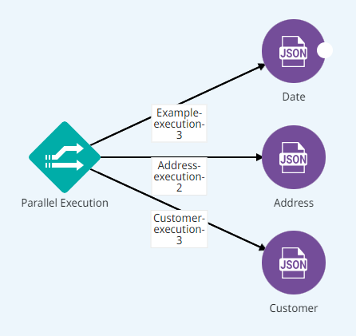

# Digibee Tools


To access the Digibee Tools collection and use the features presented in this article, you need the permission PIPELINE:CREATE. Learn more in the [documentation about Roles](https://docs.digibee.com/documentation/administration/new-access-control/access-control-roles).


The Digibee Tools collection of capsules provides resources commonly used in pipelines to make their construction more productive. Below you can learn more about each capsule in the collection.

## Digibee Tools capsules

### **CPF CNPJ Validator**

The **CPF CNPJ Validator** capsule allows you to validate the value of numbers of Brazilian documents that uniquely identify a person: CPF (_Cadastro de Pessoas Físicas_) and CNPJ (_Cadastro Nacional da Pessoa Jurídica_).

To do this, the **CPF CNPJ Validator** capsule uses mathematical calculations and guarantees that the check digit is correct. However, the capsule doesn’t validate the registry situation of the mentioned documents at the Brazilian Internal Revenue Service.

See an example of a validation result:

```
{
  "libOutPut": {
    "isCpfValid": true,
    "isCnpjValid": false,
    "noMask": "12345678909",
    "withMask": "123.456.789-09"
  }
}

```

If there is an error in the JavaScript algorithm, an execution error is triggered:

```
{
  "timestamp": 1620665936661,
  "error": "Capsule capsule-v1-digibee-collection-name-test-capsule-name-test-1.0 failed execution. Error: com.digibee.pipelineengine.exception.PipelineEngineRuntimeException: Error during validation of Cpf/Cnpj.",
  "code": 500
}
```

### **Digibee Publish Error** <a href="#h_178b9ddb55" id="h_178b9ddb55"></a>

The **Digibee Publish Error** capsule standardizes the way the pipeline publishes error messages. However, it doesn't send the messages directly to your monitoring dashboards or apps like Slack or email. The goal of the capsule is to standardize important information for integration monitoring. It also provides technical details about execution.

The next step is to create a pipeline responsible for receiving such messages and selecting options like sending a grouped email with the errors.

The capsule also guarantees that all error notifications are standardized, allowing flexibility in sending additional information through the “payload” field.

The “ Subject” or “Error Code”  fields can be used in the error grouping criteria, for example:

* When integrating requests, the errors that occurred in a given period of time must be grouped and a single ticket created for the team in charge of evaluating the incident.
* In the case of product integration, the errors with the ERP must be separated from the errors with the e-commerce platform. In this case, each group has a different grouping value and notifications can be handled decentrally.


The **Digibee Publish Error** capsule standardizes the information that must be filled in by the developer when handling errors, and this information is published by the [**Pipeline Executor**](https://docs.digibee.com/documentation/components/tools/pipeline-executor) component. Therefore, the “error-handling-group-and-notify” pipeline must be created and published in the same environment. To get an example of this, contact the Digibee support team.


See an illustration of capsule usage:

.png>)

### **Parallel Execution List to Objects** <a href="#h_9f9c91aef7" id="h_9f9c91aef7"></a>

The **Parallel Execution List to Objects** capsule converts an array into an object map using the existing “executionId” field in the array root. The use of Parallel Execution List to Objects can be applied to the output standard of the [**Parallel Execution**](https://docs.digibee.com/documentation/components/logic/parallel-execution) component when objects are recovered from parallel processing.

See an application example where a parallel execution flow is applicable:



\
The flow above results in the following array:

```
[
  {
    "executionId": "Example-execution-3",
    "result": {
      "message": {
        "year": "2021"
      }
    }
  },
  {
    "executionId": "Address-execution-2",
    "result": {
      "body": {
        "address": "Disney"
      }
    }
  },
  {
    "executionId": "Customer-execution-1",
    "result": {
      "customer": {
        "name": "Mickey Mouse"
      }
    }
  }
]
```

Combining the [**Block Execution**](https://docs.digibee.com/documentation/components/logic/block-execution) component with the parallel flow (as per the example above) and the capsule results in an object map for each “executionId”. Check it out:

```
{
  "Example-execution-3": {
    "message": {
      "year": "2021"
    }
  },
  "Address-execution-2": {
    "body": {
      "address": "Disney"
    }
  },
  "Customer-execution-1": {
    "customer": {
      "name": "Mickey Mouse"
    }
  }
}
```

### **Send Email Alert** <a href="#h_a6f6322d1f" id="h_a6f6322d1f"></a>

The **Send Email Alert** capsule is intended to facilitate sending error messages through email based on the information entered in the configuration form. It allows sending additional information in a predefined email template so that the cause of the error can be traced.

To use this capsule, you need to configure an **SMTP Auth And Properties** account type. To learn more about it, read the article [Accounts](https://docs.digibee.com/documentation/settings/accounts).

To see an example of the configuration with the Google account, read the article [Using your Gmail account with the Digibee email component (SMTP)](https://docs.digibee.com/documentation/tutorials-and-best-practices/using-your-gmail-account-with-the-digibee-email-component-smtp).


Check the message limit allowed by your email account. To make the number of sent emails more reliable, we recommend the procedure described in the **Digibee Publish Error** capsule.


### **Sort Array by Field** <a href="#h_1df9e080f5" id="h_1df9e080f5"></a>

The **Sort Array by Field** capsule organizes the JSON array in crescent (A-Z) or descending (Z-A) order.

The organization doesn’t take into account the chronological time of dates, only the alphabetical order. For proper organization, the date must be in the format “yyyy-mm-dd”.

### **Validate Consumers** <a href="#h_201e66dcbc" id="h_201e66dcbc"></a>

The **Validate Consumers** capsule can be used when a pipeline must execute with a maximum number of consumers that differs from the runtime default, so that executions do not execute with the wrong deployment configuration.

For example, if the pipeline allows execution of up to 2 concurrent requests, but the runtime is configured with 10 concurrent requests and the capsule is configured with 2, an error is issued on the executions so that the configurations are corrected. However, if the capsule configuration specifies 2 concurrent requests, the deployment must be configured with no more than 1 or 2 consumers.

To learn more about Run, read the article [Run concepts](https://docs.digibee.com/documentation/run/runtime).
