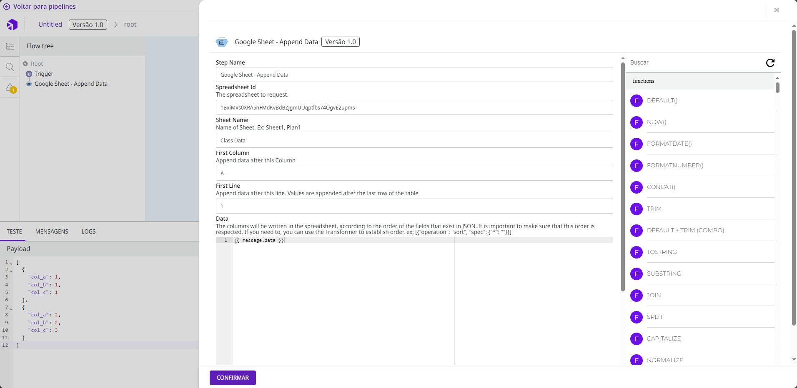

# Google Sheets


Para acessar a coleção Google Sheets e usar as funcionalidades presentes nesse artigo, você precisa ter a permissão PIPELINE:CREATE. Aprenda mais na[ documentação sobre Papéis](https://docs.digibee.com/documentation/v/pt-br/administration/new-access-control/papeis-do-controle-de-acesso).


O objetivo da coleção Google Sheets é ler dados e escrever informações na sua Planilha Google.

## Pré-requisitos para usar a coleção Google Sheets <a href="#h_2a61515a36" id="h_2a61515a36"></a>

1. **Ativação do Serviço Google Sheet API**

Para utilizar os serviços Google Sheets, você precisa ativar o recurso Google Sheets API no seu Console GCP (Google Cloud Platform). Para saber mais sobre ativação de serviços, leia o artigo[ Como ativar e desativar serviços](https://cloud.google.com/service-usage/docs/enable-disable?hl=pt-br).

2. **Autenticação**

É necessário ter uma conta Digibee do tipo google-key. Se você ainda não possui, acesse [Contas de serviço](https://console.cloud.google.com/projectselector2/iam-admin/serviceaccounts?hl=pt-br\&supportedpurview=project) no seu [console GCP](https://console.cloud.google.com/iam-admin/serviceaccounts?hl=pt-br) e crie uma nova chave. Para obter mais informações sobre como gerar uma nova chave de autenticação, leia o artigo [Criar e excluir chaves de contas de serviço](https://cloud.google.com/iam/docs/creating-managing-service-account-keys?hl=pt-br#iam-service-account-keys-list-console).

3. **Compartilhamento**

A conta de serviço gerada anteriormente possui um service account email. Utilize o endereço para compartilhar a planilha que receberá os dados em modo edição.

4. **Tratamento de erros**

Todas as cápsulas possuem retornos padronizados. Sempre que a solicitação for processada com sucesso, será devolvido o campo “success” do tipo booleano na raiz do JSON. Utilize essa informação para realizar os tratamentos de erro no seu pipeline.

## Cápsulas Google Sheets <a href="#h_6d29387461" id="h_6d29387461"></a>

A cápsula **Get Spreadsheets By Id** possibilita a consulta de metadados de uma Planilha Google.

#### Exemplo:

* **URL:** endereço para acesso através do navegador
* _**Sheets**_**:** lista das páginas existentes dentro da planilha
* _**Title**_**:** nome da planilha

### Get Rows Values by Range <a href="#h_eedd5427c7" id="h_eedd5427c7"></a>

A cápsula **Get Rows Values By Range** tem a capacidade de ler dados da Planilha Google. É necessário especificar o nome da página, o intervalo de colunas e os parâmetros para controle de paginação.

#### Exemplo:

Para ler os dados das colunas A, B, C, D, E, F, G, H, I, J, K, L da linha 1 até a linha 100, estes devem ser os parâmetros:

* _**First Column**_**:** A
* _**Last Column**_**:** L
* _**Start Row**_**:** 1
* _**Limit Row**_**:** 100

### Append Data <a href="#h_4c8d1e9c75" id="h_4c8d1e9c75"></a>

A cápsula **Append Data** simplifica a gravação de dados na sua Planilha Google graças à sua capacidade de gravar uma única linha ou uma lista.

É necessário especificar o nome da página onde os dados serão gravados. Se não houver essa especificação, a gravação será feita na primeira página encontrada.

Não é necessário especificar o intervalo de colunas. No entanto, é preciso informar a partir de qual coluna e linha a escrita dos dados deve ser feita. Os valores serão adicionados sempre depois da última linha.

#### Exemplo:

Array passado para a cápsula por meio de expressões [Double Braces](https://docs.digibee.com/documentation/v/pt-br/build/double-braces).




A cápsula **Append Data** possui características que impossibilitam a escrita de dados na mesma página da sua planilha. Em caso de escritas realizadas simultaneamente, os dados podem ser sobrescritos pelas requisições. Não utilize em fluxos que permitam o paralelismo.


Os dados do JSON serão transformados em colunas, respeitando a ordem dos atributos enviados e não a nomenclatura. Caso precise reorganizar os campos, utilize um de nossos componentes de transformação, assim como o [Transformer (JOLT)](https://docs.digibee.com/documentation/v/pt-br/components/tools/transformer-jolt).

Veja o exemplo a seguir:

```
[
  {
    "operation": "sort",
    "spec": {
      "*": ""
    }
  }
] 
```

\
