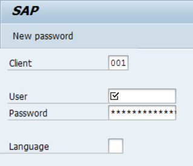
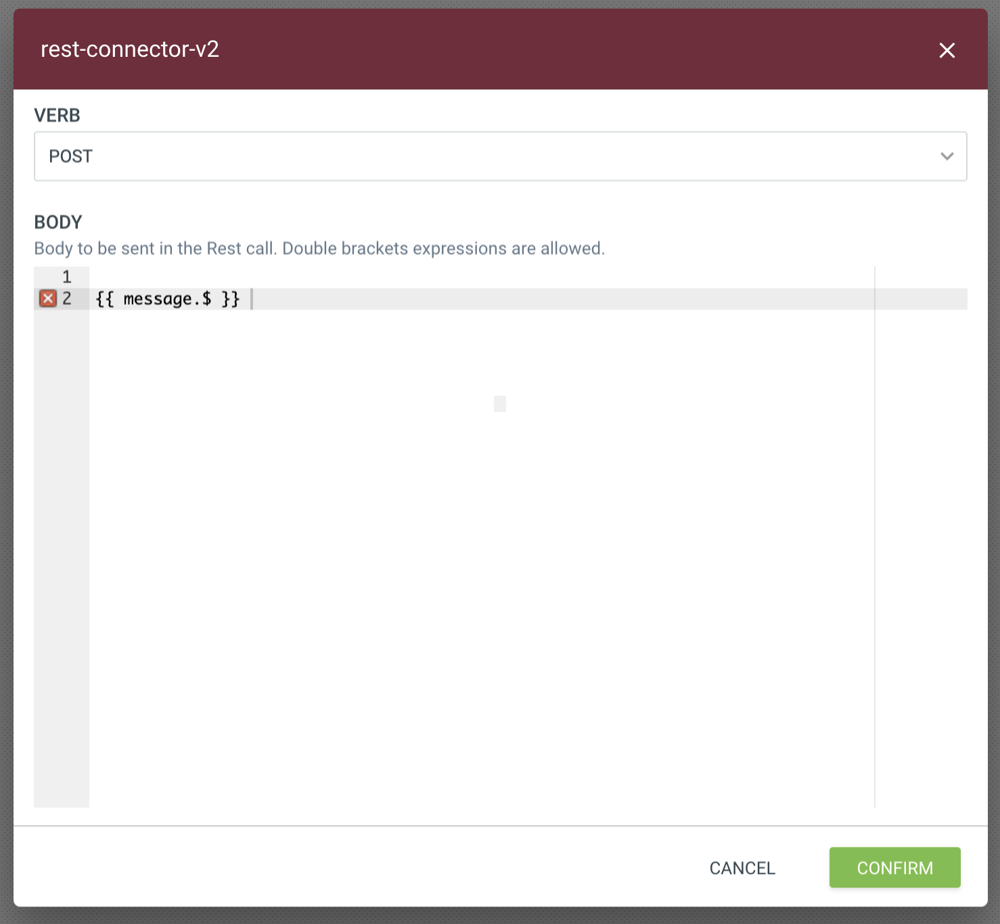
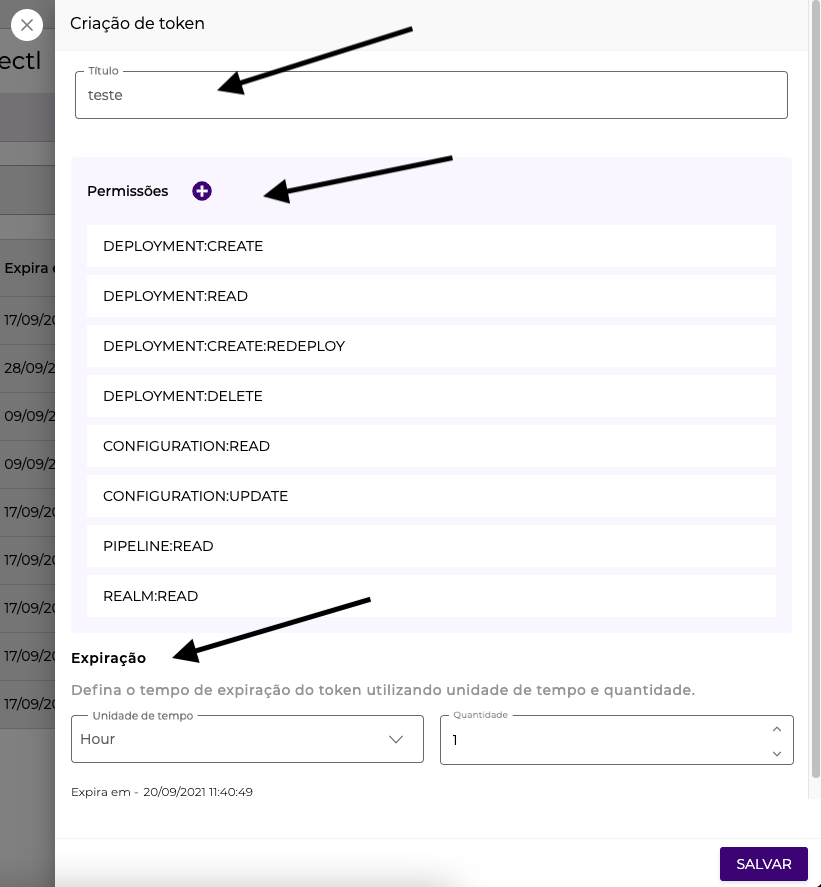

# SAP


To access the SAP collection and use the features presented in this article, you need the permission PIPELINE:CREATE. Learn more in the [documentation about Roles](https://docs.digibee.com/documentation/administration/new-access-control/access-control-roles).


The SAP collection of capsules are used to abstract calls to SAP by encapsulating the capacity to call remote functions (RFC) to the SAP system.

To use the RFC capsules, you must configure them with the parameters required by SAP (such as SID, LANGUAGE, and CLIENT ID) and define the parameters expected by SAP.

After the execution of the capsule, it’s possible to control the message flow, analyze the success and failure cases and handle the response message in JSON format to facilitate the data work in the pipeline flow.

## What is SAP? <a href="#h_b6719152ef" id="h_b6719152ef"></a>

SAP is one of the world's leading providers of business process management software and develops solutions that facilitate the flow of information between companies. Find out more on the [SAP website](https://www.sap.com/brazil/about/what-is-sap.html).

## Requirements for using the SAP collection <a href="#h_24b4d81563" id="h_24b4d81563"></a>

1. **Establish VPN**

The SAP capsules are always used to send the information flow to SAP. A Site-to-Site VPN must therefore be defined in the SAP setup.

2. **33XX Port and SAP Hostname Release**

The SAP standard connection is established. In this case, the 33XX ports (XX is the number of the SAP instance) must be released within the VPN. Without this action, access to the SAP information is not possible. In addition, the connection requires the SAP host name, which you can easily access via the SMGW transaction.

For example, if the Instance Number is 20, then the port to be released in the VPN tunnel is 3320.

3. **SAP GUI Information**

As with the SAP GUI, the capsules also require the connection information to enable the data flow. See below for the necessary information:

* Instance Number and System ID:


* Logon Language and Client ID (principal):



4. **Credentials**

Both the user and the SAP access password must be registered in the Digibee Integration Platform. An account of type “Basic” must be used.

## SAP capsules <a href="#h_499db84a7d" id="h_499db84a7d"></a>

### **SAP RFC - Connectivity Test**

With the **SAP RFC - Connectivity Test** capsule, a connectivity test can be performed without having to know the functions and SAP parameters. The capsule abstracts the call of a standard RFC (RFC\_READ\_TABLE) with the minimum parameters already defined.

If an error occurs in the response after the capsule has been executed, it must be checked whether the requirements have been met. However, if the response is `“success” : true`, you can continue with the integration and call other SAP functions.

### **SAP RFC - Connector (JSON Input)**

The SAP RFC - Connector (JSON Input) is a generic capsule that is used for every operation with the SAP remote functions. It is possible to read table data and registers in a more complete way, add new registers (such as Suppliers, Clients, and Addresses) and also update registers.

As it is a generic capsule, all native SAP functions are available and the custom ABAP functions in the SAP environment can also be executed. For example, RFC for recording invoices with the calculation of taxes.

Understand better how to work with such dynamism and what the relationship to the RFC parameters is:

1. **Import Parameters Attributes**

The input parameters (optional) that must be specified when calling the function. The field doesn’t support structural parameters.

```
{  
    "BUSINESSPARTNER": "",  
    "VALID_DATE": ""
}
```

2. **Object Params**

The input parameters (optional) that must be filled in the function. Structural parameters are supported.

```
{
  "OBJ1": {
    "ATTR1": "V1"
  },
  "OBJ2": {
    "ATTR2": "V2",
    "ATTR3": "V3"
  }
}
```

3. **Table and Fields**

Model for sending parameters in table format. To send more than one item to the same table, add a new JSON object within the array, as shown in the following example:

```
[
  {
    "TABLE1": [{
      "ATTR1": "VALUE1",
      "ATTR2": "VALUE2"
    },
   {
      "ATTR1": "VALUE1",
      "ATTR2": "VALUE2"
    }],
    "TABLE2": [{
      "ATTR1": "VALUE1",
      "ATTR2": "VALUE2"
    }]
  }
]
```


In accordance with SAP good practices, it is recommended not to send table parameters as Import Parameters.


4. **Getting to know the parameters of a RFC function**

Check how you can identify the expected parameters by an RFC to fill the **SAP RFC - Connector (JSON Input)**.

Example:

* SAP RFC standard, native in the SAP environment
* Function: **BAPI\_BUPA\_ADDRESS\_CHANGE**

First call up transaction SE37 (Function Builder) in your SAP:\




Enter the function name (**BAPI\_BUPA\_ADDRESS\_CHANGE**) and press F8 on your keyboard.

All parameters expected by RFC and their respective types are displayed in your **SAP GUI Business Client**.



As shown in the example above, the fields of type **Import Parameters Attributes** are: **BUSINESSPARTNER** and **ADDRESSGUID** (they are not structural parameters).

For the other fields, click on the icon displayed in the **Value** column. Then call up the structure editor using the key combination **Shift + F7**.

.png>)

In the figure above, **ADDRESDATA\_X** stands for the object name. The other fields are the object attributes.

Now take a look at a table-like structural parameter with which you can transmit a list and its respective attribute one after the other.

.png>)

Using the parameter examples shown above, take a look at a JSON example that simulates the format expected by SAP capsule.

**Import Parameters Attributes:**

```
{  
    "BUSINESSPARTNER": "0000000003"
}
```

**Object Params:**

```
{
  "ADDRESSDATA": {
    "STANDARDADDRESS": "X",
    "C_O_NAME": "",
    "CITY": "Barueri",
    "POSTL_COD1": "19970000",
    "STREET": "Rua adriano augusto teste",
    "HOUSE_NO": "1",
    "COUNTRY": "BR",
    "REGION": "SP",
    "LANGU": "PT",
    "VALIDFROMDATE": {{FORMATDATE(NOW(), "timestamp", "yyyy-MM-dd", null , "GMT-3") }},
    "VALIDTODATE": "2999-12-31"
  },
  "ADDRESSDATA_X": {
    "STANDARDADDRESS": "X",
    "C_O_NAME": "X",
    "POSTL_COD1": "X",
    "STREET": "X",
    "HOUSE_NO": "X",
    "COUNTRY": "X",
    "REGION": "X",
    "LANGU": "X"
  }
}
```

**Table and Fields:**

```
{
  "BAPIADTEL": [
    {
      "COUNTRY": "",
      "TELEPHONE": "",
      "TEL_NO": ""
    },
    {
      "COUNTRY": "",
      "TELEPHONE": "",
      "TEL_NO": ""
    }
  ],
  "BAPIADFAX": [
    {
      "COUNTRY": "",
      "FAX": ""
    }
  ]
}
```

### **SAP RFC - Read Nota Fiscal**


The **SAP RFC - Read Nota Fiscal** capsule was developed specifically for the needs of the Brazilian market.


The **SAP RFC - Read Nota Fiscal** capsule was developed to perform data queries of invoices in SAP using the DOCNUM field.

The RFC used for the query is **BAPI\_J\_1B\_NF\_GETDETAIL**. To query the details of an invoice, enter the DOCNUM field in **Import Parameters**.

Use [Double Braces](../../double-braces/) expressions to provide the value dynamically. See an example:

.png>)

```
{             
    "attributes":{             
        "DOCNUM": {{ message.docnum }}  
    }
}
```

### **SAP RFC - Read Table**

The **SAP RFC - Read Table** capsule was developed to execute queries directly on SAP tables. These parameters stand out among the standard parameters available under “Preconditions":

1. **TABLE:** name of the table for the data query.
2. **Skip & Limit:** parameters to control the pagination of the query and to limit the number of returned registers. In this way, the queries are executed in blocks and the process becomes more efficient.
3. **FIELDS:** fields to be returned in the query. It’s mandatory to specify at least one field to start the query.

To determine which fields exist in the SAP table, use transaction **SE11 ()**. Example for the table KNA1:

\


.png>)

4. **Options Filters:** optional parameter that enables the specification of additional data for the SAP table query. The parameter is generally used to define the data cut, which means to reduce the amount of information and avoid reading the entire table.

See some examples of filter options:

```
MATNR IN (10000,1000001,1000002,100003,100004)
ERDAT = '19990101'
BUKRS EQ '{{ message.company_code_sap }}'
```


To determine the suggested filter for your query, check the SAP Table fields. The **SE37** transaction allows you to perform query tests via RFC (READ\_TABLE) and define the parameters suitable for the query.

