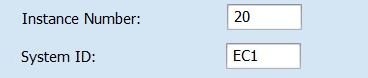
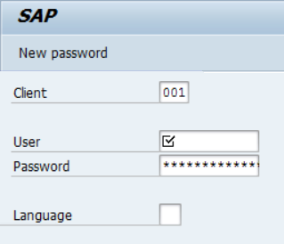

# SAP


Para acessar a coleção SAP e usar as funcionalidades presentes nesse artigo, você precisa ter a permissão PIPELINE:CREATE. Aprenda mais na[ documentação sobre Papéis](https://docs.digibee.com/documentation/v/pt-br/administration/new-access-control/papeis-do-controle-de-acesso).


As cápsulas da coleção SAP são usadas para abstrair chamadas para SAP, encapsulando a capacidade de chamar funções remotas (RFC) para o sistema SAP.

Para utilizar as cápsulas RFC, você deve configurá-las com os parâmetros exigidos pelo SAP (como SID, LANGUAGE e CLIENT ID) e definir os parâmetros esperados pelo SAP.

Após a execução da cápsula, é possível controlar o fluxo de mensagens, analisar os casos de sucesso e falha e tratar a mensagem de resposta no formato JSON para facilitar o trabalho de dados no fluxo do _pipeline_.

## Pré-requisitos para usar a coleção SAP

SAP é um dos principais fornecedores mundiais de software de gestão de processos de negócios e desenvolve soluções que facilitam o fluxo de informações entre empresas. Saiba mais no [site do SAP](https://www.sap.com/brazil/about/what-is-sap.html).

### Pré-requisitos <a href="#h_b619770c7a" id="h_b619770c7a"></a>

1. **Estabelecer VPN**

As cápsulas SAP são sempre utilizadas para enviar o fluxo de informações ao SAP. Portanto, uma _VPN Site-to-Site_ deve ser definida na instalação do SAP.

2. **Liberações de Porta 33XX e **_**Hostname**_** SAP**

A conexão padrão SAP é estabelecida. Neste caso, as portas 33XX (XX é o número da instância SAP) devem ser liberadas dentro da VPN. Sem esta ação, o acesso às informações SAP não é possível. Além disso, a conexão requer o _hostname_ SAP, que você pode acessar facilmente por meio da transação SMGW.

Por exemplo, se o _Instance Number_ for 20, então a porta a ser liberada no túnel da VPN é 3320.

3. **Informações SAP Gui**

Tal como acontece com o SAP GUI, as cápsulas também requerem informações de conexão para permitir o fluxo de dados. Veja abaixo as informações necessárias:

* _Instance Number_ e _System ID_



* _Logon Language_ e _Client ID_ (mandante)



4. **Credenciais**

Tanto o usuário quanto a senha de acesso ao SAP deverão estar cadastrados na Digibee Integration Platform. Uma conta do tipo “_Basic_” deve ser usada.

## Cápsulas SAP

### SAP RFC - Connectivity test

Com a cápsula **SAP RFC - Connectivity Test** um teste de conectividade pode ser realizado sem a necessidade de conhecer as funções e os parâmetros do SAP. A cápsula abstrai a chamada de uma RFC padrão (RFC\_READ\_TABLE) com os parâmetros mínimos já definidos.

Se ocorrer um erro na resposta após a execução da cápsula, deve-se verificar se os pré-requisitos foram atendidos. Contudo, se a resposta for `“sucess”: true`, você poderá continuar com a integração e chamar outras funções do SAP.

### SAP RFC - Connector (JSON Input)

A cápsula SAP RFC - Connector (JSON Input) é uma cápsula genérica usada para todas as operações com as funções remotas do SAP. É possível ler dados de tabelas e cadastros de forma mais completa, adicionar novos cadastros (como Fornecedores, Clientes e Endereços) e também atualizar cadastros.

Por se tratar de uma cápsula genérica, todas as funções nativas do SAP estão disponíveis e as funções ABAP customizadas no ambiente SAP também podem ser executadas. Por exemplo, RFC para inclusão de Nota Fiscal com cálculo de impostos.

Entenda melhor como trabalhar com esse dinamismo e qual a relação com os parâmetros RFC:

1. _**Import Parameters Attributes**_

Os parâmetros de entrada (opcionais) que devem ser especificados ao chamar a função. O campo não oferece suporte a parâmetros estruturais.

```
{  
    "BUSINESSPARTNER": "",  
    "VALID_DATE": ""
}
```

2. _**Object Params**_

Os parâmetros de entrada (opcionais) que devem ser preenchidos na função. Parâmetros estruturais são suportados.

```
{
  "OBJ1": {
    "ATTR1": "V1"
  },
  "OBJ2": {
    "ATTR2": "V2",
    "ATTR3": "V3"
  }
}
```

3. _**Table and Fields**_

Modelo para envio de parâmetros em formato de tabela. Para enviar mais de um item para a mesma tabela, adicione um novo objeto JSON dentro do _array_, conforme mostrado no exemplo a seguir:

```
[
  {
    "TABLE1": [{
      "ATTR1": "VALUE1",
      "ATTR2": "VALUE2"
    },
   {
      "ATTR1": "VALUE1",
      "ATTR2": "VALUE2"
    }],
    "TABLE2": [{
      "ATTR1": "VALUE1",
      "ATTR2": "VALUE2"
    }]
  }
]
```


De acordo com as boas práticas do SAP, recomenda-se não enviar parâmetros de tabela como _Import Parameters_.


4. **Conhecendo os parâmetros de uma função RFC**

Verifique como você pode identificar os parâmetros esperados por um RFC para preencher a cápsula **SAP RFC - Connector (JSON Input)**.

Exemplo:

* RFC padrão do SAP, nativo no ambiente SAP
* Função: **BAPI\_BUPA\_ADDRESS\_CHANGE**

Primeiro, acesse a transação SE37 (Function Builder) em seu SAP:

.png>)

Digite o nome da função (**BAPI\_BUPA\_ADDRESS\_CHANGE**) e pressione **F8** no teclado.

Todos os parâmetros esperados pela RFC e seus respectivos tipos são exibidos no seu **SAP GUI **_**Business Client**_.

.png>)

Como mostrado no exemplo acima, os campos do tipo _**Import Parameters Attributes**_ são: **BUSINESSPARTNER** e **ADDRESSGUID** (não são parâmetros estruturais).

Para os demais campos, clique no ícone exibido na coluna **Valor**. Em seguida, acesse o editor de estrutura usando o atalho **Shift + F7**.

.png>)

Na figura acima, **ADDRESSATA\_X** representa o nome do objeto. Os outros campos são os atributos do objeto.

Agora dê uma olhada em um parâmetro estrutural do tipo tabela que você pode usar para enviar uma lista e seus respectivos atributos um após o outro.

.png>)

Usando os exemplos de parâmetros mostrados acima, dê uma olhada em um exemplo JSON que simula o formato esperado pela cápsula SAP.

_**Import Parameters Attributes**_**:**

```
{  
    "BUSINESSPARTNER": "0000000003"
}
```

#### _**Object Params**_**:**

```
{
  "ADDRESSDATA": {
    "STANDARDADDRESS": "X",
    "C_O_NAME": "",
    "CITY": "Barueri",
    "POSTL_COD1": "19970000",
    "STREET": "Rua adriano augusto teste",
    "HOUSE_NO": "1",
    "COUNTRY": "BR",
    "REGION": "SP",
    "LANGU": "PT",
    "VALIDFROMDATE": {{FORMATDATE(NOW(), "timestamp", "yyyy-MM-dd", null , "GMT-3") }},
    "VALIDTODATE": "2999-12-31"
  },
  "ADDRESSDATA_X": {
    "STANDARDADDRESS": "X",
    "C_O_NAME": "X",
    "POSTL_COD1": "X",
    "STREET": "X",
    "HOUSE_NO": "X",
    "COUNTRY": "X",
    "REGION": "X",
    "LANGU": "X"
  }
}
```

#### _**Table and Fields**_**:**

```
{
 "BAPIADTEL": [
   {
     "COUNTRY": "",
     "TELEPHONE": "",
     "TEL_NO": ""
   },
   {
     "COUNTRY": "",
     "TELEPHONE": "",
     "TEL_NO": ""
   }
 ],
 "BAPIADFAX": [
   {
     "COUNTRY": "",
     "FAX": ""
   }
 ]
}

```

### **SAP RFC - Read Nota Fiscal**


A cápsula **SAP RFC - Read Nota Fiscal** foi desenvolvida especificamente para as necessidades do mercado brasileiro.


A cápsula **SAP RFC - Read Nota Fiscal** foi desenvolvida para realizar consultas de dados de notas fiscais no SAP utilizando o campo DOCNUM.

A RFC usada para a consulta é **BAPI\_J\_1B\_NF\_GETDETAIL**. Para consultar os detalhes de uma nota fiscal, insira o valor do campo DOCNUM em _**Import Parameters**_.

Use expressões [_Double Braces_](https://docs.digibee.com/documentation/v/pt-br/build/double-braces) para fornecer o valor dinamicamente. Veja um exemplo:


```
{
  "BAPIADTEL": [
    {
      "COUNTRY": "",
      "TELEPHONE": "",
      "TEL_NO": ""
    },
    {
      "COUNTRY": "",
      "TELEPHONE": "",
      "TEL_NO": ""
    }
  ],
  "BAPIADFAX": [
    {
      "COUNTRY": "",
      "FAX": ""
    }
  ]
}
```

### **SAP RFC - Read Table**

A cápsula **SAP RFC - Read Table** foi desenvolvida para executar consultas diretamente nas tabelas do SAP. Estes parâmetros se destacam entre os parâmetros padrão disponíveis em “Pré-requisitos”:

1. _**TABLE**_**:** nome da tabela para a consulta de dados.
2. _**Skip & Limit**_**:** parâmetros para controlar a paginação da consulta e limitar o número de registros retornados. Dessa forma, as consultas são executadas em blocos e o processo se torna mais eficiente.
3. _**FIELDS**_**:** campos a serem retornados na consulta. É obrigatório especificar pelo menos um campo para iniciar a consulta.

Para determinar quais campos existem na tabela SAP, use a transação **SE11 ()**. Exemplo para a tabela KNA1:


4. _**Option Filters**_**:** parâmetro opcional que permite a especificação de dados adicionais para a consulta na tabela do SAP. O parâmetro geralmente é utilizado para definir o corte dos dados, o que significa reduzir a quantidade de informações e evitar a leitura de toda a tabela.

Veja alguns exemplos das opções de filtros:

```
MATNR IN (10000,1000001,1000002,100003,100004)
ERDAT = '19990101'
BUKRS EQ '{{ message.company_code_sap }}'
```


Para determinar o filtro sugerido para sua consulta, verifique os campos da Tabela SAP. A transação **SE37** permite realizar testes de consulta via RFC (READ\_TABLE) e definir os parâmetros adequados para a consulta.

