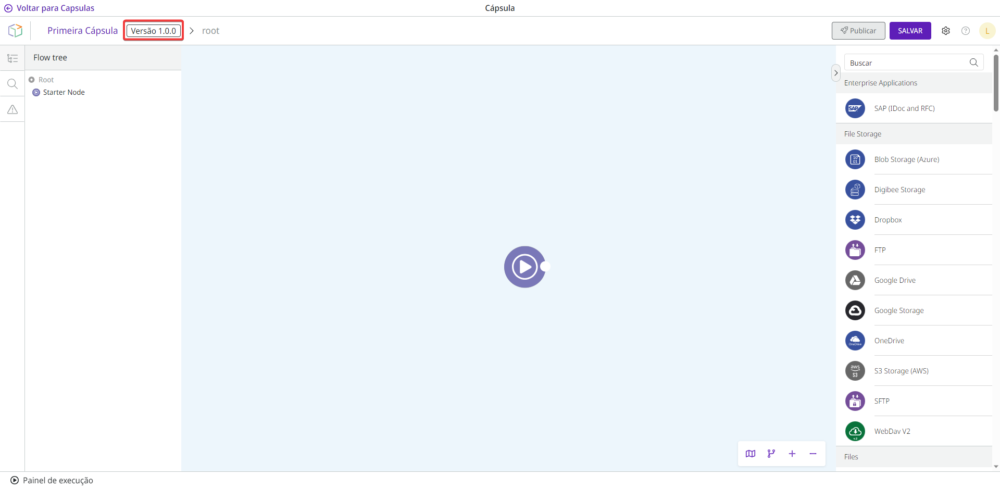

# Versionamento de Cápsulas

As Cápsulas possuem um controle de versão composto por 3 níveis representados por: 1.0.0. O primeiro número é denominado “_Major_”, o segundo número é denominado “_Minor_” e o terceiro número é denominado “_Fix_”.

Quando as versões precisam ser atualizadas, a Digibee Integration Platform analisa automaticamente a Cápsula após cada alteração para determinar os níveis da versão.

Veja como são determinados os níveis:

* _**Fix**_**:** versão da Cápsula quando a alteração não afetar os _pipelines_ que a utilizam. Incrementa o valor do _Fix_ em 1 (0.0.1).
* _**Minor**_**:** versão da Cápsula quando um item de configuração (entrada ou saída) é adicionado ou se torna opcional. Incrementa o valor do _Minor_ em 1 (0.1.0).
* _**Major**_**:** versão da Cápsula quando um item de configuração (entrada ou saída) é excluído ou se torna obrigatório. Esta versão também é aplicável quando o contrato da Cápsula for completamente alterado. Incrementa o valor do _Major_ em 1 (1.0.0).

Estas alterações só são feitas se a versão alterada já tiver sido publicada. Por exemplo, se você criar uma Cápsula, ela receberá inicialmente a versão "1.0.0". Se você não publicar, esta versão nunca será alterada, independentemente de você fazer atualizações na Cápsula ou não.

Depois de publicar a Cápsula, a versão “1.0.0” é definida como não editável. Quando uma nova atualização é feita na mesma Cápsula, a plataforma verifica o que foi alterado para determinar se o número da versão deve ser incrementado em _Major_, _Minor_ ou _Fix_.

O número da versão é exibido próximo ao nome da Cápsula.

<figure><figcaption></figcaption></figure>
