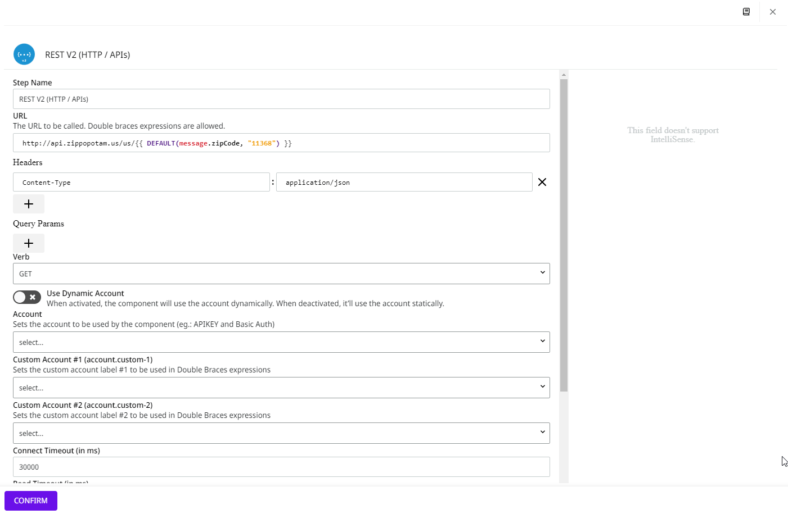

# IntelliSense

The IntelliSense feature, available in pipelines and Capsules, displays functions and Globals that you can retrieve directly from the component’s form as you build the flow. This way you can configure your components easier and faster.

If the field supports IntelliSense, a menu opens on the right side of the screen with all available options.

<figure><figcaption></figcaption></figure>

In this article, we will use the [**REST V2**](https://docs.digibee.com/documentation/components/web-protocols/rest-v2) and [**JSON Generator**](https://docs.digibee.com/documentation/components/tools/json-generator) components to show how IntelliSense works.

## Example of use

In the **REST V2** component form, you need to enter a URL to access a specific endpoint. In this example we will use the endpoint: `http://api.zippopotam.us/us/{{ DEFAULT (message.zipCode, "11368") }}`.

When we run the Execution panel, it returns the following JSON:

```json
{
  "status": 200,
  "statusMessage": "OK",
  "body": {
    "post code": "11368",
    "country": "United States",
    "country abbreviation": "US",
    "places": [
      {
        "place name": "Corona",
        "longitude": "-73.8611",
        "state": "New York",
        "state abbreviation": "NY",
        "latitude": "40.7453"
      }
    ]
  }
```

In the output of the endpoint you will find the fields `“country”`, `“post code”`, `“place name”`, `“state”`, and `“state abbreviation”`. We will use these fields to create a new output for this pipeline using the **JSON Generator** component and the REPLACE, TOINT, CONCAT, and JSONPATH [Double Braces functions](https://docs.digibee.com/documentation/build/double-braces/double-braces-functions) in IntelliSense.

Note that in the output, the value of the `"country"` field is `“United States”`. Imagine that we want to remove the space between the first and second words.

To remove this from the pipeline output, we can use the following REPLACE function:

```json
"country": {{ REPLACE (message.body.country, " ", "") }}
```

Check out the video below to see how we used IntelliSense to create this expression:

{% embed url="https://files.gitbook.com/v0/b/gitbook-x-prod.appspot.com/o/spaces%2F4523BaA7JfghHEYBbLWY%2Fuploads%2F3L7jGMWOCu49CYP7SDk9%2FIntelliSense-1.mp4?alt=media&token=200242c9-f404-4508-9d9e-2dc60cfbe6e9" %}

Now suppose we need to convert the string value of the field `"post code"` into an integer value. In this case, we can use the TOINT function. However, since the API returns `"post code"` with a space between the two words, we need to use a JSONPATH function inside the TOINT function to return the part of the JSON we are interested in.

Then we use the following expression:

```json
"postcode": {{ TOINT(JSONPATH(message.body, "$.['post code']") ) }}
```

In the video below you can see how we used this function:

{% embed url="https://files.gitbook.com/v0/b/gitbook-x-prod.appspot.com/o/spaces%2F4523BaA7JfghHEYBbLWY%2Fuploads%2F8uUwNioLtJuCAYYxUP1H%2FIntelliSense-2.mp4?alt=media&token=c7ac9d12-87bf-427e-b398-04b37776b73c" %}

Finally, we want to display the address by concatenating `“place name”`, `“state”`, and `“state abbreviation”` in the pipeline output. We use the CONCAT function to concatenate all messages and words, and the JSONPATH function to return the values that have a space between the words, such as `“place name”` and `“state abbreviation”`.


The CONCAT function has no limit on the fields that can be concatenated. If the field is not present in the message to be processed, the component ignores the request.


The result is the following expression:


```json
"address": {{ CONCAT(JSONPATH(message.body.places[0], "$.['place name']"), " - ", message.body.places[0].state, " - ", (JSONPATH(message.body.places[0], "$.['state abbreviation']")) }}
```


See the function in practice in the video below:

{% embed url="https://files.gitbook.com/v0/b/gitbook-x-prod.appspot.com/o/spaces%2F4523BaA7JfghHEYBbLWY%2Fuploads%2Fh0xsyN7h7Q0eZ0PVfIUz%2FIntelliSense-3.mp4?alt=media&token=10c5da3d-680d-49d0-ac64-477dc65aae61" %}

If we run the flow again, this is the final result of the execution:

```json
{
    "country": "UnitedStates",
    "postcode": 11368,
    "address": "Corona - New York - NY"
}
```

Learn more about the available functions in the [Double Braces Functions](https://docs.digibee.com/documentation/build/double-braces/double-braces-functions) documentation.
