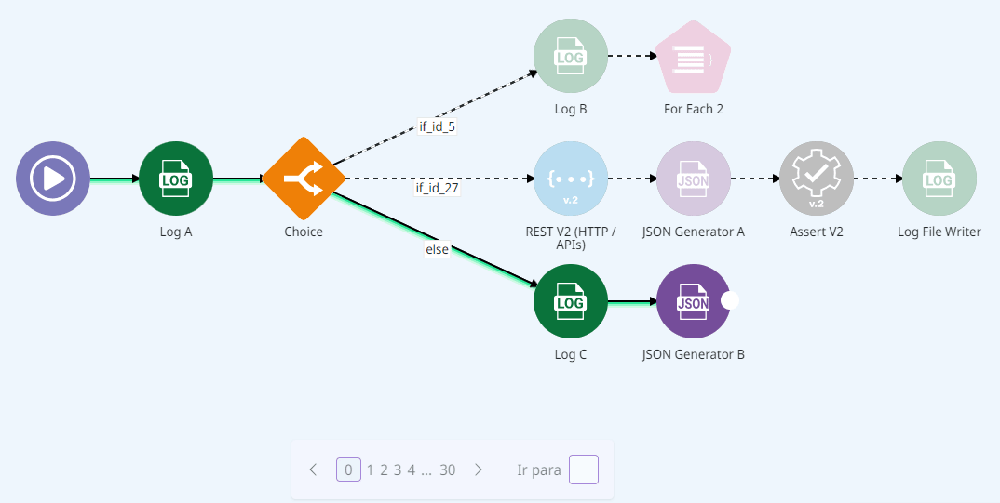

# Design and debug mode

Canvas has two different modes: design and debug. By default, it opens in design mode, where you create and edit on your flow. When you execute the flow, debug mode is activated to help you trace the path of execution and see more information about each component.

## Design mode

Design mode is the mode in which you do your work. In this mode you [configure the components and create the flow](https://docs.digibee.com/documentation/build/new-canvas-beta-restricted#h\_8d20bc202d).

While you are creating your flow and before you run the first execution, only the design mode is active.

## Debug mode

To activate debug mode, you must open the [Execution panel](https://docs.digibee.com/documentation/build/new-canvas-beta-restricted/execution-panel) in design mode and run the flow. The debug mode is activated when there are messages in the execution.


Debug mode is not activated if:

* The flow is not executed.
* The number of messages is too low.
* The limit of 2000 messages is reached.


Once the flow has been executed, you must click the **Debug** button at the top of the canvas to enter debug mode, as shown in the figure below.

<figure><figcaption><p>Button to access the debug mode.</p></figcaption></figure>

In debug mode, the execution path is shown with a green line. The dashed line and grayed out components represent the part of the flow that wasn’t executed. Red components in the flow mean that the execution failed.

See an illustration of these visual elements:

<figure><figcaption><p>Visual execution path of the flow.</p></figcaption></figure>

This mode is read-only, so you cannot edit the flow while you are in it. To edit the flow, you must switch back to design mode by clicking the **Design** button.


Changes in design mode won’t be visible in debug mode until you execute the flow again. This makes comparison easier, since you can visualize the old flow while editing the current flow.


### Components in debug mode

When you click on some of the executed components, you have access to the following information on the right side of the screen:

* **Execution status:** status of the execution of the component, which can be either "Success" or "Failed".
* **Start time:** the time when the execution of the component started, in YYYY/MM/DD HH:mm:ss.sss.
* **End time:** the time when the execution of the component ended, in YYYY/MM/DD HH:mm:ss.SSS.
* **Elapsed:** the time that elapsed during the execution of the component, in milliseconds.
* **Input:** the input that the component received.
* **Output:** the output that the component sends.
* **Errors (only for failed components):** the error that occurred when the component failed.

Besides this information, you can also click the gear icon to see the configuration of the component in read-only mode.

### Messages in debug mode

In the Execution panel, you can go to the **Messages** tab and double-click on any message to see it in debug mode at the moment the message was generated during execution.

### Loops in debug mode

Some components used in the flow can create loops. These components are: [Do While](https://docs.digibee.com/documentation/components/logic/do-while), [For Each](https://docs.digibee.com/documentation/components/logic/for-each), [Stream Excel](https://docs.digibee.com/documentation/components/files/stream-excel), [Stream File Reader](https://docs.digibee.com/documentation/components/files/stream-file-reader), [Stream File Reader Pattern](http://v), [Stream JSON File Reader](https://docs.digibee.com/documentation/components/files/stream-json-file-reader), [Stream XML File Reader](https://docs.digibee.com/documentation/components/files/stream-xml-file-reader), and [Stream DB V3](https://docs.digibee.com/documentation/components/structured-data/stream-db-v3).

When a loop is created, you can navigate through the index loops in the navigation menu at the bottom of the canvas. The three ways to navigate are to use the arrows, click on the three dots to open the index you want, or enter the index loop in the **Go to** field.

<figure><figcaption><p>Navigation menu in components with loops.</p></figcaption></figure>

The current loop index is displayed in the navigation menu and also in the breadcrumb between brackets ( \[ ] ), for example “For Each 1 (OnProcess) \[27]”. In this case the value “\[27]” stands for the current loop.

#### Loop within a loop

A flow can contain loops within loops. If you are in an **OnProcess** and want to enter another **OnProcess** in debug mode, there are two different scenarios:

**Scenario 1: accessing the OnProcess of a component that has been executed**

Let’s assume you are in the **OnProcess** of a **For Each** component (later referred to as “**For Each A**”) and are looking at loop number 2. So you are at this point in the flow:

```
root > For Each A (onProcess) [2]
```

Inside loop number 2 of this **OnProcess**, there is another **For Each**, which we’ll call “**For Each B**”, that has been executed. When you access the **OnProcess** of the **For Each B**, the subflow will be the continuation of the path you visualized in the previous level.

Now, you are at this point in the flow:

```
root > For Each A (onProcess) [2] > For Each B (onProcess) [0]
```

**Scenario 2: accessing the OnProcess of a component that was not executed**

Let’s assume you are back in the **OnProcess** of the **For Each A**, but now in loop number 5. So you are at this point in the flow:

```
root > For Each A (onProcess) [5]
```

In loop 5, the **For Each B** was not executed, but you can still access its **OnProcess** normally. When you access the **OnProcess**, debug mode automatically matches the previous level to the execution path where the subflow of **For Each B** was executed.

Since **For Each B** was executed in loop 2, the path of the breadcrumb is updated to:

```
root > For Each A (onProcess) [2] > For Each B (onProcess) [0]
```

If you return to the **For Each A** level, you will see loop 2 instead of loop 5.

### Import execution in debug mode

When you import an execution into the canvas, the debug mode is activated and you can analyze the execution in read-only mode.


The imported execution is opened in debug mode only if the execution was exported after the release of design and debug modes.


## Canvas navigation in design and debug mode

Canvas navigation, which includes the [flow tree](https://docs.digibee.com/documentation/build/pipelines/pipeline-navigation#flow-tree), [search](https://docs.digibee.com/documentation/build/pipelines/pipeline-navigation#search-field), and [linter alerts](https://docs.digibee.com/documentation/build/pipelines/pipeline-building-validation), always takes into account the mode you are in.

For example, if you add a new component in design mode, you can see it in the flow tree, find it via search, and see the linter alerts. However, if you don't execute the flow, the component doesn't exist in debug mode and won’t be found in the flow tree or search, or have any alerts.
