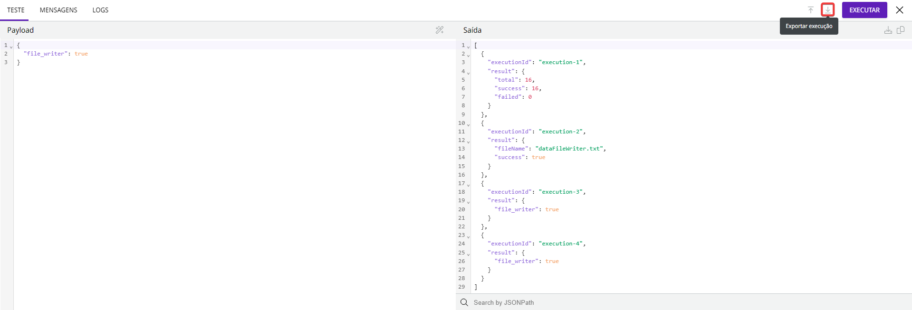
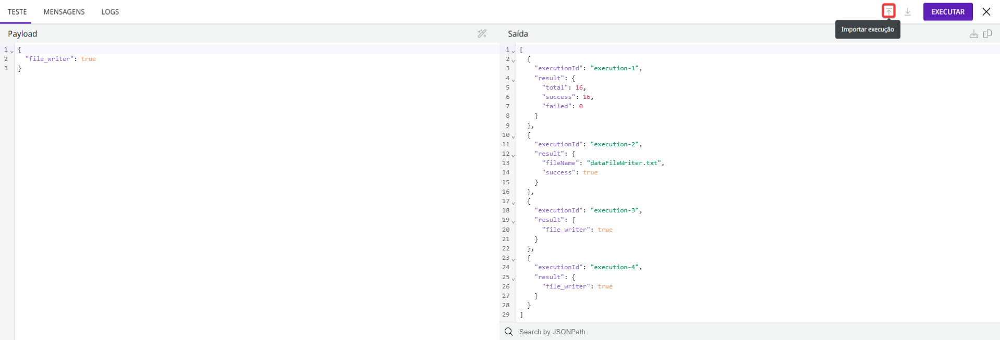

# Painel de execução


Essa funcionalidade se chamava "Test mode" até junho de 2023.


Usando o Painel de execução, você pode testar um [_pipeline_](https://docs.digibee.com/documentation/build/pipelines) ou [cápsula](../capsulas/) no canvas antes de implantar. Isso é útil para testar a lógica de implementação, depurar e solucionar possíveis problemas.

Para abrir o Painel de execução, clique em **Painel de execução** no canto inferior esquerdo do Canvas.

## Como funciona o Painel de execução

O Painel de execução executa o _pipeline_ ou cápsula no ambiente de teste e valida a lógica de integração. Além disso, o Painel de execução usa valores de teste registrados em _Globals_, Contas, Relacionamento, e serviços Multi-instância.&#x20;

Essa funcionalidade está disponível tanto em _pipelines_ quanto em Cápsulas. A única diferença é que nas cápsulas, ao testar a execução, você deve inserir os parâmetros definidos no formulário de configuração, se necessário. Para mais informações, consulte o tópico [Aba Teste](execution-panel.md#aba-teste).


Se você tentar executar muitas transações no Painel de execução, o erro “_Out of memory_” pode ser exibido.


## Visão geral das funcionalidades do Painel de execução

O Painel de execução tem três abas onde você pode depurar o seu _pipeline_ ou cápsula.

### Aba Teste

A aba **Teste** permite que você insira os dados de entrada desejados na coluna _**Payload**_ logo abaixo do título Teste. Você pode ver o resultado da execução na coluna **Saída** ao lado da coluna _**Payload**_.

<figure><figcaption></figcaption></figure>

#### Coluna Parâmetros


Essa coluna está disponível somente no Painel de execução de [Cápsulas](../capsulas/).&#x20;


Na coluna **Parâmetros**, você deve inserir os parâmetros definidos no formulário de configurações da cápsula. Como os testes representam uma execução válida, o desenvolvedor da cápsula tem a mesma experiência que o usuário terá ao usá-la em um _pipeline_.

#### Coluna _Payload_

Na coluna _**Payload**_, você pode inserir dados de entrada para testar o seu _pipeline_ ou cápsula. Depois de inserir os dados, você pode clicar no botão **Formatar JSON** no canto superior direito para formatar seu JSON.

Para executar o _pipeline_ ou cápsula, clique em **Executar**. Cada execução dura até 60 segundos, mas você pode interrompê-la a qualquer momento clicando em **Parar**.

Quando um _pipeline_ é multi-instância, um campo de seleção _**Multi-instance**_ é exibido para selecionar a instância a ser executada.

#### Coluna Saída

Na coluna **Saída**, você pode ver o resultado da execução.

Para baixar as informações de saída para o seu computador no formato JSON, clique no botão **Baixar JSON** ou copie as informações de saída para a área de transferência clicando em **Copiar JSON**.

Você pode usar o campo **Buscar por JSONPath** nas informações de saída para criar expressões para selecionar e filtrar elementos da saída JSON.

### Aba Mensagens

A aba **Mensagens** exibe o resultado da execução de cada componente. Um componente sempre recebe o _payload_ gerado pelo componente anterior, processa esse _payload_ com base em sua função e gera um novo _payload_ em resposta.

<figure><figcaption></figcaption></figure>

#### Lista de mensagens

As primeiras 2000 mensagens são listadas na coluna esquerda da aba **Mensagens**. Nessa área você pode ver o nome da mensagem (que é o mesmo que do _Step Name_ do componente) e o tempo que levou para executá-la.

Para ver uma mensagem específica, use o campo **Buscar por mensagens**. Você pode inserir o nome da mensagem, parte do nome da mensagem ou um parâmetro.

#### Pré-visualização da mensagem

Para ver a pré-visualização de cada mensagem, clique com o mouse sobre a mensagem desejada e navegue com as setas do teclado para ver a pré-visualização das outras mensagens.

Para baixar o JSON da pré-visualização da mensagem ou para copiá-lo para a área de transferência, clique nos botões no canto superior direito da coluna **Pré-Visualização da mensagem**.

Além disso, o campo **Buscar por JSONPath** permite criar expressões para selecionar e filtrar elementos JSON da saída JSON da pré-visualização da mensagem.

### Aba _Logs_

A aba _**Logs**_ contém informações sobre os _logs_ de eventos que ocorrem durante a execução de um _pipeline_ ou cápsula no Painel de execução e permite a visualização de _logs_ individuais em uma seção dedicada.

<figure><figcaption></figcaption></figure>

#### Lista de _logs_

Na lista de _logs_ você pode ver a informação a seguir:

* **Nível do **_**log**_**:** a classificação do _log_, representada por um ícone. Os níveis são:
  * **Info:** _logs_ informativos.
  * **Erro:** _logs_ com um erro durante a execução.
  * **Alerta:** _logs_ que contêm um aviso.&#x20;
* _**Timestamp**_**:** a data e a hora em que a etapa foi executada.
* **Mensagem do **_**log**_**:** as mensagens de cada _log_, por exemplo, os registros do evento referentes à execução do _pipeline_.

#### Ações

Na aba _**Logs**_, clique no botão **Filtro** para especificar os níveis de _log_ a serem listados.

Para copiar o conteúdo da mensagem do _log_ para a área de transferência, clique no botão _**Copy log message**_ no canto direito do _log_ cujo conteúdo você deseja salvar.

Você também pode pesquisar um _log_ específico inserindo parte do texto ou o texto completo da mensagem de _log_ no campo **Buscar por **_**logs**_ embaixo da lista de _logs_.

### Exportar e importar

#### Exportar

Clique no botão **Exportar execução** para baixar um arquivo com as configurações do _pipeline_ ou cápsula e os dados de execução. Espere até que todos os dados de execução estejam carregados na tela antes de exportar o arquivo para que nenhuma informação seja perdida.

<figure><figcaption></figcaption></figure>

O arquivo contém os seguintes dados:

* `pipelineId`: o ID do _pipeline_ ou cápsula.
* `pipelineName`: o nome do _pipeline_ ou cápsula.
* `currentFlowSpec`: a informação do fluxo disponível no canvas no momento que o arquivo foi exportado, incluindo todos os componentes e as suas configurações.&#x20;
* `executedFlowSpec`: a informação do fluxo do momento que o _pipeline_ ou cápsula foi executado, incluindo todos os componentes e suas configurações.&#x20;
* `realm`: o _realm_ do pipeline ou cápsula.
* `execution`: os dados de execução. Contém o _**Payload**_, **Saída**, **Mensagens**, e **Logs**.


Se você não executar o _pipeline_ ou cápsula antes de exportar o arquivo, apenas os dados relacionados ao _pipeline_ ou cápsula (como o ID e o nome), o `currentFlowSpec` e o `executedFlowSpec` estarão disponíveis no arquivo.


#### Importar

Clique no botão **Importar execução** para importar um arquivo do seu computador que contém configurações de um _pipeline_ ou cápsula e dados de execução.

<figure><figcaption></figcaption></figure>

Quando você importar o arquivo, os dados de `execution` do arquivo aparecerão no Painel de execução. No entanto, os dados do `currentFlowSpec` e do `executedFlowSpec` não aparecerão no canvas.


Você somente pode executar os dados de um arquivo no Painel de execução se você está no mesmo _pipeline_ ou cápsula do qual a execução foi exportada e se o fluxo original ainda existe.


## Informações adicionais

### _Timeout_ do Painel de execução

Para execuções no Painel de execução, o front end aguarda até 60 segundos por uma resposta. Se não houver nenhuma resposta, um _timeout_ acontece, mas a execução continua em andamento por até 5 minutos. Para analisar essa execução, vá até a página de Monitor, clique em _**Pipeline Logs**_, escreva o filtro “test-mode” em **Nome do **_**pipeline**_, e busque.

Você também pode analisar a execução na página de Monitor se perder a conexão com a internet.

### Teclas de atalho

* Para abrir ou fechar o Painel de execução: CTRL+D; Cmd+D.
* Para executar o Painel de execução: CTRL+Enter; Cmd+Enter.
