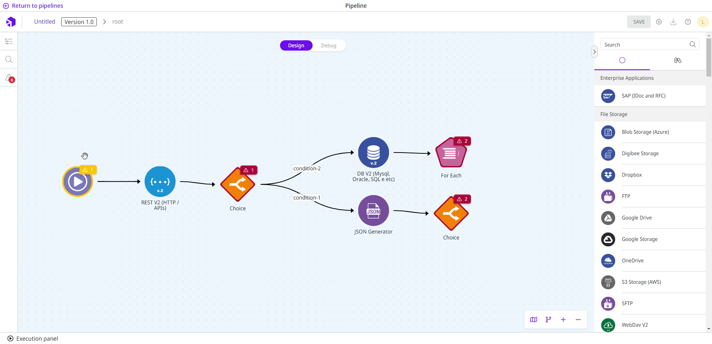
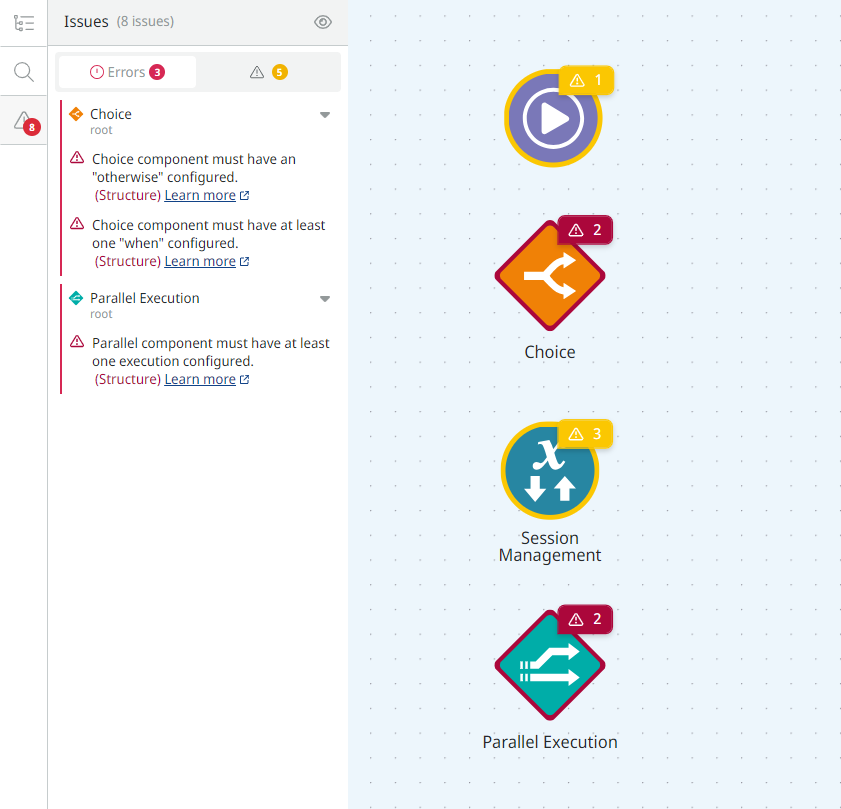

# Linter: Canvas building validation

Canvas displays alerts during pipeline and capsules building, helping developers identify and fix common issues faster.

## Find problems

For each component where a problem occurs during flow creation, the canvas displays an alert with further information. Many of the checks serve as warnings and do not require corrections or disrupt the creation process of your flows.

## Alerts

Issues validated during the creation of the pipeline or capsule are divided into **Errors** and **Warnings**. This classification of alerts helps the developer to understand the extent of the problem indicated by canvas.

### Errors

**Error** alerts indicate serious failures in pipeline or capsule creation. They must be corrected or it will not be possible to save the project.

Canvas displays errors in the following category:

* Structure: structural errors that prevent the integration flow to be processed.&#x20;

### Warnings

**Warning** alerts indicate improvement points in pipeline or capsule creation.&#x20;

Canvas displays warnings in the following category:

* Best practices: building habits that will help your pipeline or capsule perform better and facilitate future maintenance and improvement.

## Issues list

For each problem encountered during pipeline and capsules construction, an issue is displayed in a list. It displays the issues divided according to the categories listed above. It also contains the name of the component that presents the issue and a description of the problem.

In the issues list, it's also possible:

* To see the image and name of the component along with the description of the issue and the link to the documentation that will help you resolve the issue.
* To temporarily hide alerts by clicking the eye icon.
* To navigate through the sub-levels to find the component in question by clicking the target icon.
* To open the configuration form of the component to edit it by clicking the gear icon.

To open the list, click on the **Issues** button, represented by a warning icon on the left toolbar on canvas.

## Fix problems

All canvas checks contain information that will help you fix the problem. Hover over the warning icon above the component to view the information. This way, you can read it and evaluate each suggestion in your pipeline or capsule.

This page lists all possible alerts developed so far. They contain details and information on how to fix and improve your pipeline or capsule.

### Choice

1. #### The Choice component must have at least one "when" configured (structure)

Choice allows conditional branching within a pipeline or capsule. To use this component correctly, you must configure its "**when**" conditions. Each **when** condition branches the flow into a specific path. You must have at least 1 **when** condition configured.

Therefore, define at least one **when** condition to avoid interrupting the flow.

2. **The Choice component must have an "otherwise" configured (structure)**

Choice allows conditional branching within a pipeline or capsule. To use this component correctly, it is necessary to configure its "**otherwise**" condition rule. The **otherwise** condition is executed when none of the **when** conditions are met. You must have 1 **otherwise** condition configured.

Therefore, define the **otherwise** condition to be executed if none of the **when** conditions are true.

### Subflow components

The following issues refer to the components that allow structuring [subpipelines](https://docs.digibee.com/documentation/build/pipelines/subpipelines), that is, subflows of the pipeline or capsule. Subpipelines are structured around the following components:

* [Block Execution](../../components/logic/block-execution.md)
* [Do While](../../components/logic/do-while.md)
* [For Each](../../components/logic/for-each/)
* [Retry](../../components/logic/retry.md)
* [Stream Excel](../../components/files/stream-excel.md)
* [Stream File Reader](https://docs.digibee.com/documentation/components/files/stream-file-reader?q=beta+program)
* [Stream File Reader Pattern](https://docs.digibee.com/documentation/components/files/stream-file-reader-pattern?q=beta+program)
* [Stream JSON File Reader](https://docs.digibee.com/documentation/components/files/stream-json-file-reader?q=beta+program)
* [Stream XML File Reader](https://docs.digibee.com/documentation/components/files/stream-xml-file-reader?q=beta+program)
* [Stream DB V3](https://docs.digibee.com/documentation/components/structured-data/stream-db-v3?q=beta+program)

1. #### The OnProcess must have at least one component connected. (structure)

The OnProcess defines one of the subflows of the pipeline or capsule. Structure and connect the OnProcess subpipeline so that the flow is not interrupted.

2. **The OnException must have at least one component connected. (best practices)**

The OnException is the subpipeline whose job is to handle an exception in the OnProcess execution. Structure and wire the OnException subflow so that the flow of the pipeline or capsule is not interrupted.


This rule doesn't apply to the **Block Execution** component.


3. **There is at least one issue inside OnProcess (structure)**

The OnProcess defines one of the subflows of the pipeline or capsule. Review the OnProcess subpipeline issues to continue creating your flow.

4. **There is at least one issue inside OnException (structure)**

The OnException is the subpipeline whose job is to handle an exception in the OnProcess execution. Review the OnException subflow issues to continue creating your pipeline or capsule.

### Parallel

1. #### The Parallel component must have at least one execution configured (structure)

**Parallel** allows you to configure parallel executions within the flow. Connect **Parallel** to another component to prevent the from stopping.


**Parallel** must always be followed by another component for the flow to run.


2. **The Parallel component should have at least two executions configured (best practice)**

**Parallel** allows you to configure parallel executions within the flow. As a best practice, we recommend that you use **Parallel** only when you need to make two or more executions at the same time.

### Triggers

1. #### Trigger not configured. To deploy the pipeline, configure the trigger (structure)

The trigger defines how to start the execution of the pipeline. To configure the trigger, select one of the options from those offered by the Digibee Integration Platform. Next, connect it to the beginning of the flow to deploy the pipeline later. For more information, access the[ triggers documentation](https://docs.digibee.com/help-center/components/triggers).


You can save the pipeline without configuring the trigger. However, you will not be able to deploy it.


### Deprecated versions

1. #### Deprecated component version. There's a new version of this component (best practices)

The version of the component you are trying to use has been deprecated. This means that a new, improved version is available to be used.

**Example:** the **SOAP** component has three versions,[ SOAP V1](https://docs.digibee.com/help-center/components/web-protocols/soap-v2/soap-v1),[ SOAP V2](https://docs.digibee.com/help-center/components/web-protocols/soap-v2), and[ SOAP V3](https://docs.digibee.com/help-center/components/web-protocols/soap-v3). We recommend the latest version of the component, which is the **SOAP V3**.


The deprecated version of the component can still be used. However, it is important to note that increments and improvements are made only in its latest version.


### Capsules

1. #### This Capsule can't be used here because it doesn't exist in this realm (structure)

The capsule you are trying to use does not exist in the realm you are working on. You must delete it or replace it with another component, flow, or a capsule that is available in this realm.

### Session Management

1. #### The field wasn't declared previously (best practices)

The field cannot be used (GET operation) because it was not previously declared (PUT operation).

2. **The field was declared but is not being used (best practices)**

The field was previously declared (PUT operation) but is not being used.

Configure a new **Session Management** component to use (GET operation) or delete (DELETE operation) the previously declared field.
