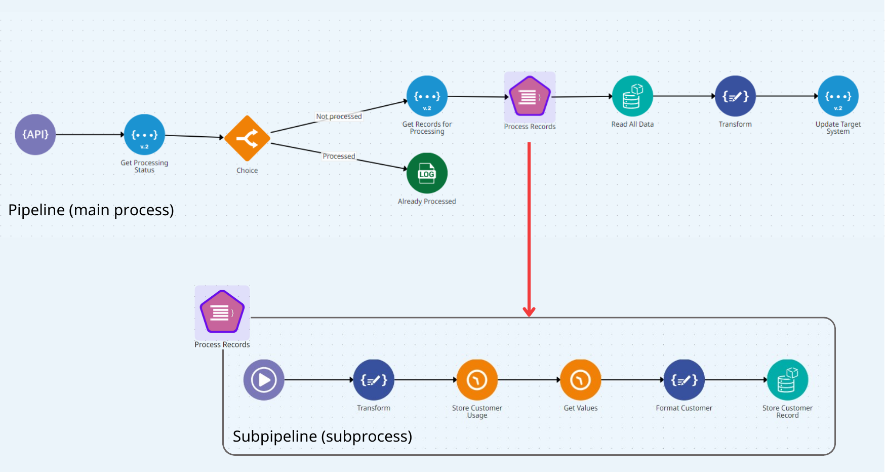

# Pipeline

The Digibee Integration Platform has the pipeline as the main piece, which is a sequence of components that allow the connection of systems to establish data flow between them.

A pipeline consists of:

* One trigger
* At least one other component


The trigger must be connected to the components of the flow.


<figure><figcaption></figcaption></figure>

A trigger is the pipeline's activation condition, that is, the element that defines how the pipeline's execution is initiated – for example, by an external call, in response to an event, or through a schedule. To learn more, read the [Triggers documentation](https://docs.digibee.com/documentation/components/triggers).

A component is an element that receives a message and can interact with it or use the information it contains to execute any of the following activities:

* Call external services, such as a [**REST**](https://docs.digibee.com/documentation/components/web-protocols/rest-v2) endpoint.
* Process messages by transforming the content of a message.
* Change the execution flow by branching the pipeline flow based on conditions, like the [**Choice**](https://docs.digibee.com/documentation/components/logic/choice) component does.
* Loop through collections, as the [**For Each**](https://docs.digibee.com/documentation/components/logic/for-each) component does.

This last case is a bit more sophisticated and to understand it we need to examine it more closely.

When you use a component that iterates in collections, each collection item is processed in a separate flow called subpipeline. See the image below:

<figure><figcaption></figcaption></figure>

1. The main flow is executed up to the component in which the subpipeline is created (in the example above, this component is **For Each**, which is called “Process Records”).
2. The execution takes place in the subpipeline, where each item of the collection is processed individually.
3. When the execution of item 2 is finished, the control returns to the beginning of the subpipeline, which starts processing the next item, and so it continues until the collection is completely processed.
4. Once the entire collection is processed, the control returns to the **For Each** component, which directs the flow to the next component in the main flow (in this case, the **Object Store** component named “Read All Data”).

To learn more, read the article [Subpipelines](https://docs.digibee.com/documentation/build/pipelines/subpipelines).
