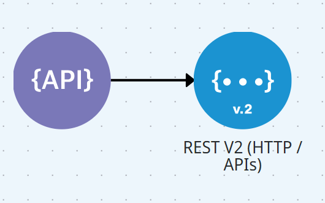

# Pipeline

A Digibee Integration Platform tem como peça central o _pipeline_, que é uma sequência de componentes que permite conectar sistemas e estabelecer fluxos de dados entre eles.

Um _pipeline_ é composto por:

* Um _trigger_
* Pelo menos um componente


O _trigger_ precisa estar conectado aos componentes.


<figure><figcaption></figcaption></figure>

O _trigger_ é a condição de disparo do _pipeline_, ou seja, é um elemento que define como a execução do _pipeline_ será iniciada – por exemplo, através de uma chamada externa, em resposta a um evento ou por um agendamento. Para saber mais, leia a [documentação sobre _Triggers_](https://docs.digibee.com/documentation/v/pt-br/components/triggers).

Um componente é um elemento que recebe uma mensagem, podendo interagir ou utilizar as informações contidas nela para executar uma das seguintes atividades:

* Chamar serviços externos, como uma chamada a um endpoint [**REST**](https://docs.digibee.com/documentation/v/pt-br/components/web-protocols/rest-v2).
* Processar mensagens transformando o conteúdo da mensagem.
* Alterar o fluxo de execução com uma bifurcação que permite direcionar o fluxo do _pipeline_ com base em uma condição, como o componente [**Choice**](https://docs.digibee.com/documentation/v/pt-br/components/logic/choice) faz.
* Percorrer coleções, como o componente [**For Each**](https://docs.digibee.com/documentation/v/pt-br/components/logic/for-each) faz.

Este último caso é um pouco mais sofisticado e, para entendê-lo, precisamos examiná-lo mais de perto.

Quando você utiliza um componente que itera em coleções, cada item da coleção é processado em um fluxo separado chamado _subpipeline_. Veja a imagem abaixo:

<figure><figcaption></figcaption></figure>

1. A execução do fluxo principal acontece até chegar ao componente onde o _subpipeline_ é criado (no exemplo acima, o componente é o **For Each**, que foi nomeado como “Processa registros”).
2. A execução passa para o _subpipeline_, onde cada item da coleção será tratado individualmente.
3. Ao término da execução do item 2, o controle volta ao início do _subpipeline_, que inicia o processamento do próximo item e assim sucessivamente, até que a coleção seja totalmente processada.
4. Uma vez que toda a coleção tenha sido processada, o controle retorna ao componente **For Each,** que direciona o fluxo para o próximo componente do fluxo principal (no caso, o componente **Object Store** nomeado como “Lê todos os dados”).

Para saber mais, leia o artigo[ _Subpipelines_](https://docs.digibee.com/documentation/v/pt-br/build/pipelines/subpipelines).
