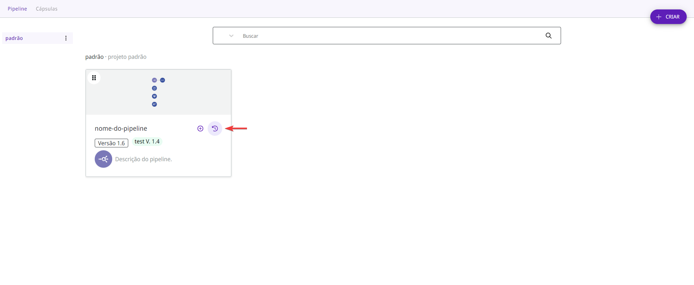
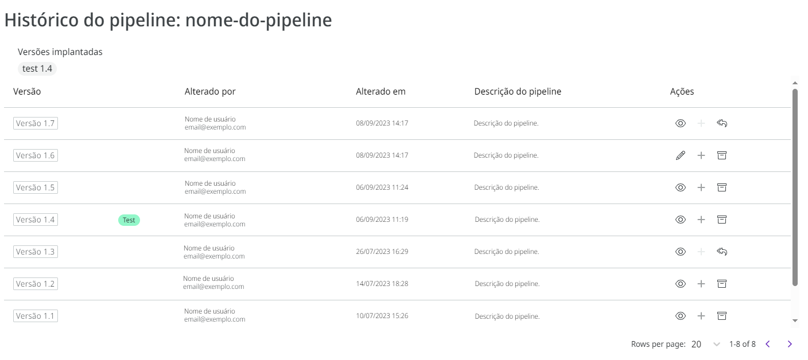
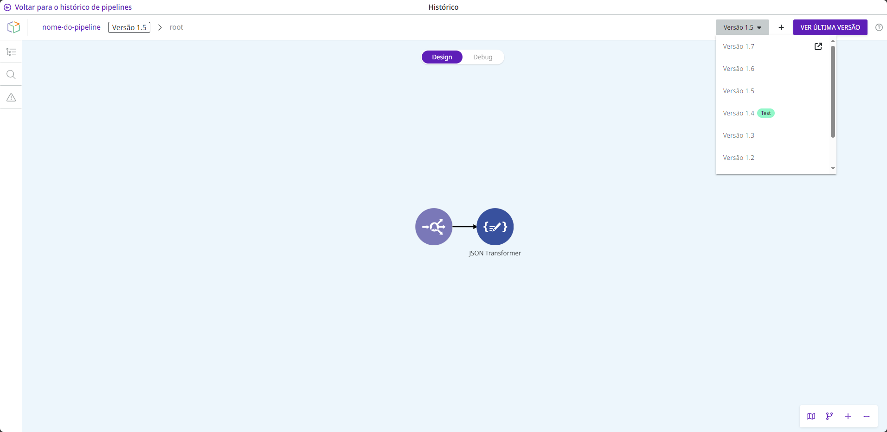

# Histórico de versões do pipeline


Para acessar o histórico de versões do pipeline e usar as funcionalidades presentes nesse artigo, você precisa ter a permissão BETA:PIPELINE-HISTORY. Aprenda mais na[ documentação sobre Papéis](https://docs.digibee.com/documentation/v/pt-br/administration/new-access-control/papeis-do-controle-de-acesso).


## O que é o histórico de versões do _pipeline_?

O histórico de versões do _pipeline_ lista todas as versões _minor_ de um _pipeline_ associadas à sua versão _major_. Isso permite que você veja quem editou cada versão pela última vez e quando ela foi editada. Você também pode ver se uma versão específica está implantada e em qual ambiente (**test** ou **prod**).

Você também pode usar o histórico de versões do _pipeline_ para executar ações como editar a última versão _minor_ do _pipeline_, visualizar e criar uma nova versão a partir de uma versão existente e arquivar uma versão específica.

Para saber mais sobre as condições de versionamento do _pipeline_, leia o artigo [Versionamento de _pipeline_](https://docs.digibee.com/documentation/v/pt-br/build/pipelines/versionamento-de-pipelines).


As versões criadas a partir de 1º de fevereiro de 2022 mostram quem editou a versão. As versões criadas antes dessa data mostram o valor padrão "_No data_". _Pipelines_ criados antes de 15 de fevereiro de 2021 não incluem informações de data de alteração e exibem 31/12/1969 por padrão.


## Como acessar o histórico de versões de um _pipeline_

Na página _Build_, identifique o _pipeline_ que possui pelo menos uma versão _minor_ para acessar o histórico. Em seguida, clique no botão **Ver histórico** (representado por um ícone de relógio) no lado direito do cartão do _pipeline_:

<figure><figcaption></figcaption></figure>

Uma página é aberta com o histórico de versões, contendo informações sobre todas as versões _minor_ do _pipeline_.

<figure><figcaption></figcaption></figure>

Essas são as informações fornecidas pelo histórico de versões do _pipeline_:

* **Versões implantadas:** as versões do _pipeline_ que foram implantadas. Essa informação só será exibida se uma das versões _minor_ do _pipeline_ for implantada em **test** ou **prod**.
* **Versão:** a versão _minor_ do _pipeline_.
* **Alterado por:** nome e endereço de email do usuário que editou a versão do _pipeline_.
* **Alterado em:** data e hora em que a versão _minor_ foi editada.
* **Descrição do **_**pipeline**_**:** a descrição que está no _pipeline_.

Você também pode escolher quantas versões deseja visualizar por página no histórico de versões do _pipeline_ e navegar pelo histórico usando a paginação no canto inferior direito.

## Ações

Determinadas ações podem ser executadas no histórico de versões do _pipeline_. As ações podem variar dependendo de cada versão _minor_ do _pipeline_.

### Editar _pipeline_

Você pode editar a última versão _minor_ do _pipeline_, desde que ela não esteja arquivada. Para editá-la, clique no botão **Editar **_**pipeline**_, que o redirecionará para o canvas.


Quando você edita a última versão do _pipeline_ e clica em **Salvar**, você cria uma nova versão _minor_ que é a versão atual do _pipeline_. Somente a última versão _minor_ pode ser editada.


### Visualizar _pipeline_

Todas as versões mais antigas de um _pipeline_ estão disponíveis para visualização, desde que não estejam arquivadas. Para visualizar uma versão específica no canvas, clique em **Visualizar **_**pipeline**_.

No canvas, você pode navegar entre versões _minor_ mais antigas de um _pipeline_ usando o histórico integrado ao canvas. Não é possível editar as configurações de _triggers_ e componentes que compõem essas versões. A única versão _minor_ que pode ser editada é a mais recente, que é a versão atual do _pipeline_.

No entanto, você pode usar as versões _minor_ antigas para criar a versão editável atual do _pipeline_. Para fazer isso, selecione a versão antiga desejada no histórico integrado ao canvas e clique no botão **Criar versão **_**minor**_ (representado por um ícone de adição) no canto superior direito da tela.


Para executar esta ação, a versão _minor_ não deve estar arquivada. Se estiver arquivada, o botão **Restaurar esta versão** substitui o botão **Criar versão **_**minor**_.


<figure><figcaption></figcaption></figure>

No canvas, você pode visualizar a versão atual do _pipeline_ clicando no botão **Veja última versão**. Por ser a versão mais recente, esse _pipeline_ é totalmente editável.

Para retornar ao histórico de versões, clique em **Voltar para o histórico de **_**pipelines**_ no canto superior esquerdo da tela.

### Arquivar _pipeline_

Você pode arquivar qualquer versão _minor_ do _pipeline_, antiga ou nova, clicando em **Arquivar **_**pipeline**_.


Somente versões não arquivadas podem ser implantadas nos ambientes de **test** e **prod** na página _Run_. Ou seja, se uma versão estiver arquivada, ela não será exibida no momento da criação de novas implantações.


### Restaurar _pipeline_

Depois que uma versão do _pipeline_ for arquivada, você poderá restaurá-la usando o botão **Restaurar **_**pipeline**_ e disponibilizá-la para visualização.

### Crie nova versão _minor_

Você pode criar uma nova e atual versão _minor_ a partir de uma versão antiga, desde que a versão antiga não esteja arquivada. Para fazer isso, selecione a versão desejada e clique no botão **Criar nova versão **_**minor**_. Isso criará uma cópia da versão e o levará para o canvas, onde poderá editá-la.

