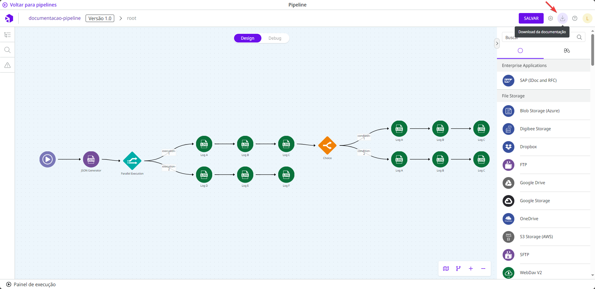

# Documentação de pipelines com IA


Clientes que assinaram contrato com a Digibee antes de 27 de novembro de 2023 devem entrar em contato com o suporte para ativar esse recurso. Para clientes que assinaram contrato com a Digibee após 27 de novembro de 2023, este recurso é ativado por padrão e eles devem pedir para desativá-lo, se desejarem. Por favor, leia os [Termos de uso para funcionalidades de IA](../../general/terms-of-use-for-ai-functionalities.md).


O Gerador de Documentação de Pipeline com IA usa técnicas avançadas de inteligência artificial para analisar o fluxo de um _pipeline_ e gerar documentação detalhada. Isso economiza tempo e esforço na criação e manutenção manual de documentação. Também reduz o esforço necessário para compreender _pipelines_ complexos e ajuda na solução de problemas.

## Como gerar a documentação

Para gerar a documentação, clique no botão **Download da documentação**, um ícone de download próximo ao botão **Configurações**. A criação da documentação pode demorar alguns segundos, mas uma vez criada, um arquivo PDF será baixado para o seu computador.


A documentação é gerada somente em inglês.


<figure><figcaption></figcaption></figure>

### Restrições na geração da documentação

A OpenAI trabalha com [_tokens_](https://help.openai.com/en/articles/4936856-what-are-tokens-and-how-to-count-them), que são "sequências comuns de caracteres encontradas em um conjunto de texto". Esses _tokens_ são limitados dependendo do modelo e, quando atingidos, a resposta não é gerada.

Nosso Gerador de Documentação de Pipeline com IA tem um limite de 128.000 _tokens_. Em um _pipeline_, esse número corresponde a aproximadamente 500-600 componentes. Uma vez que esses _tokens_ são atingidos, a documentação do _pipeline_ não é gerada, e uma mensagem de erro é exibida na tela.


Os _tokens_ são compartilhados por todas as contas da Digibee e são redefinidos diariamente.


## Estrutura da documentação

A documentação do _pipeline_ inclui as seguintes informações:

### Descrição do fluxo

A primeira parte do documento é uma descrição do fluxo, que fornece uma visão geral do _pipeline_. O texto inclui a finalidade da integração e uma descrição concisa que explica como a integração é acionada e como o fluxo é implementado.

### External Systems Involved

A seção _External Systems Involved_ lista todos os sistemas integrados ao _pipeline_. Na lista você encontra informações sobre os componentes, como nomes, parâmetros e outras configurações.

### Events

A seção _Events_ lista todos os eventos enviados no _pipeline_. Isso permite você acompanhar o fluxo de dados e possíveis problemas. Também ajuda você a entender quais outros _pipelines_ são acionados.

### Globals

A seção _Globals_ lista os componentes associados a variáveis ​​globais. Isso ajuda você a entender como elas são usadas e evita o uso indevido acidental de variáveis ​​globais para garantir uma integração confiável.

### Accounts

A seção _Accounts_ documenta contas e acesso a credenciais. Isso promove práticas recomendadas de segurança e conformidade.


No componente [**Object Store**](https://docs.digibee.com/documentation/v/pt-br/components/structured-data/object-store) a identificação da conta está desativada por ser inerente à configuração da Digibee Integration Platform.

