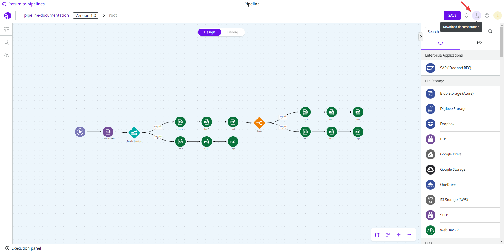

# Pipeline documentation with AI


Customers who signed a contract with Digibee before November 27, 2023 must contact support to activate this feature. For customers who signed a contract with Digibee after November 27, 2023 this feature is activated by default and they must ask to deactivate it if they wish. Please read the [Terms of use for AI functionalities](../../general/terms-of-use-for-ai-functionalities.md).


The AI Generator for Pipeline Documentation uses advanced artificial intelligence techniques to analyze the flow of a pipeline and generate detailed documentation. This saves time and effort in manually creating and maintaining documentation. It also reduces the effort required to understand complex pipelines and helps with troubleshooting.

## How to generate the documentation

To generate the documentation, click on the **Download documentation** button, a download icon next to the **Settings** button. It may take a few seconds for the documentation to be created, but once it is created, a PDF file will be downloaded to your computer.

<figure><figcaption></figcaption></figure>

### Restrictions on the documentation generation

OpenAI works with [tokens](https://help.openai.com/en/articles/4936856-what-are-tokens-and-how-to-count-them), which are “common sequences of characters found in a set of text”. These tokens are limited depending on the model, and when they are reached, the answer is not generated.

Our AI Generator for Pipeline Documentation has a limit of 128000 tokens per request. In a pipeline, this number corresponds to approximately 500-600 components. Once these tokens are reached, the pipeline documentation is not generated and an error message is displayed on the screen.


The tokens are shared to all Digibee accounts and reset every day.


## Documentation structure

The pipeline documentation includes the following information:

### Flow description

The first part of the document is a description of the flow, which gives you an overview of the pipeline. The text includes the purpose of the integration and a concise description that explains how the integration is triggered and how the flow is implemented.

### External Systems Involved

The External Systems Involved section lists all systems that are integrated into the pipeline. In the list you can find information about the components, such as their names, parameters, and other configurations.

### Events

The Events section lists all events that are sent within the pipeline. This allows you to track the data flow and possible problems. It also helps you to understand which other pipelines are triggered.

### Globals

The Globals section lists the components associated with global variables. This helps you understand how they are used and prevents accidental misuse of global variables to ensure reliable integration.

### Accounts

The Accounts section documents accounts and access to credentials. This promotes best practices for security and compliance.


In the [**Object Store**](../../components/structured-data/object-store.md) component, account identification is deactivated because it is inherent in the Digibee Integration Platform configuration.

