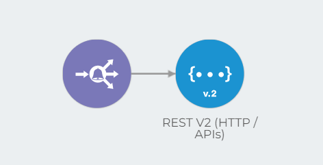

# Pipeline version history


To access the pipeline version history and use the features presented in this article, you need the permission BETA:PIPELINE-HISTORY. Learn more in the [documentation about Roles](https://docs.digibee.com/documentation/administration/new-access-control/access-control-roles).


## What is the pipeline version’s history?

The pipeline version history lists all the minor versions of a pipeline that are associated with its major version. This allows you to see who last edited each version and when it was edited. You can also see if a particular version is deployed and in which environment (**test** or **prod**).

You can also use the pipeline version history to perform actions such as edit the last minor version of the pipeline, view and create a new version from an existing version, and archive a specific version.

To learn more about the conditions of the pipeline versioning, read the article [Pipeline versioning](https://docs.google.com/document/d/1OQfQ3LEv1Zxy5HsWtaty5QycwlCiL7HreuaSH7FIBNQ/edit?usp=sharing).


Versions created on or after February 1, 2022, show who edited a version. Versions created before that date show the default value of "No data". Pipelines created before February 15, 2021, don't include change date information and display 12/31/1969 by default.


## How to access a pipeline version history

On the Build page, identify the pipeline that has at least one minor version to access the history. Then click the **View history** button (represented by a clock icon) on the right side of the pipeline card:

<figure><figcaption></figcaption></figure>

A page opens with the version history of the pipeline, which contains information about all minor versions of the pipeline.

<figure><figcaption></figcaption></figure>

Here is the information provided by the pipeline version history:

* **Deployed versions:** the versions of the pipeline that have been deployed. This information is only displayed if one of the minor versions of the pipeline is deployed in **test** or **prod**.
* **Version:** the minor version of the pipeline.
* **Changed by:** name and email address of the user who edited the pipeline version.
* **Changed at:** date and time when the minor version was edited.
* **Pipeline description:** the description of the pipeline.

You can also choose how many versions you want to view per page in the pipeline version history and navigate through the history using the pagination in the lower right corner.

## Actions

Certain actions can be performed in the version history of the pipeline. The actions may vary depending on the minor version of the pipeline.

### Edit pipeline

You can edit the last minor version of the pipeline as long as it’s not archived. To edit it, click the **Edit pipeline** button, which will take you to the canvas.


When you edit the last version of the pipeline and click **Save**, you create a new minor version that is the current version of the pipeline. Only the last minor version can be edited.


### View pipeline

All older versions of a pipeline are available for viewing as long as they are not archived. To view a specific version on canvas, click **View pipeline**.

In canvas, you can navigate between older minor versions of a pipeline using canvas' built-in history. It’s not possible to edit the trigger and component settings that make up these versions. The only minor version that can be edited is the most recent, which is the current pipeline version.

However, you can use the old minor versions to create the current, editable version of the pipeline. To do this, select the desired old version in canvas' built-in history and click the **Create minor version** button (represented by a plus icon) in the upper right corner of the screen.


To perform this action, the minor version must not be archived. If it’s archived, the **Restore this version** button replaces the **Create minor version** button.


<figure><figcaption></figcaption></figure>

In the canvas, you can view the current version of the pipeline by clicking the **See latest version** button. Like the last version, this pipeline is fully editable.

To return to the version history, click **Back to history** in the upper left corner of the canvas.

### Archive pipeline

You can archive any minor version of the pipeline, old or new, by clicking **Archive pipeline**.


Only non-archived versions can be deployed in **test** and **prod** environments on the Run page. That is, if a version is archived, it will not show up as an option for new deployments.


### Restore pipeline

Once a pipeline version is archived, you can restore it using the **Restore pipeline** button and make it available for viewing.

### Create new minor version

You can create a new, current minor version from an old version, as long as the old version is not archived. To do this, select the version you want and click the **Create new minor version** button. This will create a copy of the version and take you to canvas, where you can edit it.
