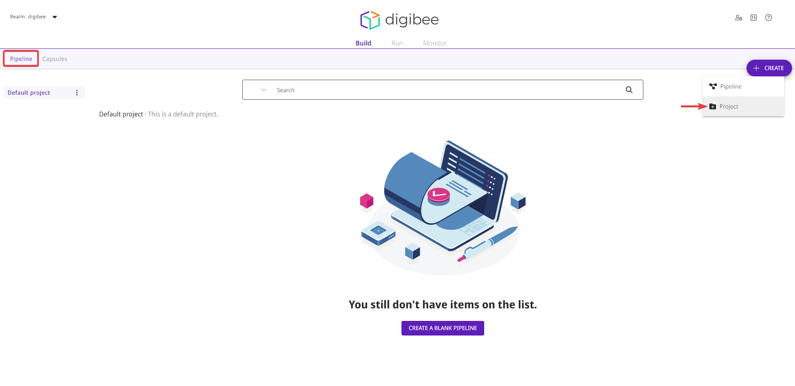
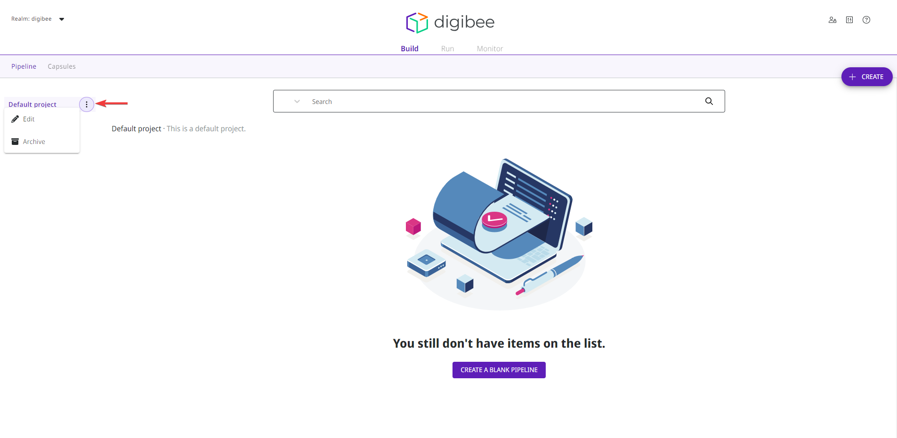

# How to create a project


To access the projects and use the features presented in this article, you need the permissions of [Project Manager](https://docs.digibee.com/documentation/administration/new-access-control/access-control-roles#system-roles). Learn more in the [documentation about Roles](https://docs.digibee.com/documentation/administration/new-access-control/access-control-roles).


Projects are folders you can use to organize and group pipelines.

Follow these steps to create a project:

1. On the Build page, open the **Pipeline** tab.
2. Click the **Create** button in the upper right corner.
3. Select the **Project** option.

<figure><figcaption></figcaption></figure>

4. In the configuration form, define the **Name** and **Description** of the project.
5. In **Project assignment**, activate the option **Select all users** if you want to assign all current and future users of your realm to the project.
6. If you want to assign specific groups and users to the project, click the plus sign next to the **Assigned groups** and **Assigned users** options to select the group or user.


You must assign at least one group or user when you create a project.


7. Click **Save** to create the project.

Once the project is created, hover over the project name in the left sidebar and click the three-dot icon button to display the following options:

* **Edit:** edit the project’s configuration form.


For [audit](https://docs.digibee.com/documentation/administration/audit) reasons, you cannot edit the name of a project. If you need to change the name of a project, create a new project with the correct name and migrate the pipelines to that project.


* **Archive:** archive the project. Only empty projects can be archived. To unarchive a project, you must contact your CSM, who will help you with this action.

<figure><figcaption></figcaption></figure>

You can also drag one or more pipelines to another project (if you want to drag multiple pipelines, press CTRL or Cmd when you select them) by clicking the move icon in the upper left corner of the pipeline card and dropping them in the desired project. You can also specify the project when saving the pipeline.
